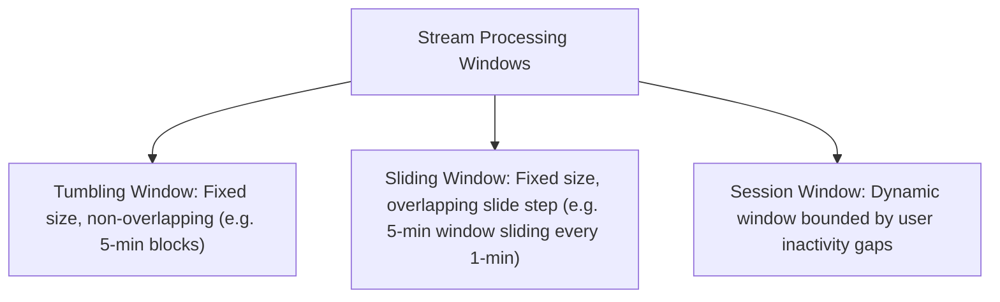

# File 17: Stream Processing and Real-Time Analytics

## Overview
**Stream Processing** (Apache Flink, Kafka Streams) continuously processes unbounded data streams in real time as events arrive, using time-windowing techniques (**Tumbling**, **Sliding**, **Session Windows**) for aggregate analytics.

---

## 1. Stream Windowing Types



---

## 2. Sliding Window Stream Aggregator Concept

```javascript
class SlidingWindowAggregator {
    constructor(windowMs = 5000) {
        this.windowMs = windowMs;
        this.events = [];
    }

    addEvent(value) {
        const now = Date.now();
        this.events.push({ timestamp: now, value });
        this._cleanOldEvents(now);
    }

    _cleanOldEvents(now) {
        const cutoff = now - this.windowMs;
        this.events = this.events.filter(e => e.timestamp >= cutoff);
    }

    getSum() {
        this._cleanOldEvents(Date.now());
        return this.events.reduce((sum, e) => sum + e.value, 0);
    }
}

const stream = new SlidingWindowAggregator(5000);
stream.addEvent(10);
stream.addEvent(20);
console.log("Current 5-second Window Sum:", stream.getSum()); // 30
```

---

## Key Takeaways
1. Process data continuously in **real-time** rather than in nightly offline batch jobs.
2. Use **Tumbling Windows** for distinct metric intervals and **Sliding Windows** for moving averages.
3. Handle **out-of-order late events** using **Watermarks**.
