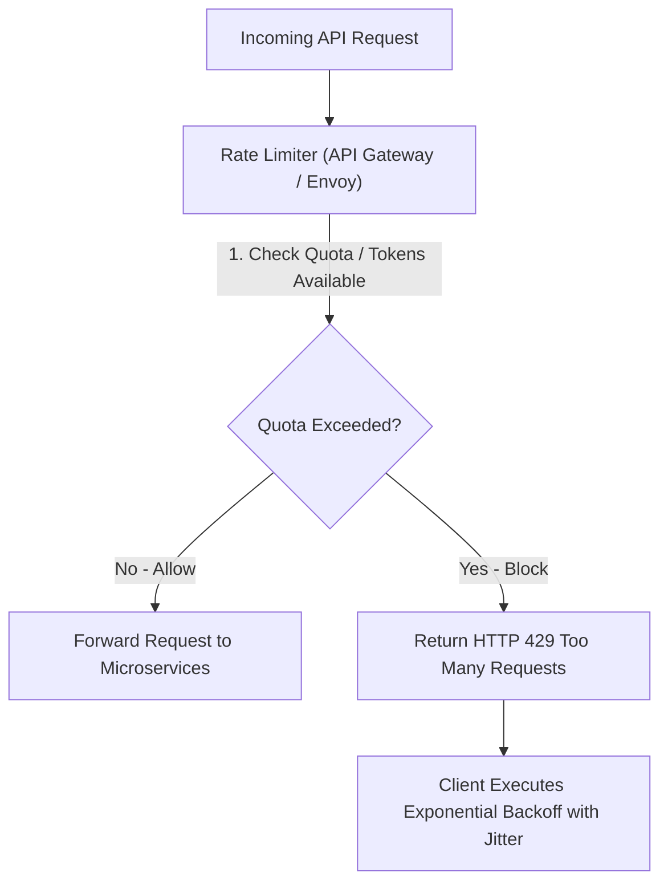
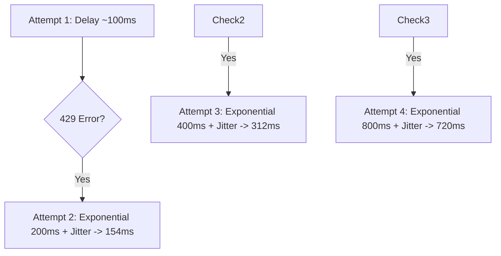

# Module 18: Rate Limiting, Throttling Architecture, & Backoff Strategies

## Theoretical Overview & Protection Mechanics

**Rate Limiting** is a traffic management strategy that controls the rate of incoming or outgoing requests to an API. It protects backend infrastructure from denial-of-service (DoS) attacks, prevents resource starvation, and enforces quota tiers.



### Real-World Case Study: Aadhaar eKYC API (UIDAI)
UIDAI provides eKYC identity verification services to banks, telecoms, and fintechs:
- **Rate Limit Rule**: Each entity is allocated 1,000 requests per minute.
- **Enforcement**: When a bank's automated verification worker exceeds its quota, UIDAI returns **HTTP 429 Too Many Requests** with `Retry-After: 60` headers, protecting UIDAI core databases from crash during surge onboarding events.

---

## 1. Rate Limiting Algorithms Matrix

| Algorithm | Traffic Handling | Memory Overhead | Accuracy Profile | Best Engineering Use Case |
| :--- | :--- | :--- | :--- | :--- |
| **Token Bucket** | **Allows bursts** up to capacity limit. | **$\mathcal{O}(1)$** (Tokens + Refill TS). | High | General API Gateway rate limiting (AWS API Gateway, Stripe). |
| **Leaky Bucket** | **Smooths bursts** to constant output. | $\mathcal{O}(N)$ (Buffer queue size). | High | Rate-limiting background queue consumers or database writes. |
| **Fixed Window Counter**| Discrete time windows. | **$\mathcal{O}(1)$** (Window key count). | **Low** (Allows 2x burst across window boundaries). | Simple low-scale APIs. |
| **Sliding Window Log** | Full timestamp array log. | $\mathcal{O}(N)$ (Stores all request timestamps). | **Exact** | Ultra-strict security APIs (Login, Password reset). |
| **Sliding Window Counter**| Weighted previous + current window count. | **$\mathcal{O}(1)$** (2 integers per client). | **High Approximation** | Distributed high-scale production rate limiters. |

---

## 2. Core Rate Limiting Implementations

### 1. Token Bucket Algorithm (`TokenBucket`)
Tokens refill at a steady rate. Each request consumes 1 token. Requests are rejected when the bucket is empty:

```javascript
class TokenBucket {
  constructor(capacity, refillRate) {
    this.capacity = capacity;
    this.tokens = capacity;
    this.refillRate = refillRate; // Tokens per second
    this.stats = { allowed: 0, rejected: 0 };
  }

  tryConsume() {
    if (this.tokens >= 1) {
      this.tokens--;
      this.stats.allowed++;
      return true;
    }
    this.stats.rejected++;
    return false;
  }

  refill(elapsedSeconds) {
    this.tokens = Math.min(this.capacity, this.tokens + elapsedSeconds * this.refillRate);
  }
}
```

### 2. Leaky Bucket Algorithm (`LeakyBucket`)
Requests enter a buffer queue and "leak" out at a constant, fixed output rate:

```javascript
class LeakyBucket {
  constructor(capacity, leakRate) {
    this.capacity = capacity;
    this.queue = [];
    this.leakRate = leakRate;
  }

  add(req) {
    if (this.queue.length >= this.capacity) return "DROPPED";
    this.queue.push(req);
    return "QUEUED";
  }

  leak(count) {
    return this.queue.splice(0, count); // Leaks out at fixed rate
  }
}
```

### 3. Sliding Window Counter (`SlidingWindowCounter`)
Approximates precise sliding rates with $\mathcal{O}(1)$ memory by combining the current window count with a weighted fraction of the previous window count:

```javascript
class SlidingWindowCounter {
  constructor(windowMs, maxReq) {
    this.windowMs = windowMs;
    this.maxReq = maxReq;
    this.windows = {};
  }

  allow(clientId, timestamp) {
    const windowStart = Math.floor(timestamp / this.windowMs) * this.windowMs;
    if (!this.windows[clientId]) {
      this.windows[clientId] = { prevCount: 0, currCount: 0, currStart: windowStart };
    }
    const state = this.windows[clientId];

    if (windowStart !== state.currStart) {
      state.prevCount = windowStart - state.currStart === this.windowMs ? state.currCount : 0;
      state.currCount = 0;
      state.currStart = windowStart;
    }

    const prevWeight = 1 - (timestamp - windowStart) / this.windowMs;
    const weightedCount = state.prevCount * prevWeight + state.currCount;

    if (weightedCount >= this.maxReq) return { allowed: false, weightedCount };
    state.currCount++;
    return { allowed: true, weightedCount: weightedCount + 1 };
  }
}
```

---

## 3. Distributed Rate Limiting Engine

In multi-server deployments behind a load balancer, local in-memory counters fail because requests from a single client land on different servers. **Distributed Rate Limiting** centralizes counts in a shared Redis cluster using Lua scripts (`INCR` + `EXPIRE`).

```javascript
class DistributedRateLimiter {
  constructor(maxReq, windowMs) {
    this.maxReq = maxReq;
    this.windowMs = windowMs;
    this.store = {}; // Simulates shared Redis cluster
  }

  allow(clientId, serverId, timestamp) {
    const key = `${clientId}:${Math.floor(timestamp / this.windowMs)}`;
    if (!this.store[key]) this.store[key] = 0;
    this.store[key]++;
    
    // Globally enforced limit regardless of which server handles the request
    return { allowed: this.store[key] <= this.maxReq, count: this.store[key], serverId };
  }
}
```

---

## 4. Exponential Backoff with Jitter Algorithms

When clients receive `HTTP 429 Too Many Requests`, retrying immediately creates a **Thundering Herd** problem. **Exponential Backoff with Jitter** introduces randomized spreads between retries:

$$\text{Full Jitter Delay} = \text{Random}(0, \min(\text{MaxDelay}, \text{BaseDelay} \times 2^{\text{attempt}}))$$



```javascript
class ExponentialBackoff {
  constructor(baseMs, maxMs, maxRetries) {
    this.baseMs = baseMs;
    this.maxMs = maxMs;
    this.maxRetries = maxRetries;
  }

  computeDelay(attempt, strategy = "full-jitter") {
    const temp = Math.min(this.maxMs, this.baseMs * Math.pow(2, attempt));
    if (strategy === "full-jitter") {
      return Math.floor(Math.random() * temp);
    } else if (strategy === "equal-jitter") {
      return Math.floor(temp / 2 + (Math.random() * temp) / 2);
    }
    return temp; // Pure exponential
  }
}
```

---

## 5. HTTP Response Headers Standard

Rate limiters communicate status to clients via standard HTTP headers:

```http
HTTP/1.1 429 Too Many Requests
X-RateLimit-Limit: 1000
X-RateLimit-Remaining: 0
X-RateLimit-Reset: 1700000060
Retry-After: 60
Content-Type: application/json

{
  "error": "Too Many Requests",
  "message": "Rate limit quota exceeded. Please retry after 60 seconds."
}
```

---

## Key Takeaways

1. **Token Bucket for General APIs**: Use Token Bucket to permit burst traffic while capping average request rates.
2. **Leaky Bucket for Output Smoothing**: Use Leaky Bucket to feed downstream database writes at a constant rate.
3. **Sliding Window Counter for Memory Efficiency**: Use Sliding Window Counter for high-accuracy rate limiting with $\mathcal{O}(1)$ memory.
4. **Use Shared Stores for Distributed Limits**: Centralize counts in Redis to enforce global rate limits across multi-region server clusters.
5. **Always Add Jitter to Retries**: Combine exponential backoff with full jitter to spread retry attempts and prevent thundering herds.
