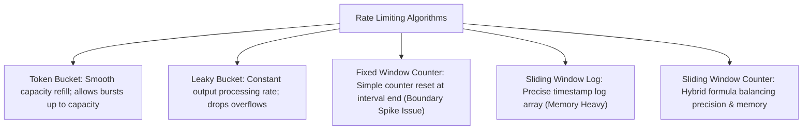

# File 18: Rate Limiting and Throttling Algorithms

## Overview
**Rate Limiting** protects backend infrastructure from abuse, spam, and denial-of-service (DDoS) traffic spikes by restricting the number of requests a client can make within a specified time window.

---

## 1. Rate Limiting Algorithms Comparison



---

## 2. Token Bucket Implementation

```javascript
class TokenBucket {
    constructor(capacity, refillRatePerSec) {
        this.capacity = capacity;               // Max bucket capacity
        this.refillRate = refillRatePerSec;     // Tokens added per second
        this.tokens = capacity;                 // Current tokens
        this.lastRefill = Date.now();
    }

    _refill() {
        const now = Date.now();
        const elapsedSec = (now - this.lastRefill) / 1000;
        const tokensToAdd = elapsedSec * this.refillRate;
        
        this.tokens = Math.min(this.capacity, this.tokens + tokensToAdd);
        this.lastRefill = now;
    }

    tryConsume(tokensToConsume = 1) {
        this._refill();
        if (this.tokens >= tokensToConsume) {
            this.tokens -= tokensToConsume;
            return true; // Request Allowed
        }
        return false;   // Rate Limited (429 Too Many Requests)
    }
}

const bucket = new TokenBucket(5, 1); // Capacity 5, refills 1 token/sec
console.log("Request 1:", bucket.tryConsume()); // true
```

---

## Key Takeaways
1. **Token Bucket** is ideal when handling occasional legitimate traffic bursts.
2. Return HTTP Status **`429 Too Many Requests`** with `Retry-After` headers when rate limits are exceeded.
3. Redis is used to store distributed rate limit counters atomically across API Gateways.
