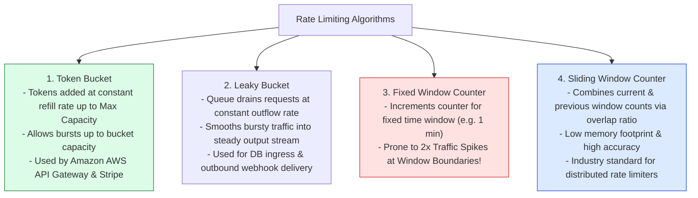
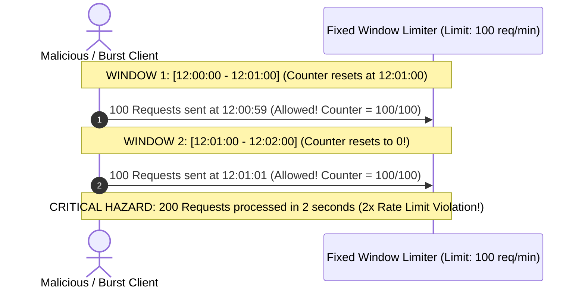
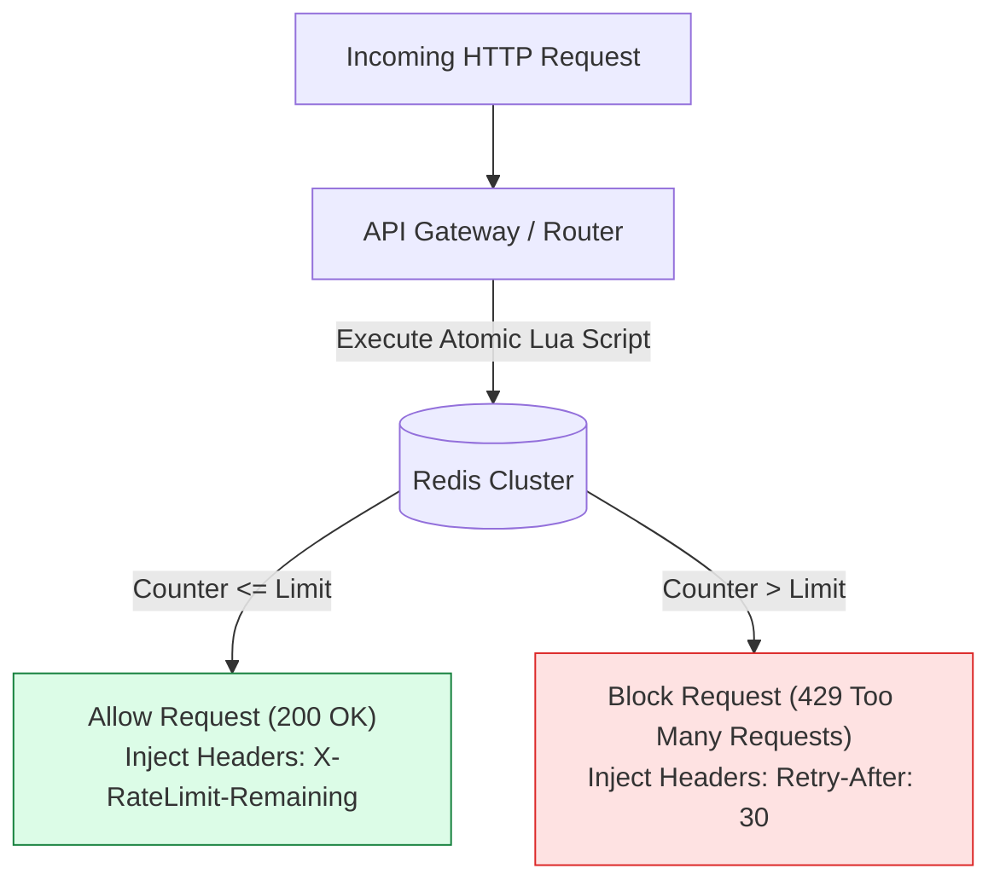

# Module 18: Rate Limiting Architecture, Throttling Algorithms, and Distributed Redis Guards

## Overview

**Rate Limiting** and **Throttling** protect backend infrastructure, database clusters, and third-party API quotas from denial-of-service (DDoS) attacks, brute-force security threats, and accidental traffic spikes.

Rate limiters inspect incoming request identity (IP address, User ID, API Key) and enforce threshold limits.

Understanding **Rate Limiting Algorithms (Token Bucket, Leaky Bucket, Fixed Window, Sliding Window Log, Sliding Window Counter)**, **Distributed Atomic Redis Rate Limiting (Lua Scripts)**, and **HTTP 429 Too Many Requests Headers** is essential.

---

## 1. Rate Limiting Algorithm Taxonomy & Mechanics



### Comprehensive Algorithm Comparison Matrix

| Algorithm | Handles Bursts? | Memory Footprint | Accuracy | Boundary Spike Hazard? | Primary Production Use Case |
| :--- | :--- | :--- | :--- | :--- | :--- |
| **Token Bucket** | **Yes** (Up to capacity) | **Low** (2 integers per key) | High | No | General API Gateway Throttling |
| **Leaky Bucket** | No (Smooths bursts) | Medium (FIFO Queue) | High | No | Outbound Webhook Dispatching |
| **Fixed Window** | No | **Ultra-Low** (1 integer) | Low | **Yes (2x Burst at Boundary)**| Basic IP Rate Limiting |
| **Sliding Window Log** | Yes | High (Array of timestamps) | **100% Precise** | No | Low-volume high-security endpoints |
| **Sliding Window Counter**| Yes (Weighted) | **Low** (2 window counters) | ~99.9% High | No | High-scale distributed rate limiters |

---

## 2. Boundary Spike Problem in Fixed Window Counters

Fixed window algorithms reset counters at rigid clock boundaries (e.g. 12:00:00, 12:01:00). A client sending 100 requests at 12:00:59 and another 100 requests at 12:01:01 bypasses the intended limit of 100 requests/minute by bursting **200 requests within 2 seconds**:



---

## 3. Distributed Redis Rate Limiting & HTTP 429 Header Standards

In multi-node web architectures, rate limits must be enforced centrally in Redis using atomic **Lua Scripts** to avoid race conditions:



### Standardized Rate Limit Response Headers

| Header Name | Header Value Example | Description |
| :--- | :--- | :--- |
| **`X-RateLimit-Limit`** | `100` | Maximum requests permitted per window duration. |
| **`X-RateLimit-Remaining`**| `42` | Number of requests remaining in current window. |
| **`X-RateLimit-Reset`** | `1700000060` | Unix Epoch timestamp when window resets. |
| **`Retry-After`** | `30` | Seconds client must pause before retrying after 429 error. |

---

## 4. Practical Implementation Showcase: Token Bucket Rate Limiter Engine

```javascript
class TokenBucketRateLimiter {
  constructor(capacity = 10, refillRatePerSec = 2) {
    this.capacity = capacity;           // Max bucket capacity (Burst Limit)
    this.refillRate = refillRatePerSec; // Tokens added per second
    this.tokens = capacity;             // Current available tokens
    this.lastRefillTimestamp = Date.now();
  }

  // Refill tokens lazily based on elapsed time
  _refill() {
    const now = Date.now();
    const elapsedSeconds = (now - this.lastRefillTimestamp) / 1000;
    const tokensToAdd = elapsedSeconds * this.refillRate;

    this.tokens = Math.min(this.capacity, this.tokens + tokensToAdd);
    this.lastRefillTimestamp = now;
  }

  // Consume tokens for incoming request
  tryConsume(tokensToConsume = 1) {
    this._refill();

    if (this.tokens >= tokensToConsume) {
      this.tokens -= tokensToConsume;
      return {
        allowed: true,
        remainingTokens: Math.floor(this.tokens),
        retryAfterSec: 0
      };
    } else {
      const missingTokens = tokensToConsume - this.tokens;
      const retryAfterSec = Math.ceil(missingTokens / this.refillRate);
      return {
        allowed: false,
        remainingTokens: 0,
        retryAfterSec
      };
    }
  }
}

// Execution Demonstration
const limiter = new TokenBucketRateLimiter(5, 1); // Capacity 5, refills 1 token/sec

function simulateRequests() {
  console.log("=== TOKEN BUCKET RATE LIMITER TEST ===");
  for (let i = 1; i <= 7; i++) {
    const result = limiter.tryConsume(1);
    if (result.allowed) {
      console.log(`✓ Request #${i}: ALLOWED (Tokens Remaining: ${result.remainingTokens})`);
    } else {
      console.log(`✖ Request #${i}: RATE LIMITED (429 Too Many Requests | Retry-After: ${result.retryAfterSec}s)`);
    }
  }
}

simulateRequests();
```

---

## Key Production Takeaways

1. **Use Token Bucket for General API Rate Limiting**: Token Bucket provides the optimal balance of allowing legitimate user bursts (e.g. initial page loading asset requests) while enforcing average refill limits.
2. **Execute Rate Limit Counting Atomically in Redis via Lua Scripts**: Avoid race conditions in multi-instance API Gateways by executing atomic Redis `INCR` + `EXPIRE` Lua scripts.
3. **Always Include Standard `X-RateLimit` Headers & `Retry-After`**: Return `429 Too Many Requests` along with `Retry-After: <seconds>` headers to inform client SDKs exactly how long to back off.
4. **Rate Limit Tiered Identity**: Implement multi-tier rate limiting (e.g. 60 req/min for Anonymous IPs, 1,000 req/min for Authenticated Users, 10,000 req/min for Enterprise API Keys).

