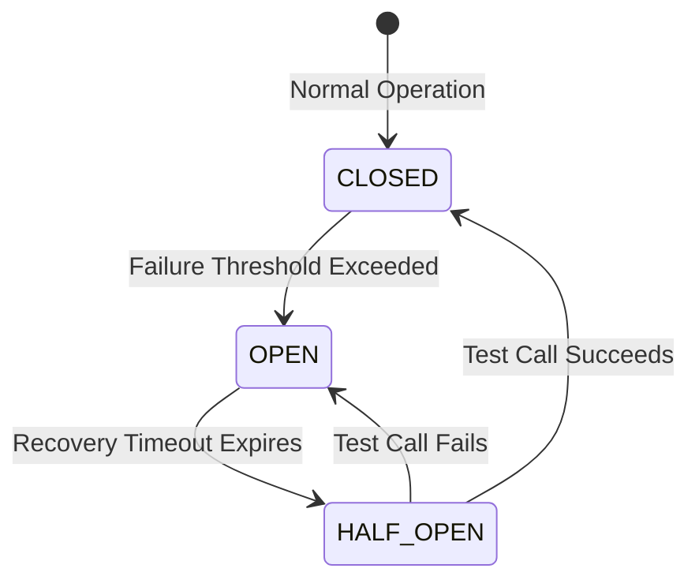
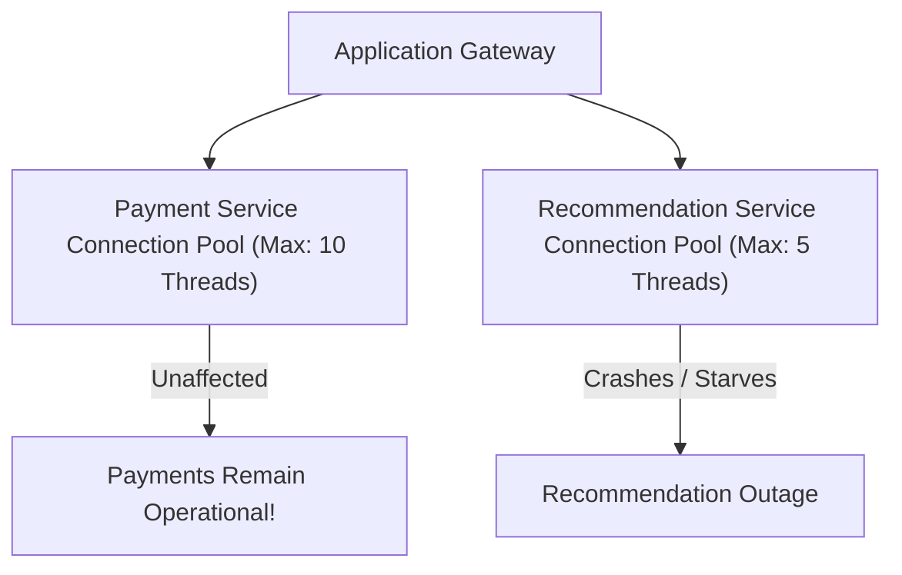

# File 19: Circuit Breaker and Bulkhead Patterns

## Overview
- The **Circuit Breaker Pattern** prevents cascading system failures by monitoring remote service errors and tripping open to instantly reject calls when a failure threshold is passed.
- The **Bulkhead Pattern** isolates application resources (thread pools, connection pools) into isolated compartments so that a failure in one component does not crash the entire application.

---

## 1. Circuit Breaker FSM State Machine

---

## 2. Bulkhead Isolation Architecture

---

## Key Takeaways
1. **Circuit Breaker** transitions between **CLOSED**, **OPEN**, and **HALF_OPEN** to stop cascading outages.
2. **Bulkhead** isolates thread/connection pools so failing sub-services cannot starve system-wide resources.
3. Combine with Fallback defaults (e.g. cached response or degraded feature).
