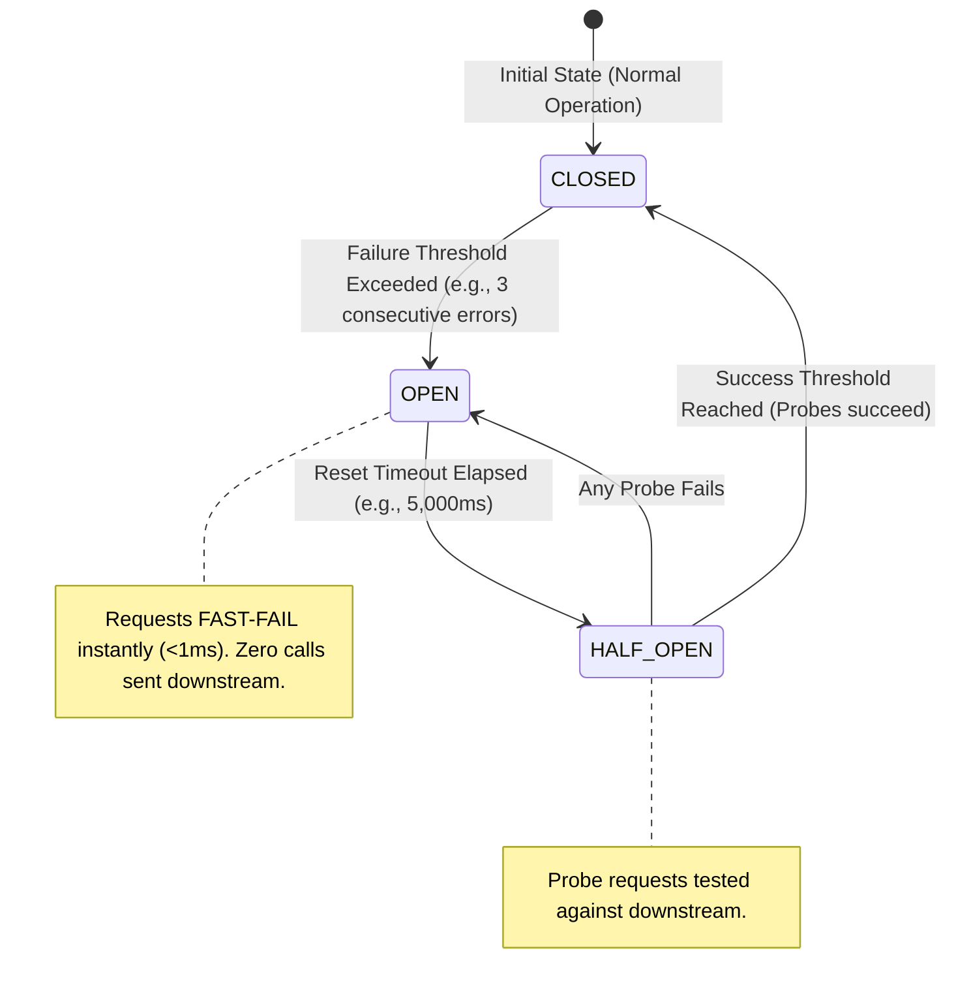
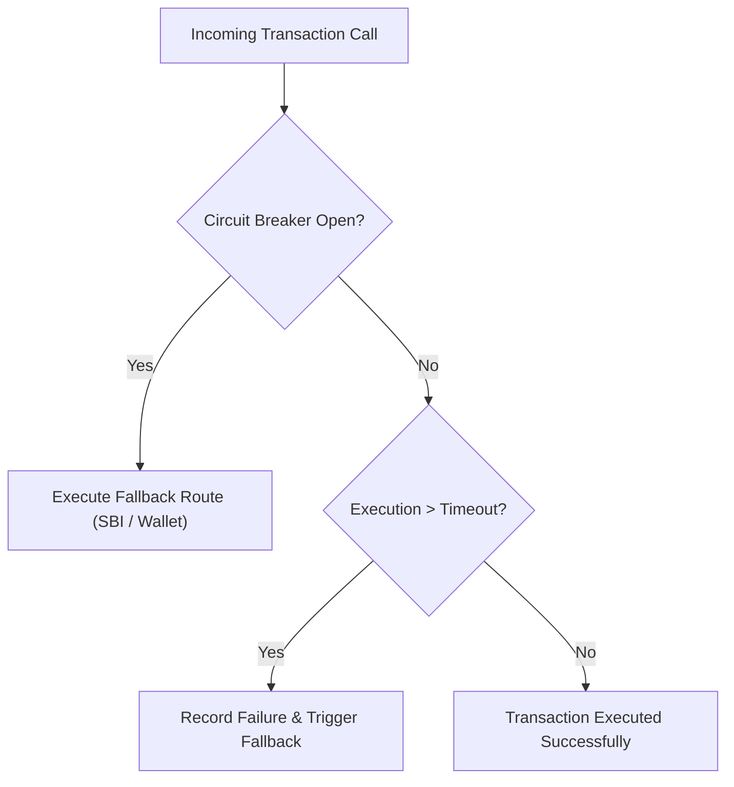

# Module 19: Circuit Breaker Architecture, Bulkhead Isolation, & Resilience Pipelines

## Theoretical Overview & Resiliency Architecture

In a distributed microservice architecture, a failure in a single downstream dependency (e.g., a banking partner API or database) can cause requests to pile up, exhausting thread pools and triggering **cascading failures** across the entire platform.

```mermaid
flowchart TD
    ClientReq["Client Payment Request"] --> Gateway["API Gateway / Payment Service"]
    
    Gateway --> CB["Circuit Breaker (YES Bank Pool)"]
    CB -->|State: CLOSED (Normal)| PrimaryBank["YES Bank Gateway (Downstream Failure)"]
    CB -.->|State: OPEN (Fast-Fail)| FallbackBank["Fallback Partner (SBI / HDFC Gateway)"]
```

### Real-World Case Study: Paytm Payment Gateway Moratorium
During the 2020 YES Bank moratorium in India:
- **Without Resiliency Patterns**: Thousands of Paytm transactions routed to YES Bank hung indefinitely until HTTP timeouts occurred, exhausting Paytm's web server thread pools and crashing the entire Paytm application.
- **With Circuit Breakers & Bulkheads**: Paytm's circuit breaker detected YES Bank's 100% failure rate after 3 consecutive errors and immediately tripped to **OPEN**. Subsequent payment requests fast-failed in **$< 1\text{ ms}$** and automatically fell back to SBI or ICICI gateways.

---

## 1. Resilience Patterns Matrix

| Resilience Pattern | Primary Purpose | Failure Mode Mitigated | Engineering Mechanism |
| :--- | :--- | :--- | :--- |
| **Circuit Breaker** | Stops invoking failing downstream services. | Cascading system crashes & thread exhaustion. | 3-State Machine (`CLOSED`, `OPEN`, `HALF-OPEN`). |
| **Bulkhead Isolation**| Segregates resource pools per dependency. | One broken dependency consuming all server threads. | Dedicated thread pools & limited worker queues per service. |
| **Timeout Guard** | Caps maximum waiting time for responses. | Indefinite thread hanging on non-responsive sockets.| Async socket timers (e.g., 2,000ms threshold). |
| **Exponential Retry** | Recovers from transient network glitches. | Temporary network packet drops. | Retries with exponential backoff & randomized jitter. |
| **Fallback Handler** | Delivers degraded secondary functionality. | Complete service outages. | Route to alternate provider, local cache, or default payload. |

---

## 2. Circuit Breaker 3-State Machine



```javascript
class CircuitBreaker {
  constructor(name, opts = {}) {
    this.name = name;
    this.state = "CLOSED";
    this.failureCount = 0;
    this.successCount = 0;
    this.failThreshold = opts.failThreshold || 3;
    this.successThreshold = opts.successThreshold || 2;
    this.resetTimeoutMs = opts.resetTimeoutMs || 5000;
    this.lastFailTime = 0;
  }

  canExecute() {
    if (this.state === "CLOSED") return true;
    if (this.state === "OPEN") {
      if (Date.now() - this.lastFailTime >= this.resetTimeoutMs) {
        this.state = "HALF_OPEN"; // Transition to probe state
        this.halfOpenAttempts = 0;
        return true;
      }
      return false; // Fast-fail immediately!
    }
    return true;
  }

  recordSuccess() {
    if (this.state === "HALF_OPEN") {
      this.successCount++;
      if (this.successCount >= this.successThreshold) {
        this.state = "CLOSED"; // Recovered!
        this.failureCount = 0;
      }
    }
  }

  recordFailure() {
    this.failureCount++;
    this.lastFailTime = Date.now();
    if (this.state === "HALF_OPEN" || this.failureCount >= this.failThreshold) {
      this.state = "OPEN"; // Trip circuit breaker!
    }
  }
}
```

---

## 3. Bulkhead Isolation Pattern (`BulkheadPool`)

Nautical bulkheads prevent a ship from sinking by dividing the hull into watertight compartments. In software, **Bulkheads** isolate thread pools per downstream service so an outage in one bank partner cannot starve others.

```mermaid
flowchart TD
    AppGateway["Payment Gateway Core Engine"] --> SBI_Bulkhead["SBI Bulkhead Pool (Max: 5 Threads, Queue: 3)"]
    AppGateway --> YES_Bulkhead["YES Bank Bulkhead Pool (Max: 3 Threads, Queue: 2)"]
    
    SBI_Bulkhead -->|HEALTHY| SBI_Server["SBI Core Banking API"]
    YES_Bulkhead -.->|OVERLOADED / FAILING| YES_Server["YES Bank API (Hangs 30s)"]
    
    Note over YES_Bulkhead: Rejects excess requests instantly! SBI Pool remains 100% operational.
```

```javascript
class BulkheadPool {
  constructor(name, maxConcurrent, queueSize) {
    this.name = name;
    this.maxConcurrent = maxConcurrent;
    this.queueSize = queueSize;
    this.active = 0;
    this.queued = 0;
  }

  submit(task) {
    if (this.active < this.maxConcurrent) {
      this.active++;
      try { task(); } finally { this.active--; }
      return "EXECUTED";
    }
    if (this.queued < this.queueSize) {
      this.queued++;
      return "QUEUED";
    }
    return "REJECTED_BULKHEAD_FULL"; // Protects global thread pool
  }
}
```

---

## 4. Fallback Chain Execution (`FallbackChain`)

When primary execution fails or fast-fails due to an OPEN circuit, **Fallback Chains** execute alternative business paths cleanly:

```javascript
class FallbackChain {
  constructor(name) {
    this.name = name;
    this.strategies = [];
  }

  add(name, fn) {
    this.strategies.push({ name, fn });
    return this;
  }

  execute() {
    for (const strategy of this.strategies) {
      try {
        const res = strategy.fn();
        if (res.success) return { status: "OK", via: strategy.name, data: res.data };
      } catch (err) {
        // Continue to next fallback strategy in chain
      }
    }
    return { status: "ALL_FALLBACKS_FAILED" };
  }
}
```

---

## 5. Integrated Production Resilience Pipeline

Combining Circuit Breaker, Timeout Guard, and Fallbacks into a single execution wrapper:



```javascript
class ResiliencePipeline {
  constructor(name, opts = {}) {
    this.cb = new CircuitBreaker(name, opts);
    this.timeoutMs = opts.timeoutMs || 2000;
    this.fallbackFn = opts.fallback;
  }

  execute(expectedLatency, actionFn) {
    if (!this.cb.canExecute()) {
      return { status: "FALLBACK", data: this.fallbackFn() }; // Fast-fail fallback
    }

    if (expectedLatency > this.timeoutMs) {
      this.cb.recordFailure();
      return { status: "FALLBACK_TIMEOUT", data: this.fallbackFn() };
    }

    this.cb.recordSuccess();
    return { status: "SUCCESS", data: actionFn() };
  }
}
```

---

## Key Takeaways

1. **Circuit Breakers Stop Cascading Failures**: Trip to `OPEN` state after failure thresholds are crossed to fast-fail requests in $<1\text{ ms}$.
2. **Bulkheads Isolate Dependencies**: Separate thread pools per downstream service so a hanging dependency cannot exhaust server resources.
3. **Always Bound Timeouts**: Set strict socket timeouts to prevent threads from waiting indefinitely.
4. **Implement Graceful Fallbacks**: Route failed payment transactions to secondary gateway partners or wallet balances automatically.
