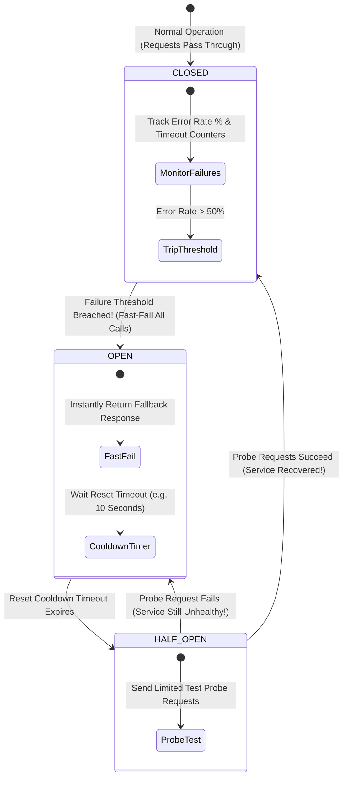
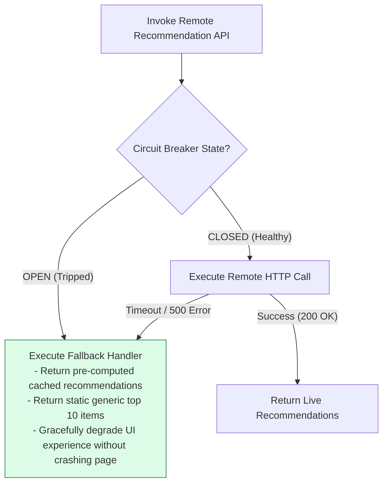

# Module 19: Circuit Breaker State Machine, Bulkhead Isolation, and Resilience Patterns

## Overview

In microservice architectures, remote service calls over network boundaries will eventually fail or experience latency degradation. Left unmitigated, a single failing downstream dependency can cause **Cascading Outages** by consuming all available server connection threads across the entire microservice graph.

The **Circuit Breaker Pattern** monitors remote error rates and trips open to instantly reject calls when failure thresholds are breached, while the **Bulkhead Pattern** isolates thread/connection pools into independent compartments so a failure in one component cannot starve system-wide resources.

---

## 1. Circuit Breaker Finite State Machine (FSM) Architecture



### Circuit Breaker FSM State Reference Matrix

| State Name | Request Execution Behavior | State Transition Trigger | Secondary System Effect |
| :--- | :--- | :--- | :--- |
| **`CLOSED`** | Executed normally against remote target | Error rate exceeds threshold (e.g. $>50\%$ failures in 10s) | Continuous error rate monitoring in rolling window |
| **`OPEN`** | **Fast-Failed Instantly** (Returns Fallback) | Cooldown timer expires (e.g. 10-30 seconds) | Protects downstream service from load during outage |
| **`HALF_OPEN`** | Permits limited probe requests (e.g. 3 calls) | Probe succeeds $\rightarrow$ `CLOSED`; Probe fails $\rightarrow$ `OPEN` | Safely checks if target service has recovered |

---

## 2. Bulkhead Resource Compartmentation Architecture

The **Bulkhead Pattern** takes its name from ship watertight bulkheads—if one compartment floods, the remaining compartments remain dry and keep the ship afloat. In software architecture, bulkheads isolate thread pools, Semaphore concurrency slots, or connection pools per downstream service:

```mermaid
flowchart TD
    ClientReq[Incoming Application Request] --> Gateway[API Gateway / Microservice]

    subgraph Bulkhead Compartment Isolation
        Gateway -->|Dedicated Thread Pool A (Max 10)| SvcA[Payment Microservice]
        Gateway -->|Dedicated Thread Pool B (Max 5)| SvcB[Recommendation Microservice]
        Gateway -->|Dedicated Thread Pool C (Max 20)| SvcC[Catalog Microservice]
    end

    SvcB -- "Outage / Slow Latency (Starves 5 Threads)" --> OutageB[Recommendation Outage]
    SvcA -- "Unaffected! 10 Threads Available" --> PassA[Payments Operational!]
    SvcC -- "Unaffected! 20 Threads Available" --> PassC[Catalog Operational!]

    style SvcA fill:#dcfce7,stroke:#15803d
    style OutageB fill:#fee2e2,stroke:#dc2626
    style Gateway fill:#dbeafe,stroke:#1d4ed8
```

---

## 3. Resilience Pattern Mechanics: Fallbacks & Graceful Degradation



---

## 4. Practical Implementation Showcase: Production-Grade Circuit Breaker Engine

```javascript
class CircuitBreaker {
  constructor(requestFn, options = {}) {
    this.requestFn = requestFn;
    this.failureThreshold = options.failureThreshold || 3; // 3 failures to open
    this.resetTimeoutMs = options.resetTimeoutMs || 5000;  // 5s cooldown
    
    this.state = "CLOSED"; // CLOSED, OPEN, HALF_OPEN
    this.failureCount = 0;
    this.nextAttempt = Date.now();
  }

  async execute(...args) {
    // 1. Check if OPEN and in Cooldown Period
    if (this.state === "OPEN") {
      if (Date.now() > this.nextAttempt) {
        console.log("🟡 [CIRCUIT BREAKER] Cooldown expired. Switching to HALF_OPEN probe state...");
        this.state = "HALF_OPEN";
      } else {
        const remainingSec = Math.ceil((this.nextAttempt - Date.now()) / 1000);
        console.log(`🔴 [CIRCUIT BREAKER] Circuit is OPEN! Fast-failing request (Retry in ${remainingSec}s)...`);
        throw new Error("CIRCUIT_OPEN_FAST_FAIL");
      }
    }

    // 2. Attempt Execution
    try {
      const response = await this.requestFn(...args);
      this._onSuccess();
      return response;
    } catch (err) {
      this._onFailure();
      throw err;
    }
  }

  _onSuccess() {
    this.failureCount = 0;
    if (this.state === "HALF_OPEN") {
      console.log("🟢 [CIRCUIT BREAKER] Probe request succeeded! Circuit reset to CLOSED.");
      this.state = "CLOSED";
    }
  }

  _onFailure() {
    this.failureCount++;
    console.error(`✖ [REMOTE FAILURE] Failure count: ${this.failureCount}/${this.failureThreshold}`);

    if (this.failureCount >= this.failureThreshold || this.state === "HALF_OPEN") {
      this.state = "OPEN";
      this.nextAttempt = Date.now() + this.resetTimeoutMs;
      console.error(`🔴 [CIRCUIT BREAKER] Failure threshold reached! Circuit TRIPPED to OPEN for ${this.resetTimeoutMs / 1000}s.`);
    }
  }
}

// Execution Demonstration
async function runCircuitBreakerDemo() {
  let simulatedFailures = true;
  const mockRemoteApi = async () => {
    if (simulatedFailures) throw new Error("503 Service Unavailable");
    return { status: "OK", data: "Live Remote Payload" };
  };

  const breaker = new CircuitBreaker(mockRemoteApi, { failureThreshold: 2, resetTimeoutMs: 2000 });

  // Simulate Requests to Trip Circuit
  for (let i = 1; i <= 4; i++) {
    try {
      await breaker.execute();
    } catch (e) {
      // Expected fast-fails or remote errors
    }
  }

  // Wait out 2-second cooldown
  console.log("\nWaiting 2.1 seconds for reset timeout...");
  await new Promise((r) => setTimeout(r, 2100));

  // Recovery Simulation
  simulatedFailures = false;
  const recoveredResult = await breaker.execute();
  console.log("Recovered Call Result:", recoveredResult);
}

runCircuitBreakerDemo();
```

---

## Key Production Takeaways

1. **Implement Circuit Breakers on All Outbound Microservice HTTP/gRPC Clients**: Prevent cascading failures by wrapping remote network calls (e.g. Netflix Hystrix, Resilience4j, Cockatiel) with circuit breaker guards.
2. **Combine Circuit Breakers with Fallbacks**: Always provide meaningful fallback responses (e.g. stale cached data, default values, or empty arrays) when a circuit breaker fast-fails to preserve user experience.
3. **Use Bulkhead Isolation for Critical Path Services**: Never allow secondary, non-critical sub-services (e.g. recommendations or analytics) to share thread pools or database connections with critical path operations like payments or checkout.
4. **Monitor Circuit Breaker Transitions via Alerting**: Trigger real-time DevOps alerts whenever a circuit breaker transitions from `CLOSED` to `OPEN` to catch downstream outages immediately.

