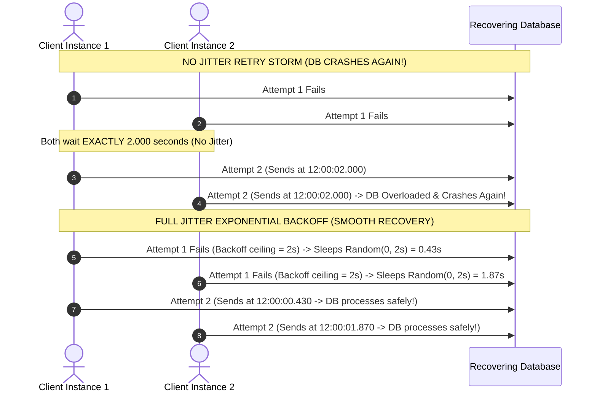
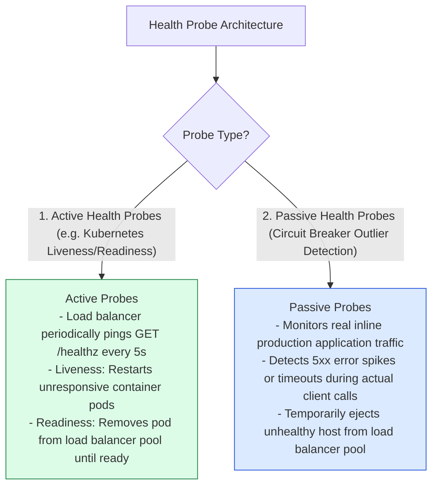

# Module 20: Fault Tolerance Architecture, Exponential Backoff with Jitter, Timeouts, and Health Probes

## Overview

In high-scale distributed systems, individual node crashes, network packet loss, and transient database latency spikes are guaranteed to occur. **Fault Tolerance** defines a system's capability to continue operating correctly without system-wide outages when underlying components fail.

Key resilience building blocks include **Strict Network Timeouts**, **Exponential Backoff with Full Jitter Retries**, **Graceful Degradation Fallbacks**, and **Active/Passive Health Check Probes**.

Understanding **Retry Storm Prevention (Thundering Herd)**, **Jitter Mathematical Formulas**, and **Liveness/Readiness Probes** is essential.

---

## 1. Fault Tolerance Architectural Pipeline

```mermaid
flowchart TD
    ClientReq[Client Service Request] --> TimeoutGuard{1. Timeout Guard:<br/>Has request exceeded 500ms limit?}
    
    TimeoutGuard -- "No (Fast Execution)" --> DirectSuccess[Return Success Response]
    TimeoutGuard -- "Yes (Timeout Breached)" --> RetryCheck{2. Retry Strategy:<br/>Attempt < Max Retries (3)?}

    RetryCheck -- "Yes" --> JitterDelay["3. Calculate Exponential Backoff + Jitter Delay<br/>Sleep t = random(0, min(MaxDelay, Base * 2^attempt))"]
    JitterDelay --> TimeoutGuard

    RetryCheck -- "No (Retries Exhausted)" --> FallbackHandler["4. Execute Graceful Fallback Handler<br/>Return Cached / Default Payload"]

    style TimeoutGuard fill:#dbeafe,stroke:#1d4ed8
    style JitterDelay fill:#fef3c7,stroke:#b45309
    style FallbackHandler fill:#dcfce7,stroke:#15803d
```

---

## 2. Exponential Backoff with Jitter vs. Thundering Herd Retry Storms

When a database recovers after a temporary outage, thousands of clients executing immediate retries simultaneously create a **Retry Storm (Thundering Herd)** that instantly crashes the recovering database again.

Adding **Full Jitter** randomizes retry sleep intervals, spreading incoming retry spikes smoothly across time:

$$\text{Sleep Delay} = \text{Random}(0, \min(\text{MaxBackoff}, \text{BaseBackoff} \times 2^{\text{attempt}}))$$



---

## 3. Active vs. Passive Health Probes



---

## 4. Practical Implementation Showcase: Complete Resilient Execution Wrapper

```javascript
class ResilienceWrapper {
  // Execute function wrapped with Timeout, Exponential Backoff + Full Jitter, and Fallback
  static async execute({
    fn,
    fallbackFn,
    maxRetries = 3,
    baseDelayMs = 100,
    maxDelayMs = 2000,
    timeoutMs = 500
  }) {
    for (let attempt = 1; attempt <= maxRetries; attempt++) {
      try {
        // 1. Strict Timeout Guard via Promise.race
        const timeoutPromise = new Promise((_, reject) =>
          setTimeout(() => reject(new Error("NETWORK_TIMEOUT_BREACHED")), timeoutMs)
        );

        return await Promise.race([fn(), timeoutPromise]);
      } catch (err) {
        console.warn(`⚠️ [ATTEMPT ${attempt}/${maxRetries} FAILED] ${err.message}`);

        if (attempt === maxRetries) {
          console.error("✖ [RETRIES EXHAUSTED] Executing Graceful Fallback...");
          return await fallbackFn(err);
        }

        // 2. Full Jitter Exponential Backoff Calculation
        const exponentialCeiling = Math.min(maxDelayMs, baseDelayMs * Math.pow(2, attempt));
        const jitteredDelay = Math.floor(Math.random() * exponentialCeiling);

        console.log(`  ↺ Sleeping for ${jitteredDelay}ms (Full Jitter Backoff)...`);
        await new Promise((resolve) => setTimeout(resolve, jitteredDelay));
      }
    }
  }
}

// Execution Demonstration
async function runResilienceDemo() {
  let attemptCounter = 0;
  
  // Unreliable Flaky API Simulation
  const flakyRemoteApi = async () => {
    attemptCounter++;
    if (attemptCounter < 3) {
      throw new Error("503 Service Unavailable");
    }
    return { status: 200, payload: "Live Data Payload" };
  };

  // Fallback Function
  const fallback = async (err) => ({ status: 200, payload: "Cached Fallback Payload", degraded: true });

  console.log("=== EXECUTING FAULT TOLERANCE WRAPPER ===");
  const result = await ResilienceWrapper.execute({
    fn: flakyRemoteApi,
    fallbackFn: fallback,
    maxRetries: 4,
    baseDelayMs: 200,
    timeoutMs: 1000
  });

  console.log("Final Response Output:", result);
}

runResilienceDemo();
```

---

## Key Production Takeaways

1. **Always Enforce Hard Network Timeouts**: Never make external HTTP/gRPC calls without explicit timeouts (e.g. 500ms - 2000ms). Unbounded timeouts cause connection thread leaks and server starvation.
2. **Always Use Full Jitter with Exponential Backoff**: When retrying failed requests, randomize the sleep interval using Full Jitter (`random(0, min(Max, Base * 2^attempt))`) to prevent thundering herd retry storms.
3. **Differentiate Liveness and Readiness Probes**: In Kubernetes/container setups, use **Readiness Probes** to control whether traffic is routed to a pod during startup/warmup, and **Liveness Probes** to reboot hung/deadlocked containers.
4. **Ensure Retried Operations are Idempotent**: Only apply automated retries to safe/idempotent endpoints (`GET`, `PUT`, `DELETE`) or `POST` requests accompanied by an `Idempotency-Key` header.

