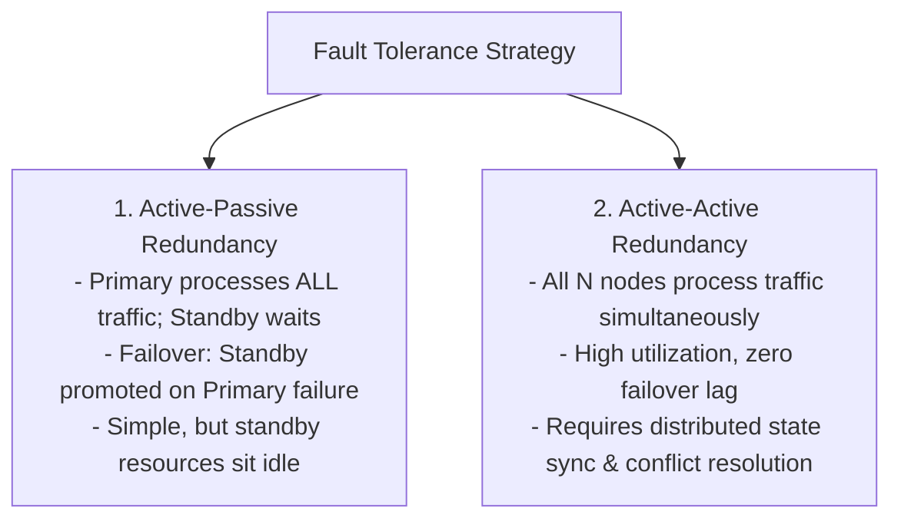
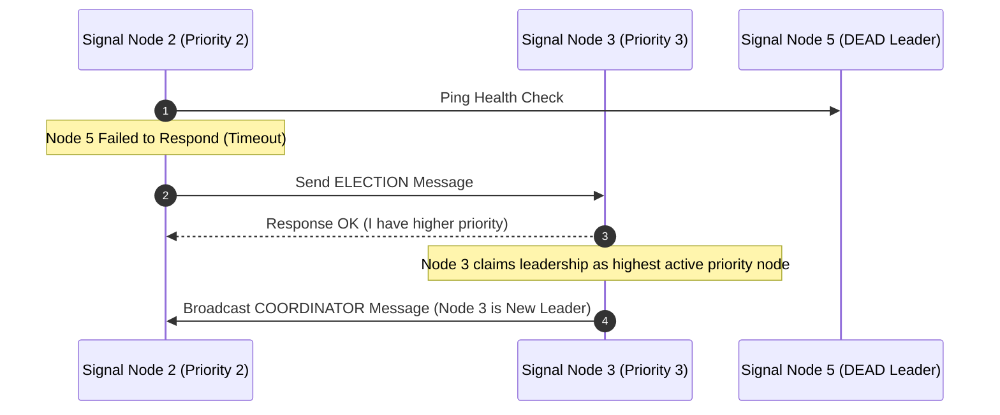
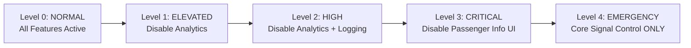

# Module 20: Fault Tolerance Patterns, Active-Active Redundancy, & Chaos Engineering

## Theoretical Overview & Fault Tolerant Architecture

**Fault Tolerance** is the architectural capability of a distributed system to continue operating without interruption even when one or more internal components (servers, networks, databases) fail.



### Real-World Case Study: Railway Signal Control Cabins
Indian Railways operates over **7,000 stations** with dual-redundant signal control systems:
- **Active-Passive Cabins**: Primary cabin controls track signals; Standby cabin continuously mirrors state.
- **Leader Election**: If Primary fails, Standby is promoted to Primary via automated election.
- **Idempotent Commands**: Re-sending signal changes via retries uses unique Idempotency Keys to prevent duplicate signal updates.

---

## 1. Redundancy Patterns Comparison Matrix

| Architecture Model | Traffic Routing | Failover Delay | Cost Efficiency | System Complexity |
| :--- | :--- | :--- | :--- | :--- |
| **Active-Passive** | 100% traffic to Primary; 0% to Standby. | Small failover delay ($\approx 5\text{s}$). | Low (Standby box sits idle). | Low. |
| **Active-Active** | Load balanced across all active nodes. | **Zero Failover Delay** (Instant). | **High** (100% capacity utilization). | High (Requires state sync). |
| **Multi-Site Active** | Multi-region Anycast routing. | Zero Failover Delay. | Highest (Multi-datacenter cost). | Highest (Cross-region replication). |

---

## 2. Core Fault Tolerance Implementations

### 1. Active-Passive Redundancy Cluster (`ActivePassiveCluster`)
```javascript
class SignalCabin {
  constructor(id, role) {
    this.id = id;
    this.role = role;
    this.healthy = true;
  }

  process(cmd) {
    if (!this.healthy) return { status: "FAILED", cabin: this.id };
    if (this.role !== "PRIMARY") return { status: "REJECTED", cabin: this.id };
    return { status: "OK", cabin: this.id, cmd };
  }

  promote() { this.role = "PRIMARY"; }
  demote() { this.role = "STANDBY"; }
}

class ActivePassiveCluster {
  constructor(pId, sId) {
    this.primary = new SignalCabin(pId, "PRIMARY");
    this.standby = new SignalCabin(sId, "STANDBY");
  }

  processCommand(cmd) {
    let res = this.primary.process(cmd);
    if (res.status === "FAILED") {
      this.failover(); // Automatic failover to standby
      res = this.primary.process(cmd);
    }
    return res;
  }

  failover() {
    this.standby.promote();
    const temp = this.primary;
    this.primary = this.standby;
    this.standby = temp;
    this.standby.demote();
  }
}
```

### 2. Active-Active Load Balancing Cluster (`ActiveActiveCluster`)
```javascript
class ActiveActiveCluster {
  constructor(count) {
    this.nodes = Array.from({ length: count }, (_, i) => ({ id: `node-${i + 1}`, healthy: true, processed: 0 }));
  }

  route() {
    const healthy = this.nodes.filter((n) => n.healthy);
    if (!healthy.length) return { status: "ALL_NODES_DOWN" };
    
    // Load balance to node processing least traffic
    healthy.sort((a, b) => a.processed - b.processed);
    healthy[0].processed++;
    return { status: "OK", node: healthy[0].id };
  }
}
```

---

## 3. Leader Election: The Bully Algorithm (`BullyElection`)

When a coordinator node crashes, the cluster runs a **Leader Election** to select the active node with the **highest priority ID**.



```javascript
class BullyElection {
  constructor() { this.nodes = {}; this.leader = null; }

  addNode(id, priority) { this.nodes[id] = { id, priority, alive: true }; }

  elect(initiatorId) {
    const init = this.nodes[initiatorId];
    if (!init || !init.alive) return null;

    // Find higher-priority active nodes
    const higherNodes = Object.values(this.nodes).filter(
      (n) => n.priority > init.priority && n.alive
    );

    if (higherNodes.length === 0) {
      this.leader = initiatorId; // Highest node becomes leader
      return this.leader;
    }
    // Highest alive node wins election
    this.leader = higherNodes.sort((a, b) => b.priority - a.priority)[0].id;
    return this.leader;
  }
}
```

---

## 4. Idempotency Keys for Network Retry Safety

When network disruptions cause retries, **Idempotency Keys** ensure that processing a command multiple times yields the exact same state as a single execution.

```javascript
class IdempotentProcessor {
  constructor() {
    this.processedKeys = new Set();
    this.state = {};
  }

  process(cmd) {
    if (this.processedKeys.has(cmd.idempotencyKey)) {
      return { status: "ALREADY_PROCESSED_DEDUPLICATED" };
    }
    this.state[cmd.signalId] = cmd.value;
    this.processedKeys.add(cmd.idempotencyKey);
    return { status: "PROCESSED_SUCCESSFULLY" };
  }
}
```

---

## 5. Graceful Degradation & Disaster Recovery (RPO / RTO)

### 1. Graceful Feature Shedding Hierarchy
Under extreme traffic load or partial component failure, system components degrade non-critical features while keeping core operations 100% active:



### 2. Disaster Recovery Metrics (RPO vs. RTO)
- **RPO (Recovery Point Objective)**: Maximum acceptable duration of **data loss** measured in time (e.g., RPO = 15 mins means up to 15 mins of data loss).
- **RTO (Recovery Time Objective)**: Maximum acceptable duration of **system downtime** required to restore service (e.g., RTO = 30 mins).

```javascript
const drStrategies = [
  { name: "Backup & Restore", rpo: "24 Hours", rto: "8 Hours", cost: "$" },
  { name: "Warm Standby", rpo: "15 Minutes", rto: "30 Minutes", cost: "$$$" },
  { name: "Multi-Site Active-Active", rpo: "< 1 Second", rto: "< 5 Seconds", cost: "$$$$$" },
];
```

---

## Key Takeaways

1. **Active-Active Offers Zero Downtime**: Active-Active redundancy provides maximum capacity utilization and instant failover without standby waste.
2. **Bully Election Rebuilt Leaders**: Higher-priority active nodes claim leadership when primary nodes crash.
3. **Idempotency Keys Prevent Duplicate Action**: Enforce unique idempotency keys on every transaction mutation to protect against retry storms.
4. **Shed Non-Critical Features**: Define explicit graceful degradation levels to protect core application pipelines during crisis events.
