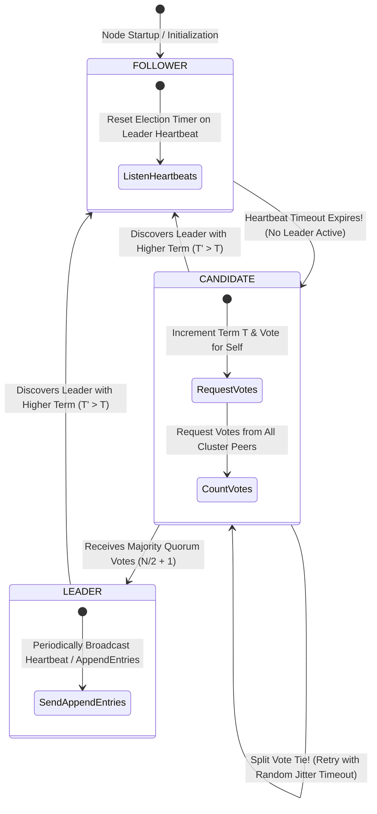
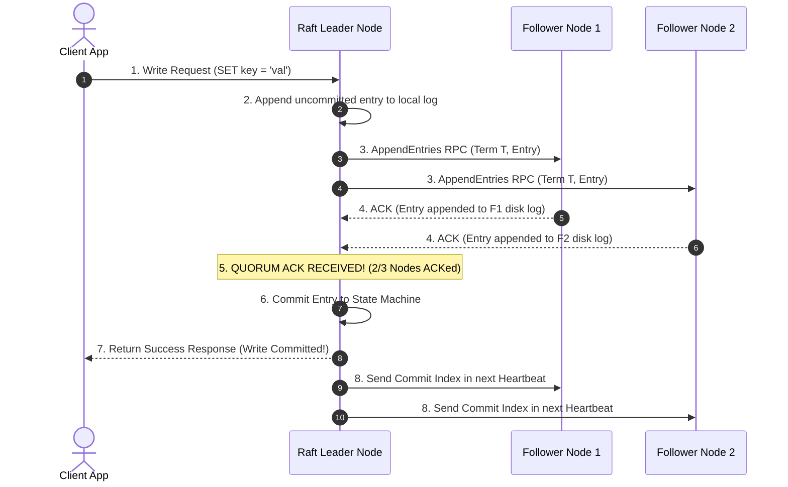

# Module 21: Distributed Consensus Architecture, Raft Algorithm, Paxos, and Quorum Math

## Overview

In distributed systems, **Consensus** is the fundamental problem of getting a cluster of independent, untrusted nodes connected by an unreliable network to agree on a single data value, leader election, or sequence of state machine transitions.

Consensus algorithms like **Raft** and **Paxos** guarantee system-wide consistency despite node crashes, network latency, and network partitions.

Understanding **Raft Node States (Follower, Candidate, Leader)**, **Quorum Math ($Q = \lfloor N/2 \rfloor + 1$)**, **Randomized Election Timeouts**, and **Production Coordinators (etcd, Consul, Apache ZooKeeper)** is essential.

---

## 1. Raft Finite State Machine & Leader Election Flow



---

## 2. Quorum Consensus Math & Split-Brain Prevention

A consensus cluster of size $N$ requires a **Quorum Majority** of operational nodes to elect a leader or commit a log entry:

$$\text{Quorum Size } Q = \left\lfloor \frac{N}{2} \right\rfloor + 1$$

```mermaid
flowchart TD
    subgraph 5-Node Cluster Network Partition Scenario
        N1[Node 1] & N2[Node 2] & N3[Node 3] --- Partition barrier((NETWORK PARTITION)) --- N4[Node 4] & N5[Node 5]
    end

    subgraph Majority Partition (3 Nodes)
        N1 & N2 & N3 -->|3/5 Nodes = Quorum Majority| LeaderOK["Can Elect Leader & Commit Writes! (Quorum Q = 3)"]
    end

    subgraph Minority Partition (2 Nodes)
        N4 & N5 -->|2/5 Nodes < Quorum| Blocked["Rejects Writes! Prevents Split-Brain Data Corruption!"]
    end

    style LeaderOK fill:#dcfce7,stroke:#15803d
    style Blocked fill:#fee2e2,stroke:#dc2626
```

### Consensus System Parameter Matrix

| Cluster Size ($N$) | Quorum Majority ($Q$) | Maximum Tolerable Node Failures ($F$) | Odd vs. Even Recommendation |
| :--- | :--- | :--- | :--- |
| **3 Nodes** | 2 Nodes | **1 Node Failure** | Minimum recommended production cluster |
| **4 Nodes** | 3 Nodes | **1 Node Failure** | **Not recommended** (Same fault tolerance as 3, higher overhead) |
| **5 Nodes** | 3 Nodes | **2 Node Failures** | Optimal balance of fault tolerance & latency |
| **7 Nodes** | 4 Nodes | **3 Node Failures** | High-security infrastructure (etcd / ZooKeeper) |

---

## 3. Log Replication & Commit Sequence



---

## 4. Practical Implementation Showcase: Raft Leader Election & Vote Simulator

```javascript
class RaftConsensusNode {
  constructor(nodeId, clusterNodes) {
    this.nodeId = nodeId;
    this.clusterNodes = clusterNodes; // Array of all node IDs in cluster
    this.state = "FOLLOWER"; // FOLLOWER, CANDIDATE, LEADER
    this.currentTerm = 0;
    this.votedFor = null;
  }

  // Handle Heartbeat Timeout & Trigger Election
  onElectionTimeout() {
    console.log(`\n⏱ [ELECTION TIMEOUT] Node ${this.nodeId} timed out. Starting election...`);
    this.state = "CANDIDATE";
    this.currentTerm++;
    this.votedFor = this.nodeId; // Vote for self
    let votesCount = 1;

    console.log(`🗳 [NODE ${this.nodeId}] Candidate for Term ${this.currentTerm}. Requesting votes...`);

    // Simulate voting requests to cluster peers
    for (const peerId of this.clusterNodes) {
      if (peerId === this.nodeId) continue;
      const voteGranted = this._requestVoteFromPeer(peerId, this.currentTerm, this.nodeId);
      if (voteGranted) votesCount++;
    }

    // Quorum Math: floor(N / 2) + 1
    const quorum = Math.floor(this.clusterNodes.length / 2) + 1;
    console.log(`  📊 Votes Received: ${votesCount}/${this.clusterNodes.length} (Quorum Needed: ${quorum})`);

    if (votesCount >= quorum) {
      this.state = "LEADER";
      console.log(`👑 [ELECTION SUCCESS] Node ${this.nodeId} ELECTED AS LEADER for Term ${this.currentTerm}!`);
    } else {
      this.state = "FOLLOWER";
      console.log(`✖ [ELECTION FAILED] Node ${this.nodeId} failed to reach quorum. Reverting to FOLLOWER.`);
    }
  }

  _requestVoteFromPeer(peerId, term, candidateId) {
    // Peer vote logic simulation: grants vote if peer has not voted in this term
    console.log(`   -> Peer Node ${peerId} granted vote to Candidate Node ${candidateId}`);
    return true;
  }
}

// Execution Demonstration
const clusterIds = [1, 2, 3, 4, 5];
const node = new RaftConsensusNode(1, clusterIds);
node.onElectionTimeout();
```

---

## Key Production Takeaways

1. **Always Deploy Consensus Clusters with an Odd Number of Nodes**: Deploy consensus nodes (etcd, Consul, ZooKeeper) in clusters of 3, 5, or 7. A 4-node cluster provides zero additional failure tolerance over a 3-node cluster while increasing network overhead.
2. **Use Randomized Election Timeouts to Prevent Split Votes**: Set candidate election timeouts to randomized ranges (e.g. 150ms - 300ms) to ensure split-vote ties are resolved quickly.
3. **Use etcd / Consul for Distributed Configuration & Locks**: Avoid building custom consensus algorithms. Rely on proven distributed key-value stores built on Raft (etcd, Consul) for leader election, service discovery, and distributed locking.
4. **Log Replication Requires Majority Quorum ACK Before Commit**: Never mark a write operation as committed until a majority quorum ($Q = \lfloor N/2 \rfloor + 1$) of nodes have successfully flushed the log record to disk.

