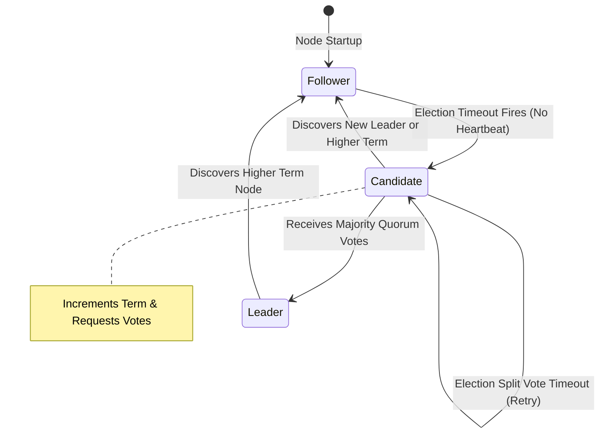

# Module 21: Distributed Consensus Architecture, Raft Protocol, & Quorum Mechanics

## Theoretical Overview & Distributed State Machine Replication

**Distributed Consensus** is the fundamental protocol enabling a group of independent nodes in a distributed network to agree on a single data state or sequence of actions, even when some nodes fail, drop packets, or experience network partitions.

```mermaid
flowchart TD
    Client["Client Write (SET constituency = 'Varanasi')"] --> Leader["Raft Leader Node (Term 1)"]
    
    Leader -->|1. Append Entry to Log| LeaderLog[("Leader Log")]
    Leader -->|2. Replicate Log Entry| Follower1["Follower Node 1"]
    Leader -->|2. Replicate Log Entry| Follower2["Follower Node 2"]
    Leader -.->|Offline Node| Follower3["Follower Node 3 (DOWN)"]
    
    Follower1 -->>|3. ACK| Leader
    Follower2 -->>|3. ACK| Leader
    
    Note over Leader: 4. Quorum Reached (3/4 ACKs) -> COMMIT Entry
    Leader -->>Client: 5. Write Committed Response (Success)
```

### Real-World Case Study: Election Commission of India Vote Counting
The Election Commission of India tallies votes across thousands of polling booths:
- **Returning Officer (Raft Leader)**: Coordinates official constituency vote tallies.
- **Vote Counting Nodes (Followers)**: Replicate tally sheets locally.
- **Quorum Consensus**: A result is officially declared committed only when a strict majority ($Q = \lfloor N/2 \rfloor + 1$) of booth counting supervisors confirm the ledger log.

---

## 1. Consensus Protocols & Production Systems Matrix

| Protocol | Primary Leader Mechanics | Quorum Requirement | Known Production Adoptors | Key Engineering Focus |
| :--- | :--- | :--- | :--- | :--- |
| **Raft** | Strong Leader with Randomized Election Timeouts. | Majority ($Q = \lfloor N/2 \rfloor + 1$). | **etcd** (Kubernetes), **CockroachDB**, **Consul**. | **Understandability** & strict leader log isolation. |
| **Paxos** | Dual-Phase Voting (Prepare / Accept). | Majority. | **Google Chubby**, **Google Spanner**. | Formal mathematical foundation. |
| **Zab (ZooKeeper)** | Atomic Broadcast with Epoch Numbers. | Majority. | **Apache ZooKeeper**, Kafka (Pre-KRaft). | FIFO order-preserving message broadcast. |
| **ISR (In-Sync Replicas)**| Leader with active synced replica list. | Configurable ($min.insync.replicas$). | **Apache Kafka**. | High-throughput streaming partition logs. |

---

## 2. Core Raft State Machine & Code Implementations

Nodes in a Raft cluster exist in one of three states: **Follower**, **Candidate**, or **Leader**.



### 1. Raft Leader Election Engine (`RaftNode`)
```javascript
class RaftNode {
  constructor(id, clusterSize) {
    this.id = id;
    this.state = "follower";
    this.currentTerm = 0;
    this.votedFor = null;
    this.clusterSize = clusterSize;
    this.votesReceived = 0;
  }

  startElection() {
    this.currentTerm++;
    this.state = "candidate";
    this.votedFor = this.id;
    this.votesReceived = 1; // Vote for self
    return this.currentTerm;
  }

  requestVote(candidateId, candidateTerm) {
    if (candidateTerm > this.currentTerm) {
      this.currentTerm = candidateTerm;
      this.votedFor = null;
    }
    if (candidateTerm >= this.currentTerm && this.votedFor === null) {
      this.votedFor = candidateId;
      return true; // Grant vote
    }
    return false;
  }

  becomeLeader() {
    this.state = "leader";
  }
}
```

### 2. Log Replication & Majority Commit Engine (`RaftCluster`)
The leader appends incoming client commands to its log and replicates them to followers. An entry is committed as soon as a **Quorum** of followers confirm persistence:

```javascript
class RaftCluster {
  constructor(size) {
    this.size = size;
    this.nodes = Array.from({ length: size }, (_, i) => ({ id: `Node-${i}`, log: [], isAlive: true }));
    this.leader = this.nodes[0];
  }

  appendEntry(command) {
    const entry = { term: 1, index: this.leader.log.length, command };
    this.leader.log.push(entry);
    
    let acks = 1; // Leader ACK
    const quorum = Math.floor(this.size / 2) + 1;

    for (let i = 1; i < this.nodes.length; i++) {
      if (this.nodes[i].isAlive) {
        this.nodes[i].log.push({ ...entry });
        acks++;
      }
      if (acks >= quorum) {
        return true; // COMMITTED: Reached Majority Quorum!
      }
    }
    return false; // Failed to reach Quorum
  }
}
```

---

## 3. Quorum Mechanics & Split-Brain Prevention

A **Quorum** is the minimum number of active nodes required to make cluster decisions.

$$\text{Quorum Size } (Q) = \left\lfloor \frac{N}{2} \right\rfloor + 1$$

$$\text{Tolerated Failures } (F) = N - Q = \left\lfloor \frac{N - 1}{2} \right\rfloor$$

```javascript
// Cluster Sizing vs. Tolerated Node Failures
const clusterSpecs = [
  { nodes: 3, quorum: 2, maxFailures: 1 },
  { nodes: 5, quorum: 3, maxFailures: 2 },
  { nodes: 7, quorum: 4, maxFailures: 3 },
];
```

```mermaid
flowchart LR
    subgraph Partition A (2 / 5 Nodes - MINORITY)
        N1["Old Leader (N1)"]
        N2["Node N2"]
        StatusA["STATUS: REJECTED<br/>Cannot reach Quorum (2 < 3)"]
    end

    subgraph Partition B (3 / 5 Nodes - MAJORITY QUORUM)
        N3["New Leader (N3)"]
        N4["Node N4"]
        N5["Node N5"]
        StatusB["STATUS: ACTIVE<br/>Has Majority Quorum (3 >= 3)"]
    end

    NetworkSplit["Network Partition Boundary"] -.-> PartitionA
    NetworkSplit -.-> PartitionB
```

> [!IMPORTANT]
> **Split-Brain Immunity**: Because any two majorities of size $\lfloor N/2 \rfloor + 1$ in a cluster of size $N$ **must overlap by at least one node**, it is mathematically impossible for two independent network partitions to form valid quorums simultaneously.

---

## 4. Consistency Levels: Strong vs. Eventual Execution Path

```javascript
class ConsistencyExecution {
  constructor(nodes) { this.nodes = nodes; }

  strongWrite(key, val) {
    // Blocks until ALL nodes persist update (Zero stale reads, high latency)
    this.nodes.forEach((n) => { n.data[key] = val; });
    return "ACK_STRONG_COMMIT";
  }

  eventualWrite(key, val) {
    // Returns immediately after Primary commits (Async background sync)
    this.nodes[0].data[key] = val;
    return "ACK_EVENTUAL_COMMIT";
  }
}
```

---

## Key Takeaways

1. **Raft Simplifies Consensus**: Raft decomposes consensus into 3 independent subproblems: Leader Election, Log Replication, and Safety.
2. **Quorum Guarantees Overlap**: Requiring a strict majority ($Q = \lfloor N/2 \rfloor + 1$) guarantees that any new leader sees all previously committed log entries.
3. **Prevent Split-Brain via Odd Node Sizing**: Deploy clusters with odd numbers of nodes (3, 5, or 7) to maximize fault tolerance.
4. **etcd Powers Kubernetes State**: Kubernetes relies on etcd and the Raft protocol to maintain global cluster state consistency.
