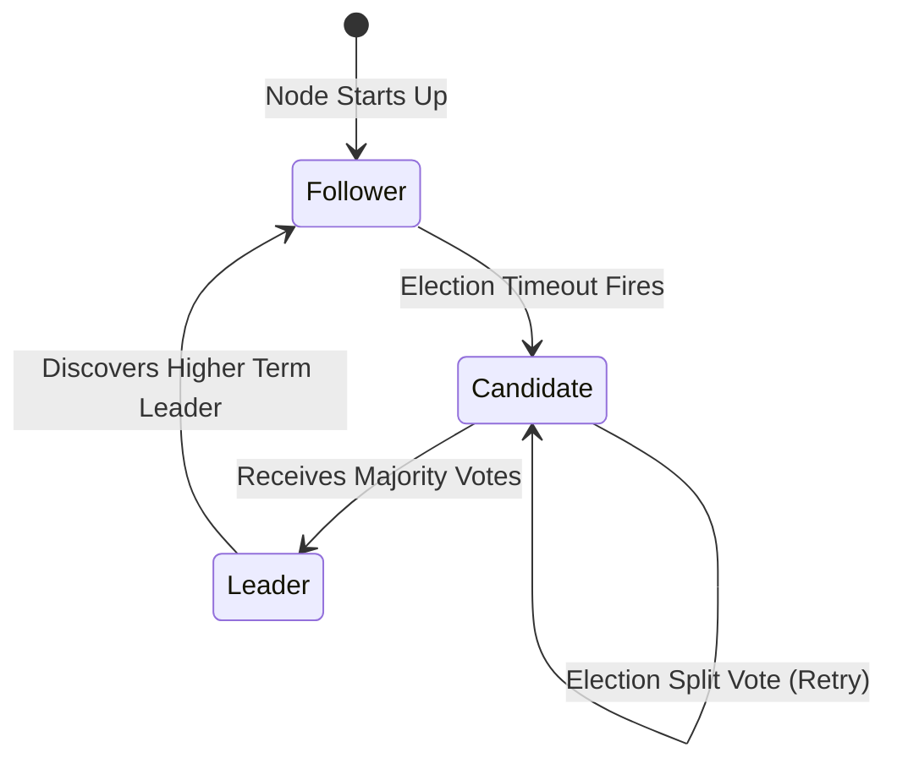

# File 21: Distributed Consensus (Raft and Paxos)

## Overview
**Distributed Consensus** enables a cluster of independent nodes to agree on a single data value or state transition, even in the presence of node crashes or network partitions. **Raft** decomposes consensus into Leader Election, Log Replication, and Safety.

---

## 1. Raft Node States & Leader Election Flow



---

## 2. Simplified Raft Leader Election Concept

```javascript
class RaftNode {
    constructor(id, clusterSize) {
        this.id = id;
        this.clusterSize = clusterSize;
        this.state = "FOLLOWER"; // FOLLOWER, CANDIDATE, LEADER
        this.currentTerm = 0;
        this.votedFor = null;
    }

    startElection() {
        this.state = "CANDIDATE";
        this.currentTerm++;
        this.votedFor = this.id;
        let votesReceived = 1;

        console.log(`[NODE ${this.id}] Started election for Term ${this.currentTerm}`);

        // Majority vote check (quorum = floor(n/2) + 1)
        const quorum = Math.floor(this.clusterSize / 2) + 1;
        if (votesReceived >= quorum) {
            this.state = "LEADER";
            console.log(`[NODE ${this.id}] Elected as LEADER for Term ${this.currentTerm}!`);
        }
    }
}

const node1 = new RaftNode(1, 3);
node1.startElection();
```

---

## Key Takeaways
1. **Raft** organizes consensus into **Leader Election**, **Log Replication**, and **Safety**.
2. Requires a **Quorum Majority** ($N/2 + 1$) to elect leaders and commit log entries.
3. Used in production cluster coordinators like **etcd** (Kubernetes), **Consul**, and **ZooKeeper**.
