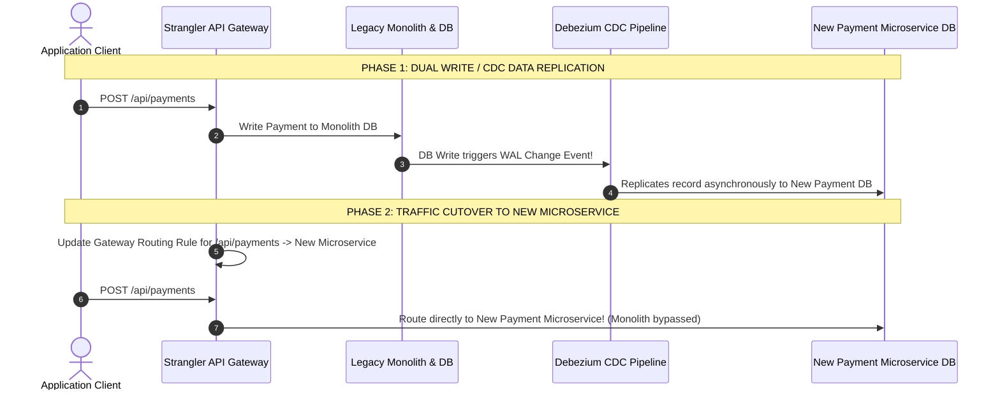

# Module 22: Monolith to Microservices Migration, Strangler Fig Pattern, and Domain-Driven Design (DDD)

## Overview

Migrating a legacy **Monolithic Application** to a **Microservices Architecture** involves decomposing a single unified codebase and shared database into independently deployable, domain-isolated microservices.

Executing a high-risk "Big-Bang Rewrite" frequently results in project failure. Instead, production migrations rely on the **Strangler Fig Pattern**, incrementally intercepting legacy monolithic routes and intercepting traffic to new microservices behind an **API Proxy/Gateway**.

Understanding **Domain-Driven Design (DDD) Bounded Contexts**, **Database-per-Service Extraction**, and **Change Data Capture (CDC)** is essential.

---

## 1. Monolith vs. Microservices Architectural Paradigm Comparison

```mermaid
flowchart TD
    subgraph 1. Monolithic Architecture
        ClientA[Client] --> MonolithApp["Unified Monolithic Codebase<br/>(Order, User, Payment, Inventory Modules in 1 Process)"]
        MonolithApp --> SingleDB[(Single Shared Relational Database)]
    end

    subgraph 2. Microservices Architecture (Bounded Contexts)
        ClientB[Client] --> Gateway[API Gateway]
        Gateway --> OrderSvc[Order Service]
        Gateway --> UserSvc[User Service]
        Gateway --> PaymentSvc[Payment Service]

        OrderSvc --> OrderDB[(Order DB)]
        UserSvc --> UserDB[(User DB)]
        PaymentSvc --> PaymentDB[(Payment DB)]
    end

    style SingleDB fill:#fee2e2,stroke:#dc2626
    style OrderDB fill:#dcfce7,stroke:#15803d
    style UserDB fill:#dcfce7,stroke:#15803d
    style PaymentDB fill:#dcfce7,stroke:#15803d
```

---

## 2. The Strangler Fig Incremental Migration Pattern

The **Strangler Fig Pattern** (named after the Australian strangler fig tree that grows around a host tree until it completely replaces it) places an interceptor proxy in front of the legacy monolith:

```mermaid
flowchart TD
    ClientApp[Client Traffic] --> Proxy["Strangler Interceptor Proxy / API Gateway"]

    Proxy -->|1. Un-migrated Legacy Traffic (/orders, /users)| Monolith["Legacy Monolithic Core"]
    Proxy -->|2. Migrated Intercepted Route (/payments)| NewPaymentSvc["NEW Payment Microservice"]

    Monolith -.->|Change Data Capture (CDC / Debezium)| NewPaymentSvc

    style Proxy fill:#dbeafe,stroke:#1d4ed8
    style NewPaymentSvc fill:#dcfce7,stroke:#15803d
    style Monolith fill:#fef3c7,stroke:#b45309
```

---

## 3. Database Migration Strategy: Database-per-Service & Change Data Capture (CDC)

Decomposing a shared monolithic database into isolated microservice databases without downtime requires a multi-phase synchronization pipeline:



---

## 4. Practical Implementation Showcase: Strangler Gateway Interceptor Router

```javascript
class StranglerGatewayRouter {
  constructor(legacyMonolithUrl) {
    this.legacyMonolithUrl = legacyMonolithUrl;
    this.migratedRouteRegistry = new Map(); // PathPrefix -> TargetMicroserviceUrl
  }

  // Register newly extracted microservice route
  registerMigratedRoute(pathPrefix, targetMicroserviceUrl) {
    this.migratedRouteRegistry.set(pathPrefix, targetMicroserviceUrl);
    console.log(`📌 [MIGRATED ROUTE REGISTERED] '${pathPrefix}' -> ${targetMicroserviceUrl}`);
  }

  // Route incoming request
  interceptAndRoute(requestPath) {
    console.log(`\n🔍 [INCOMING REQUEST] Path: '${requestPath}'`);

    for (const [prefix, serviceUrl] of this.migratedRouteRegistry.entries()) {
      if (requestPath.startsWith(prefix)) {
        console.log(`  ✓ [STRANGLER INTERCEPTED] Routing '${requestPath}' to NEW Microservice at ${serviceUrl}`);
        return { target: serviceUrl, type: "MICROSERVICE" };
      }
    }

    console.log(`  ➔ [FALLBACK TO MONOLITH] Routing '${requestPath}' to Legacy Monolith at ${this.legacyMonolithUrl}`);
    return { target: this.legacyMonolithUrl, type: "MONOLITH" };
  }
}

// Execution Demonstration
const gateway = new StranglerGatewayRouter("http://monolith-legacy.internal:8080");

// Phase 1: All routes go to monolith
gateway.interceptAndRoute("/api/v1/users/101");
gateway.interceptAndRoute("/api/v1/payments/charge");

// Phase 2: Cut over Payments to newly deployed Payment Microservice
gateway.registerMigratedRoute("/api/v1/payments", "http://payment-service.internal:3000");

gateway.interceptAndRoute("/api/v1/users/101");      // Reroutes to Legacy Monolith
gateway.interceptAndRoute("/api/v1/payments/charge"); // Intercepted by New Payment Microservice!
```

---

## Key Production Takeaways

1. **Never Perform Big-Bang Monolith Rewrites**: Always use the **Strangler Fig Pattern** to incrementally extract single domain modules one microservice at a time behind an API Gateway proxy.
2. **Enforce Database-per-Service Ownership**: Never allow multiple microservices to connect directly to the same database tables. Each microservice must strictly encapsulate its own database schema.
3. **Use Domain-Driven Design (DDD) to Define Bounded Contexts**: Identify microservice boundaries by grouping business domain capabilities that change together (e.g. Order Context, Inventory Context) into explicit Bounded Contexts.
4. **Leverage Change Data Capture (CDC) for Sync During Cutover**: Use CDC tools like Debezium and Kafka to replicate database changes from the legacy monolith to new microservice databases during live migration phases.

