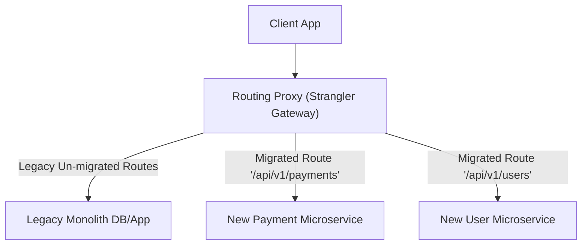

# File 22: Monolith to Microservices (Strangler Fig Pattern)

## Overview
Migrating a legacy **Monolithic Application** to a **Microservices Architecture** involves breaking apart single large codebases into independently deployable, domain-focused services using the **Strangler Fig Pattern**.

---

## 1. Strangler Fig Migration Pattern



---

## 2. Strangler Proxy Routing Concept

```javascript
class StranglerProxyRouter {
    constructor(legacyMonolithUrl) {
        this.legacyUrl = legacyMonolithUrl;
        this.migratedRoutes = new Map();
    }

    registerMicroserviceRoute(pathPrefix, microserviceUrl) {
        this.migratedRoutes.set(pathPrefix, microserviceUrl);
    }

    routeRequest(path) {
        for (const [prefix, serviceUrl] of this.migratedRoutes) {
            if (path.startsWith(prefix)) {
                return `[MICROSERVICE ROUTE] Proxying ${path} to ${serviceUrl}`;
            }
        }
        return `[LEGACY MONOLITH ROUTE] Proxying ${path} to ${this.legacyUrl}`;
    }
}

const proxy = new StranglerProxyRouter("http://monolith-legacy.internal");
proxy.registerMicroserviceRoute("/api/v1/payments", "http://payment-service.internal");

console.log(proxy.routeRequest("/api/v1/orders"));   // Legacy Monolith
console.log(proxy.routeRequest("/api/v1/payments")); // New Microservice!
```

---

## Key Takeaways
1. Use the **Strangler Fig Pattern** to migrate legacy monoliths incrementally without risky big-bang rewrites.
2. Microservices should own their **own dedicated databases** (Database-per-service pattern).
3. Monoliths offer simplicity for small teams; microservices enable independent team deployment velocity at scale.
