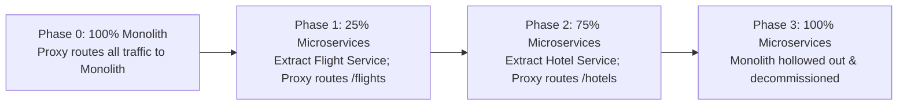

# Module 22: Monolith to Microservices Migration & Strangler Fig Pattern

## Theoretical Overview & Architectural Evolution

A **Monolith** bundles all application features, domain modules, and business logic into a single deployable code artifact and shared database.

A **Microservice Architecture** decomposes an application into loosely coupled, independently deployable services organized around **Domain-Driven Design (DDD) Bounded Contexts**, where each service exclusively owns its data store.

```mermaid
flowchart TD
    subgraph Monolithic Architecture
        Client1["Client Request"] --> API1["Single Monolith Application Core"]
        API1 --> SharedDB[("Shared Monolithic Database")]
    end

    subgraph Microservices Architecture (Strangler Fig Migration)
        Client2["Client Request"] --> Gateway["API Proxy Router (Strangler Fig)"]
        Gateway -->|Route /flights| FlightSvc["Flight Microservice"] --> FlightDB[("Flight DB")]
        Gateway -->|Route /hotels| HotelSvc["Hotel Microservice"] --> HotelDB[("Hotel DB")]
        Gateway -.->|Legacy Route /buses| Monolith["Hollowed Monolith"] --> LegacyDB[("Legacy DB")]
    end
```

### Real-World Case Study: MakeMyTrip Platform Evolution
MakeMyTrip started as a single monolithic application handling flights, hotels, buses, and holidays:
- **Monolith Bottleneck**: A bug fix in hotel pricing required redeploying the entire codebase, risking flight booking outages during holiday peak seasons.
- **Strangler Fig Solution**: MakeMyTrip placed an API Gateway in front of the monolith and incrementally extracted domain services over 18 months until the legacy monolith was hollowed out and safely decommissioned.

---

## 1. Monolith vs. Microservices Architecture Matrix

| Dimension | Monolithic Architecture | Microservices Architecture |
| :--- | :--- | :--- |
| **Deployment Model** | Single artifact (All-or-Nothing). | **Independent service deployments**. |
| **Data Ownership** | Single shared relational database. | **Database Per Service** (Encapsulated storage). |
| **Scaling Profile** | Vertical or full-instance horizontal. | Fine-grained independent horizontal scaling. |
| **Boundary Boundaries** | In-memory package modules. | Out-of-process HTTP/gRPC or Async Events. |
| **Failure Blast Radius** | High (Crash in 1 module brings down entire app).| Low (Failure isolated to single microservice). |

---

## 2. Domain-Driven Design (DDD) & Service Boundaries

Defining wrong service boundaries creates a **Distributed Monolith**—the complexity of distributed systems combined with the tight coupling of a monolith.

```javascript
// Service Boundary Mapping by Bounded Context
const boundedContexts = {
  "Flight Domain": {
    entities: ["Flight", "Seat", "Airline"],
    events: ["FlightBooked", "FlightCancelled"],
  },
  "Hotel Domain": {
    entities: ["Hotel", "Room", "Reservation"],
    events: ["HotelBooked", "HotelCancelled"],
  },
  "Payment Domain": {
    entities: ["Payment", "Refund", "Transaction"],
    events: ["PaymentCompleted", "RefundIssued"],
  },
};
```

> [!RULE]
> **DDD Boundary Rule**: If two modules share no core data entities and communicate exclusively via domain events (`FlightBooked`), they belong in distinct Bounded Contexts.

---

## 3. Strangler Fig Migration Pattern (`StranglerFigMigration`)

The **Strangler Fig Pattern** migrates monolithic applications incrementally by placing a routing proxy in front of legacy systems, peeling off microservices domain by domain without system downtime.



```javascript
class StranglerFigMigration {
  constructor() {
    this.monolith = new MonolithApp();
    this.flightService = new FlightService();
    this.hotelService = new HotelService();
    this.routingTable = { flights: "monolith", hotels: "monolith", buses: "monolith" };
  }

  route(domain, payload) {
    const target = this.routingTable[domain];
    if (target === "microservice") {
      if (domain === "flights") return this.flightService.execute(payload);
      if (domain === "hotels") return this.hotelService.execute(payload);
    }
    // Fallback to legacy monolith
    return this.monolith.execute(domain, payload);
  }

  migrateDomain(domain) {
    this.routingTable[domain] = "microservice"; // Toggle routing dynamically
  }
}
```

---

## 4. Shared Database Anti-Pattern vs. Database Per Service

```mermaid
flowchart TD
    subgraph Anti-Pattern: Shared Database
        ServiceA["Flight Service"] --> SharedDB[("Shared DB: 'bookings' Table")]
        ServiceB["Hotel Service"] --> SharedDB
        Note over SharedDB: Schema change by Team A breaks Team B!
    end

    subgraph Recommended Pattern: Database Per Service
        SvcA["Flight Service"] --> DBA[("Flight DB (PostgreSQL)")]
        SvcB["Hotel Service"] --> DBB[("Hotel DB (MongoDB)")]
        SvcA -.->|Async Event| SvcB
    end
```

### Why Shared Database Fails in Microservices
1. **Tight Coupling**: Schema migrations in one service break independent deployments in sibling services.
2. **Loss of Encapsulation**: Domain entities can be directly mutated by external SQL queries bypassing domain business rules.
3. **No Polyglot Optimizations**: Prevents services from using optimal database paradigms (e.g., MongoDB for document catalogs, Redis for caching).

---

## 5. Inter-Service Communication Patterns

```javascript
class AsyncEventBus {
  constructor() { this.subscribers = {}; }

  subscribe(topic, serviceName, handlerFn) {
    if (!this.subscribers[topic]) this.subscribers[topic] = [];
    this.subscribers[topic].push({ serviceName, handlerFn });
  }

  publish(topic, eventData) {
    (this.subscribers[topic] || []).forEach((sub) => sub.handlerFn(eventData));
  }
}
```

---

## 6. Incremental Migration Roadmap (4-Phase Strategy)

1. **Phase 0: Foundation (Months 1–2)**: Map domain bounded contexts, establish CI/CD automation, and deploy API Gateway routing layer.
2. **Phase 1: First Extraction (Months 3–4)**: Extract the least-coupled domain (e.g., Notifications or User Profiles) with its own database and toggle Gateway routing.
3. **Phase 2: Core Migration (Months 5–12)**: Peeling off primary business domains (Flights, Hotels) using event-driven communication.
4. **Phase 3: Decommissioning (Month 12+)**: Verify 0% traffic hits legacy monolith routes and decommission legacy database infrastructure.

---

## Key Takeaways

1. **Start Monolithic**: Build early applications as monoliths until team size or scaling complexity requires decomposition.
2. **Adopt Strangler Fig**: Never rewrite large production applications from scratch; use the Strangler Fig pattern for zero-downtime incremental migration.
3. **Enforce Database Per Service**: Eliminate shared databases to preserve independent service deployments and domain encapsulation.
4. **Use Async Events for Commands**: Use synchronous REST/gRPC for queries and asynchronous event streams for state mutation commands across services.
