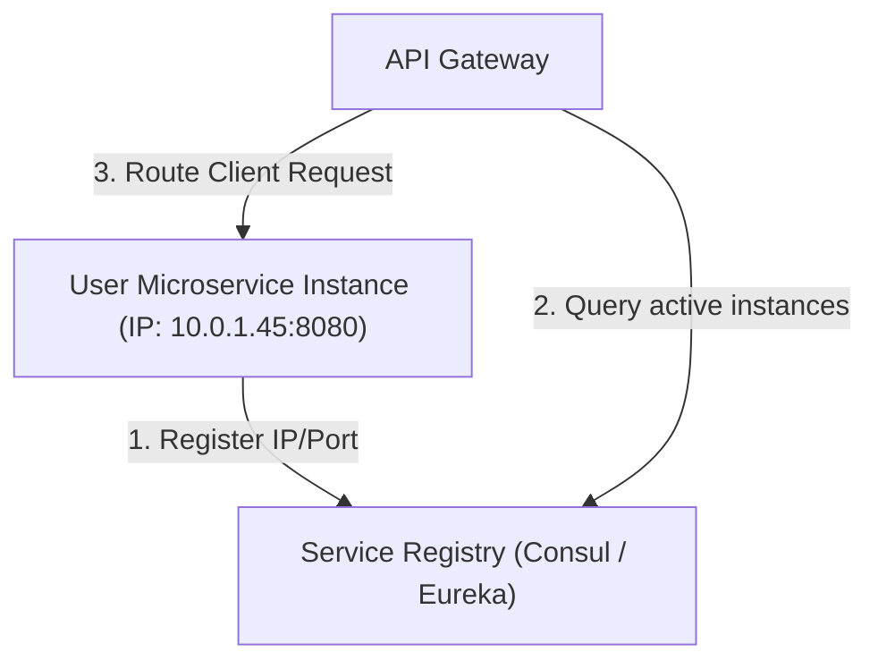

# File 23: API Gateway and Service Discovery

## Overview
In microservices architectures, **Service Discovery** (Eureka, Consul) allows dynamic IP/Port lookup of elastic container instances. The **API Gateway** acts as the single entry point, performing authentication, routing, and load balancing across discovered services.

---

## 1. Dynamic Service Discovery Architecture



---

## 2. Dynamic Service Registry Implementation

```javascript
class ServiceRegistry {
    constructor() {
        this.services = new Map();
    }

    register(serviceName, instanceId, ip, port) {
        if (!this.services.has(serviceName)) {
            this.services.set(serviceName, new Map());
        }
        this.services.get(serviceName).set(instanceId, { ip, port, lastHeartbeat: Date.now() });
        console.log(`[REGISTERED] ${serviceName} -> ${ip}:${port}`);
    }

    discover(serviceName) {
        const instances = this.services.get(serviceName);
        if (!instances || instances.size === 0) return null;

        const active = Array.from(instances.values());
        // Simple Round-Robin Selection
        const selected = active[Math.floor(Math.random() * active.length)];
        return `http://${selected.ip}:${selected.port}`;
    }
}

const registry = new ServiceRegistry();
registry.register("UserService", "inst-1", "10.0.1.10", 8080);
registry.register("UserService", "inst-2", "10.0.1.11", 8080);

console.log("Discovered Endpoint:", registry.discover("UserService"));
```

---

## Key Takeaways
1. **Service Discovery** dynamically registers and resolves IP addresses of auto-scaling container instances.
2. Instances send periodic **Heartbeats** to prevent stale node routing.
3. The **API Gateway** relies on Service Discovery to load balance incoming client requests.
