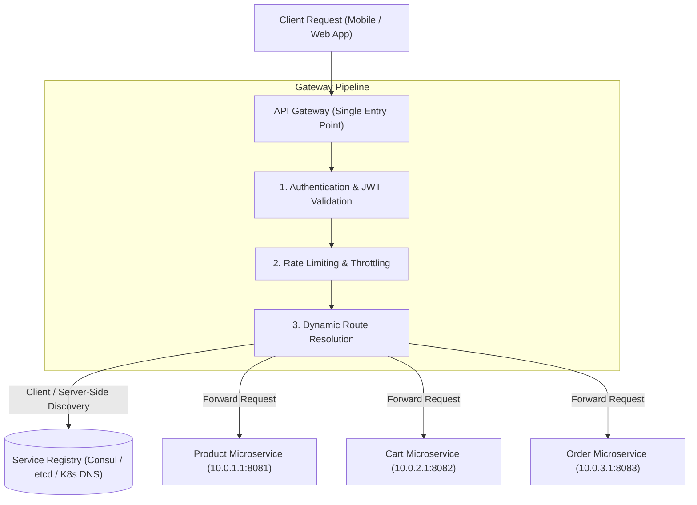

# Module 23: API Gateway Architecture, Service Discovery, & Sidecar Pattern

## Theoretical Overview & Entry Point Architecture

In a microservices architecture, a single user request often requires data from dozens of independent microservices. Rather than forcing client applications (Web, iOS, Android) to track dynamic IP addresses and manage authentication for each microservice, an **API Gateway** acts as the single unified entry point.



### Real-World Case Study: JioMart E-Commerce Platform
JioMart handles millions of daily grocery orders across thousands of product categories:
- **API Gateway (Mall Entrance)**: Validates customer JWT identity, enforces rate limits during flash sales, and routes requests to backend services.
- **Service Registry (Mall Directory)**: Dynamic directory (e.g., Consul / K8s DNS) tracking live IP addresses of auto-scaled catalog, cart, and payment instances.

---

## 1. Discovery Patterns Comparison Matrix

| Discovery Paradigm | Mechanics | Pros | Cons | Popular Frameworks |
| :--- | :--- | :--- | :--- | :--- |
| **Client-Side Discovery** | Client queries Registry directly and load balances locally. | Zero extra network hops. | Discovery logic duplicated in every client SDK. | Netflix Eureka, Ribbon. |
| **Server-Side Discovery** | Router / Load Balancer queries Registry and forwards request. | Client remains simple & un-coupled. | Extra network hop; LB is SPOF bottleneck. | AWS ALB, NGINX, Kubernetes ClusterIP. |
| **Sidecar Pattern (Mesh)**| Local sidecar proxy (Envoy) handles discovery & mTLS. | Transparent to application code; cross-language. | Memory & CPU overhead per pod. | Istio (Envoy), Linkerd, Consul Connect. |

---

## 2. Core Implementations & Code Models

### 1. API Gateway Engine with Middleware (`APIGateway`)
```javascript
class APIGateway {
  constructor() {
    this.routes = {};
    this.middleware = [];
    this.rateLimits = {};
  }

  registerRoute(pathPrefix, targetService) { this.routes[pathPrefix] = targetService; }

  addMiddleware(name, fn) { this.middleware.push({ name, fn }); }

  handle(req) {
    // 1. Execute Middleware Pipeline (Auth, Rate Limit)
    for (const mw of this.middleware) {
      const res = mw.fn(req, this);
      if (!res.pass) return { status: res.status, reason: res.reason };
    }

    // 2. Resolve Dynamic Path Route
    const route = Object.keys(this.routes).find((r) => req.path.startsWith(r));
    if (!route) return { status: 404, error: "Route Not Found" };

    const targetService = this.routes[route];
    return { status: 200, body: `Routed to ${targetService.name}` };
  }
}
```

### 2. Dynamic Service Registry (`ServiceRegistry`)
Tracks active service instances via heartbeats and evicts stale instances:

```javascript
class ServiceRegistry {
  constructor() { this.services = {}; }

  register(serviceName, instanceId, host, port, metadata = {}) {
    if (!this.services[serviceName]) this.services[serviceName] = [];
    this.services[serviceName].push({
      id: instanceId,
      host,
      port,
      metadata,
      status: "UP",
      lastHeartbeat: Date.now(),
    });
  }

  deregister(serviceName, instanceId) {
    if (this.services[serviceName]) {
      this.services[serviceName] = this.services[serviceName].filter((i) => i.id !== instanceId);
    }
  }

  getInstances(serviceName) {
    return (this.services[serviceName] || []).filter((i) => i.status === "UP");
  }

  evictStale(maxAgeMs) {
    const now = Date.now();
    for (const instances of Object.values(this.services)) {
      instances.forEach((inst) => {
        if (now - inst.lastHeartbeat > maxAgeMs) inst.status = "DOWN";
      });
    }
  }
}
```

---

## 3. Client-Side vs. Server-Side Service Discovery

```javascript
// Client-Side Discovery Implementation
class ClientDiscovery {
  constructor(registry) {
    this.registry = registry;
    this.rrIndex = {};
  }

  discover(serviceName) {
    const instances = this.registry.getInstances(serviceName);
    if (!instances.length) return null;
    
    // Client-side Round-Robin selection
    if (!this.rrIndex[serviceName]) this.rrIndex[serviceName] = 0;
    return instances[this.rrIndex[serviceName]++ % instances.length];
  }
}

// Server-Side Discovery Implementation
class ServerSideLB {
  constructor(registry) { this.registry = registry; this.rrIndex = {}; }

  route(serviceName) {
    const instances = this.registry.getInstances(serviceName);
    if (!instances.length) return { status: 503 };
    
    if (!this.rrIndex[serviceName]) this.rrIndex[serviceName] = 0;
    const target = instances[this.rrIndex[serviceName]++ % instances.length];
    return { status: 200, targetHost: `${target.host}:${target.port}` };
  }
}
```

---

## 4. The Sidecar Pattern & Service Mesh Architecture

In a **Service Mesh** (e.g., Istio / Envoy), every microservice instance is paired with a lightweight **Sidecar Proxy**. Outbound calls pass through the local sidecar, offloading cross-cutting concerns from application code:

```mermaid
flowchart LR
    subgraph Pod 1 (Cart Service)
        App1["Cart Application Code"] -->|Localhost call| Sidecar1["Envoy Sidecar Proxy"]
    end

    subgraph Pod 2 (Product Service)
        Sidecar2["Envoy Sidecar Proxy"] -->|Localhost call| App2["Product Application Code"]
    end

    Sidecar1 -->|mTLS Encrypted Link + Discovery| Sidecar2
```

```javascript
class SidecarProxy {
  constructor(instanceId, registry) {
    this.instanceId = instanceId;
    this.registry = registry;
  }

  intercept(targetService, request) {
    const instances = this.registry.getInstances(targetService);
    if (!instances.length) return { status: 503, error: "Service Unavailable" };
    
    // Transparently handles dynamic routing, mTLS encryption, and retries
    const target = instances[0];
    return { status: 200, routedTo: `${target.host}:${target.port}${request.path}` };
  }
}
```

---

## 5. Advanced API Gateway Architecture Patterns

1. **Backend for Frontend (BFF)**: Deploy separate optimized gateway instances tailored for specific client types (e.g., Mobile BFF vs Web BFF vs Third-Party Partner BFF).
2. **Request Aggregation**: The Gateway calls multiple downstream services in parallel and merges the responses into a single combined payload.
3. **Edge Authentication**: Validate OAuth2/JWT tokens at the Gateway edge, passing verified user claims (`X-User-Id`, `X-User-Roles`) to downstream microservices.

---

## Key Takeaways

1. **Unify Entry Points via API Gateways**: Offload authentication, rate limiting, and path routing to an API Gateway.
2. **Dynamic Registries Enable Auto-scaling**: Use Service Registries (Consul, etcd, K8s DNS) to track ephemeral IP addresses of auto-scaled instances.
3. **Offload Networking to Sidecars**: Use Sidecar Proxies (Envoy / Istio) to handle service discovery, mTLS encryption, and retries transparently.
4. **Tailor Gateways with BFF**: Implement Backend for Frontend (BFF) gateways to provide lightweight payloads for mobile clients and rich payloads for desktop web apps.
