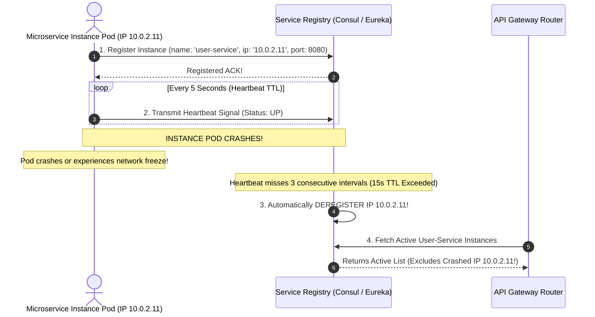

# Module 23: API Gateway Architecture, Dynamic Service Discovery, and BFF Patterns

## Overview

In microservices architectures, container instances scale up and down dynamically, assigning ephemeral IP addresses on cloud infrastructure (Kubernetes, AWS ECS). **Service Discovery** provides dynamic IP/Port location resolution without hardcoding static backend IP configurations.

The **API Gateway** acts as the single entry point for external client traffic, offloading cross-cutting concerns (**JWT Authentication, SSL Termination, Rate Limiting, Request Routing, Response Aggregation**) and coordinating with the Service Registry.

Understanding **Client-Side vs. Server-Side Service Discovery**, **Heartbeat Health Probes**, and the **Backend-For-Frontend (BFF)** pattern is essential.

---

## 1. API Gateway Cross-Cutting Concerns Pipeline

```mermaid
flowchart TD
    Client[Mobile / Web Client] --> HTTPS[HTTPS Request]
    
    subgraph API Gateway Responsibilities Pipeline
        HTTPS --> SSLTerm[1. SSL/TLS Termination]
        SSLTerm --> Auth[2. JWT Authentication & Scope Verification]
        Auth --> RateLimit[3. Rate Limiting Guard (Redis Lua)]
        RateLimit --> Discover[4. Service Registry Discovery Lookup]
        Discover --> Route[5. Load Balanced Proxy Routing]
    end

    Route -->|Proxied Request| TargetSvc[Discovered Microservice Instance]

    style API Gateway Responsibilities Pipeline fill:#dbeafe,stroke:#1d4ed8
    style TargetSvc fill:#dcfce7,stroke:#15803d
```

---

## 2. Client-Side vs. Server-Side Service Discovery Topologies

```mermaid
flowchart TD
    subgraph 1. Client-Side Service Discovery (Eureka / Spring Cloud)
        Client1[Microservice A Client] -->|1. Query Registry| Reg1[(Service Registry)]
        Reg1 -- "2. Return IP List" --> Client1
        Client1 -->|3. Load Balance Locally| Inst1["Microservice B Instance (10.0.1.45)"]
    end

    subgraph 2. Server-Side Service Discovery (Kubernetes CoreDNS / AWS ALB)
        Client2[Microservice A Client] -->|1. Call Virtual Name 'user-service'| LB[AWS ALB / K8s Service Router]
        LB -->|2. Query Registry| Reg2[(K8s CoreDNS Registry)]
        LB -->|3. Proxy Request| Inst2["Microservice B Instance (10.0.1.45)"]
    end

    style Reg1 fill:#dcfce7,stroke:#15803d
    style Reg2 fill:#dbeafe,stroke:#1d4ed8
```

### Discovery Topology Comparison Matrix

| Discovery Pattern | Routing Component | Registry Integration | Primary Advantage | Primary Drawback | Production Examples |
| :--- | :--- | :--- | :--- | :--- | :--- |
| **Client-Side Discovery** | Client SDK | Direct Registry API query | Zero intermediate load balancer hop | Language-specific SDK lock-in | Netflix Eureka, HashiCorp Consul SDK |
| **Server-Side Discovery** | Load Balancer / Proxy | Transparent DNS / Router | Platform agnostic; Zero client SDK code | Extra network hop through Load Balancer | Kubernetes CoreDNS, AWS ALB, NGINX |

---

## 3. Dynamic Service Registry & Heartbeat Deregistration Flow



---

## 4. Practical Implementation Showcase: Dynamic Service Registry & Router

```javascript
class ServiceRegistryEngine {
  constructor(heartbeatTtlMs = 10000) {
    this.registry = new Map(); // ServiceName -> Map<InstanceId, InstanceMeta>
    this.heartbeatTtlMs = heartbeatTtlMs;
  }

  // Register or Update Service Instance
  registerInstance(serviceName, instanceId, ip, port) {
    if (!this.registry.has(serviceName)) {
      this.registry.set(serviceName, new Map());
    }

    const instanceMeta = {
      instanceId,
      ip,
      port,
      lastHeartbeat: Date.now()
    };

    this.registry.get(serviceName).set(instanceId, instanceMeta);
    console.log(`📌 [REGISTERED] Service '${serviceName}' Instance ${instanceId} -> http://${ip}:${port}`);
  }

  // Record Client Heartbeat
  sendHeartbeat(serviceName, instanceId) {
    const serviceInstances = this.registry.get(serviceName);
    if (serviceInstances && serviceInstances.has(instanceId)) {
      const instance = serviceInstances.get(instanceId);
      instance.lastHeartbeat = Date.now();
      console.log(`  ❤️ [HEARTBEAT ACK] '${serviceName}' Instance ${instanceId}`);
    }
  }

  // Discover Active Un-expired Instance (Round-Robin Selection)
  discoverInstance(serviceName) {
    const serviceInstances = this.registry.get(serviceName);
    if (!serviceInstances || serviceInstances.size === 0) return null;

    const now = Date.now();
    const activeInstances = [];

    // Filter healthy instances within Heartbeat TTL
    for (const [id, meta] of serviceInstances.entries()) {
      if (now - meta.lastHeartbeat <= this.heartbeatTtlMs) {
        activeInstances.push(meta);
      } else {
        console.warn(`  ☠ [STALE EVICTION] Evicting dead instance '${id}' (Missed Heartbeat)`);
        serviceInstances.delete(id);
      }
    }

    if (activeInstances.length === 0) return null;

    // Load Balance Selection
    const selected = activeInstances[Math.floor(Math.random() * activeInstances.length)];
    return `http://${selected.ip}:${selected.port}`;
  }
}

// Execution Demonstration
async function runRegistryDemo() {
  const registry = new ServiceRegistryEngine(3000); // 3-second Heartbeat TTL

  // Register 2 instances of OrderService
  registry.registerInstance("OrderService", "inst_01", "10.0.1.15", 8080);
  registry.registerInstance("OrderService", "inst_02", "10.0.1.16", 8080);

  // Discover endpoint
  console.log("Discovered Endpoint:", registry.discoverInstance("OrderService"));

  // Keep inst_01 alive, let inst_02 crash
  await new Promise((r) => setTimeout(r, 1500));
  registry.sendHeartbeat("OrderService", "inst_01");

  // Fast forward past TTL to trigger eviction of dead inst_02
  await new Promise((r) => setTimeout(r, 2000));
  console.log("Discovered Endpoint Post-Eviction:", registry.discoverInstance("OrderService"));
}

runRegistryDemo();
```

---

## Key Production Takeaways

1. **Use Server-Side Discovery with Kubernetes CoreDNS**: Prefer Server-Side Service Discovery built into cloud orchestrators (Kubernetes DNS / AWS Service Connect) to avoid tying client applications to language-specific registry SDKs.
2. **Centralize Cross-Cutting Concerns at the API Gateway**: Offload JWT validation, TLS termination, CORS policy enforcement, and IP rate limiting to the API Gateway layer (Kong, Envoy, NGINX, AWS API Gateway).
3. **Use Backend-For-Frontend (BFF) Layers for Mobile/Web Client Specialization**: Implement dedicated BFF microservices for iOS, Android, and Desktop Web clients to aggregate multiple downstream microservice calls into single tailored API responses.
4. **Enforce Dynamic Heartbeat TTL Eviction**: Configure short TTL intervals (5-10 seconds) on service registries so crashed container instances are pruned immediately from load balancer targets.

