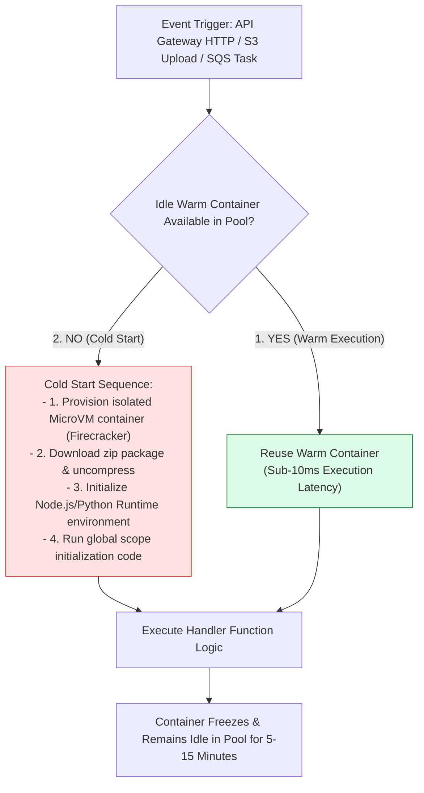
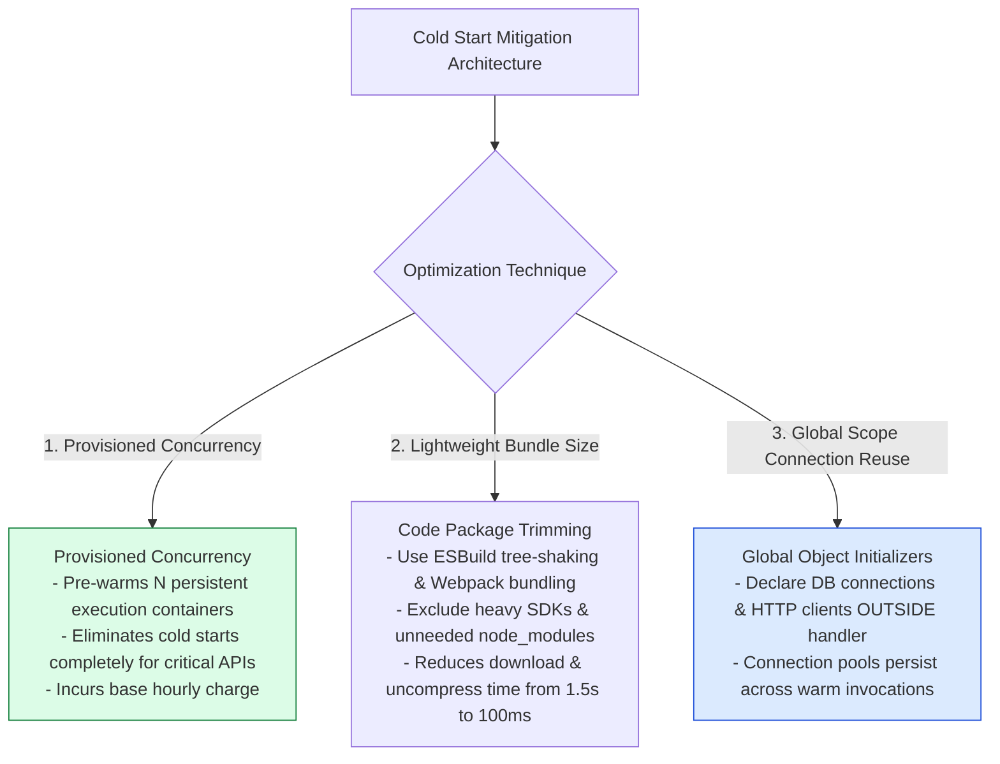

# Module 24: Serverless Computing, Functions-as-a-Service (FaaS), and Cold Start Mitigations

## Overview

**Serverless Computing (FaaS - Functions-as-a-Service)** (AWS Lambda, Google Cloud Functions, Azure Functions) allows developers to execute code containers on-demand triggered by events without provisioning, patching, or managing server infrastructure.

Serverless platforms scale automatically from zero to tens of thousands of concurrent execution containers, shifting billing from idle server instances to exact execution duration measured in milliseconds ($\text{Gigabyte-Seconds}$).

Understanding **Cold Start vs. Warm Container Lifecycles**, **Provisioned Concurrency**, **Stateless Execution Constraints**, and **Externalized State Stores (DynamoDB / ElastiCache)** is essential.

---

## 1. FaaS Container Lifecycle: Cold Start vs. Warm Execution



---

## 2. Serverless vs. Always-On Container Provisioning Comparison

```mermaid
flowchart TD
    subgraph 1. Serverless FaaS (AWS Lambda)
        S_Load[Zero Traffic] -->|Scales to Zero| S_Cost0["$0 / month Billing!"]
        S_Load2[Burst 10k Traffic] -->|Instant MicroVM Auto-Scale| S_Scale10k["10,000 Parallel Execution Containers"]
    end

    subgraph 2. Provisioned EC2 / Kubernetes Cluster
        K_Load[Zero Traffic] -->|Fixed Pod Pool| K_CostFixed["Fixed $500/month Instance Cost"]
        K_Load2[Burst 10k Traffic] -->|HPA Auto-scaling Delay| K_Lag["2-5 Min Cluster Node Provisioning Lag"]
    end

    style S_Cost0 fill:#dcfce7,stroke:#15803d
    style K_CostFixed fill:#fef3c7,stroke:#b45309
```

### Serverless FaaS vs. Dedicated Server Instance Matrix

| Metric / Property | Serverless FaaS (AWS Lambda) | Dedicated Server / K8s (EC2 / EKS) |
| :--- | :--- | :--- |
| **Billing Model** | Pay per exact execution ms ($\text{GB-sec}$) | Fixed hourly instance cost (Idle capacity charged) |
| **Scaling Velocity** | Sub-second scale to thousands of containers | 1-5 minute container / node autoscaling lag |
| **Scale-to-Zero?** | **Yes** ($0 cost during complete idle) | No (Base instance cost always incurred) |
| **Maximum Execution Duration**| Hard 15-minute execution limit | Unlimited continuous background execution |
| **State Management** | **Must be strictly stateless** | Can retain state in server RAM across requests |

---

## 3. Cold Start Mitigation Strategies Architecture



---

## 4. Practical Implementation Showcase: Serverless Function with Connection Reuse & Handler

```javascript
// GLOBAL SCOPE INITIALIZATION (Executed ONCE during Cold Start!)
console.log("❄️ [COLD START] Initializing global runtime & database connection pool...");
const globalDatabasePool = new Map([
  ["user_101", { id: "user_101", name: "Ananya Roy", balance: 4500 }]
]);

// AWS Lambda / FaaS Standard Handler Entry Point
exports.handler = async (event, context) => {
  const invocationStart = Date.now();
  console.log(`\n▶ [LAMBDA INVOCATION] Request ID: ${context.awsRequestId}`);

  try {
    const httpMethod = event.httpMethod || "GET";
    const userId = event.queryStringParameters?.userId || "user_101";

    if (httpMethod === "GET") {
      // Re-use warm database connection pool initialized in global scope!
      const user = globalDatabasePool.get(userId);

      if (!user) {
        return {
          statusCode: 404,
          headers: { "Content-Type": "application/json" },
          body: JSON.stringify({ error: "User not found" })
        };
      }

      return {
        statusCode: 200,
        headers: {
          "Content-Type": "application/json",
          "X-Execution-Time-Ms": String(Date.now() - invocationStart)
        },
        body: JSON.stringify({
          success: true,
          data: user,
          executionMode: context.isWarm ? "WARM_CONTAINER" : "COLD_START"
        })
      };
    }

    return {
      statusCode: 405,
      body: JSON.stringify({ error: "Method Not Allowed" })
    };
  } catch (err) {
    console.error("✖ [HANDLER ERROR]", err);
    return {
      statusCode: 500,
      body: JSON.stringify({ error: "Internal Server Error" })
    };
  }
};

// Execution Simulation
const mockContext = { awsRequestId: "req_99812", isWarm: true };
const mockEvent = { httpMethod: "GET", queryStringParameters: { userId: "user_101" } };

exports.handler(mockEvent, mockContext).then((response) => {
  console.log("Serverless Function Response:", response);
});
```

---

## Key Production Takeaways

1. **Initialize Heavy DB Clients in the Global Scope**: Declare database connection pools, AWS SDK clients, and Redis connections outside the function handler function to reuse them across warm container invocations.
2. **Use Provisioned Concurrency for Latency-Sensitive Endpoints**: Enable Provisioned Concurrency on critical user-facing API routes to eliminate cold start spikes for key business transactions.
3. **Keep Serverless Function Bundles Lean**: Minimize deployment package zip sizes using tree-shaking tools (esbuild / Webpack) to shorten container download and initialization latencies.
4. **Enforce Strict Idempotency & Statelessness**: Never store session or application state in local container disk/memory. Serverless containers can be torn down at any moment; store state externally in Redis or DynamoDB.

