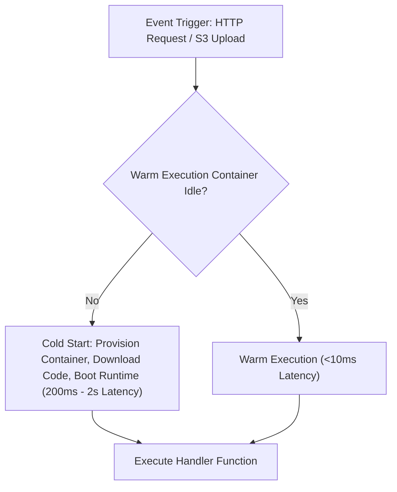

# File 24: Serverless Computing and Event-Driven Functions (FaaS)

## Overview
**Serverless Computing (FaaS - Functions as a Service)** like AWS Lambda or Cloud Functions allows running event-driven code execution containers on-demand without provisioning or managing underlying server infrastructure, scaling automatically from zero to thousands of concurrent executions.

---

## 1. Serverless Cold Start vs Warm Execution Lifecycle



---

## 2. Serverless Function Handler Implementation

```javascript
// AWS Lambda Function Handler Signature
exports.handler = async (event, context) => {
    console.log("Event Received:", JSON.stringify(event));

    const { httpMethod, queryStringParameters } = event;

    if (httpMethod === "GET") {
        return {
            statusCode: 200,
            headers: { "Content-Type": "application/json" },
            body: JSON.stringify({
                message: "Hello from Serverless Function!",
                query: queryStringParameters
            })
        };
    }

    return {
        statusCode: 400,
        body: JSON.stringify({ error: "Unsupported method" })
    };
};
```

---

## Key Takeaways
1. **Pay-per-use billing**: You pay only for exact execution duration (milliseconds).
2. Beware of **Cold Starts** when provisioning new execution containers.
3. Keep serverless functions **stateless** and lightweight.
