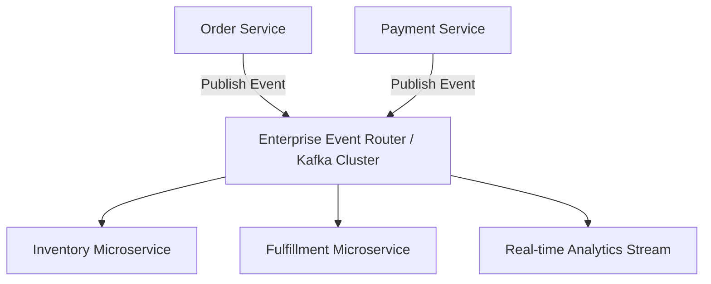

# File 25: Event-Driven Architecture (EDA) Enterprise Patterns

## Overview
**Event-Driven Architecture (EDA)** is an enterprise architectural pattern where decoupled software components produce, detect, consume, and react to domain events. EDA relies on event routers, event logs (Kafka), and event-driven microservices.

---

## 1. Enterprise Event Mesh Architecture



---

## 2. Event Dispatcher & Reaction Pipeline

```javascript
class EnterpriseEventBus {
    constructor() {
        this.handlers = new Map();
    }

    subscribe(eventType, handler) {
        if (!this.handlers.has(eventType)) this.handlers.set(eventType, []);
        this.handlers.get(eventType).push(handler);
    }

    async emit(event) {
        console.log(`[EVENT MESH EMIT] ${event.type}`, event);
        const list = this.handlers.get(event.type) || [];
        await Promise.all(list.map(fn => fn(event)));
    }
}

const eventMesh = new EnterpriseEventBus();

eventMesh.subscribe("ORDER_SHIPPED", async event => {
    console.log(`[SMS NOTIFICATION] Sent tracking SMS for order ${event.orderId}`);
});

eventMesh.emit({ type: "ORDER_SHIPPED", orderId: "ORD_994", trackingNo: "TRACK_123" });
```

---

## Key Takeaways
1. **EDA** provides maximum agility, reactivity, and component isolation.
2. Domain events describe **facts that occurred in the past** (e.g. `OrderPlaced`, `PaymentProcessed`).
3. Ensures seamless system scalability for high-throughput enterprise platforms.
