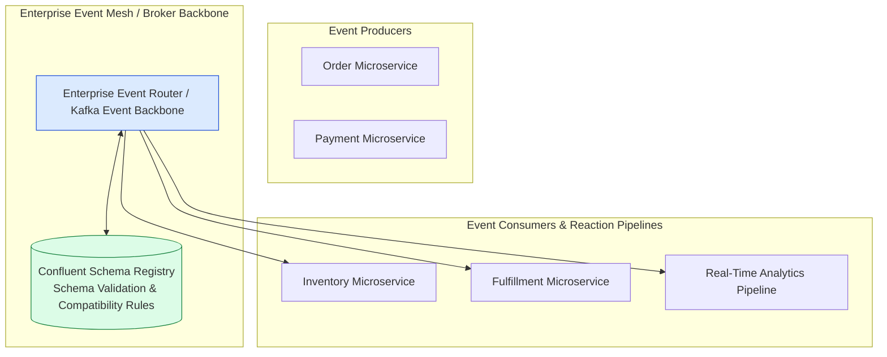
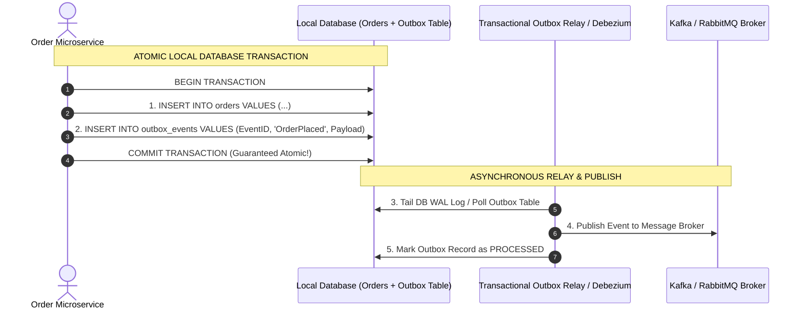
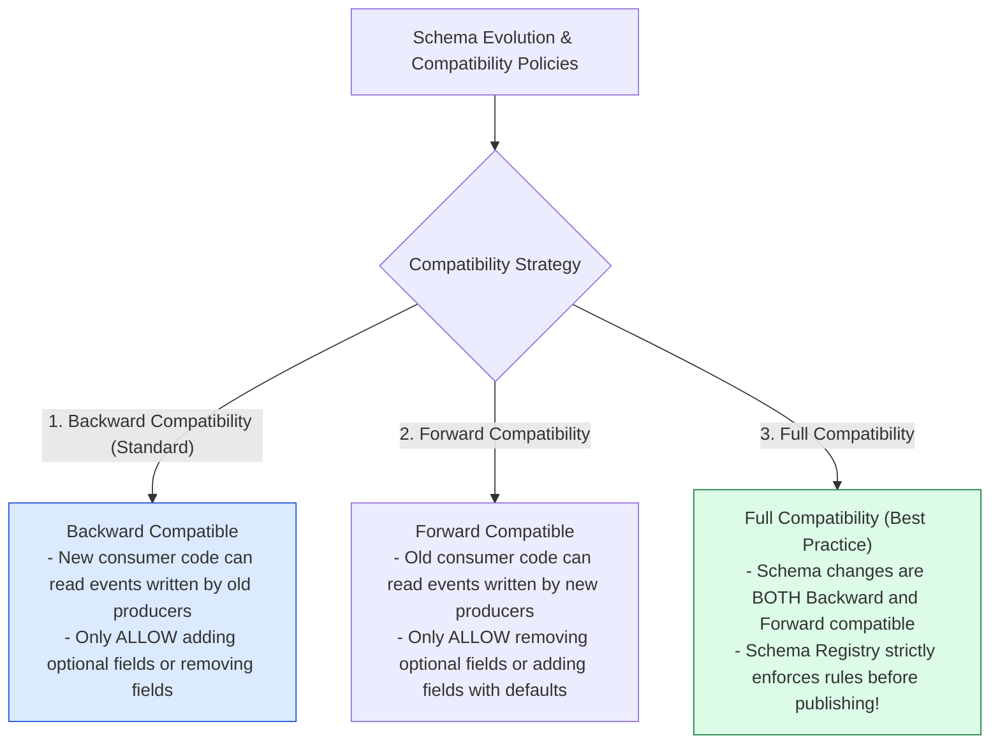

# Module 25: Enterprise Event-Driven Architecture (EDA), Transactional Outbox, and Schema Registries

## Overview

**Event-Driven Architecture (EDA)** is an enterprise architectural pattern where software components communicate asynchronously by producing, detecting, consuming, and reacting to domain events (`OrderPlaced`, `PaymentFailed`, `ShipmentDispatched`).

Building resilient enterprise EDA platforms requires solving major distributed systems challenges: **Dual Write Bugs (Database + Message Broker Consistency)**, **Schema Evolution & Versioning**, and **Event Ordering & Deduplication**.

Understanding the **Transactional Outbox Pattern**, **Schema Registries (Confluent Schema Registry / Avro)**, and **Enterprise Event Mesh Topology** is essential.

---

## 1. Enterprise Event Mesh Architecture Topology



---

## 2. The Dual-Write Problem & Transactional Outbox Pattern

When an application writes to a local database AND publishes an event to a message broker in a single API call, a crash midway leaves the system in an inconsistent state (**Dual-Write Bug**).

The **Transactional Outbox Pattern** solves this by writing the domain entity and an outbox record inside the **same local database transaction**, followed by an asynchronous CDC Relay tailing the WAL log:



---

## 3. Schema Evolution & Versioning Rules



---

## 4. Practical Implementation Showcase: Transactional Outbox Pattern Engine

```javascript
class TransactionalOutboxManager {
  constructor() {
    this.databaseTables = {
      orders: new Map(),
      outbox_events: new Map()
    };
    this.publishedBrokerEvents = [];
  }

  // Atomic Local DB Transaction (Order Creation + Outbox Event Entry)
  async createOrderTransactional(orderId, orderDetails) {
    console.log(`\n🔒 [BEGIN LOCAL DB TRANSACTION] Creating Order #${orderId}`);

    try {
      // Step 1: Write Order Entity
      this.databaseTables.orders.set(orderId, { ...orderDetails, status: "CREATED" });

      // Step 2: Write Outbox Event Record in SAME Transaction!
      const outboxId = `outbox_${Date.now()}_${Math.floor(Math.random() * 1000)}`;
      const outboxRecord = {
        outboxId,
        aggregateType: "ORDER",
        aggregateId: orderId,
        eventType: "ORDER_CREATED",
        payload: JSON.stringify({ orderId, ...orderDetails }),
        processed: false,
        createdAt: new Date().toISOString()
      };
      this.databaseTables.outbox_events.set(outboxId, outboxRecord);

      console.log(`  ✓ [DB COMMIT SUCCESS] Order #${orderId} & Outbox Event #${outboxId} written atomically!`);
      return { success: true, orderId, outboxId };
    } catch (err) {
      console.error("  ✖ [DB ROLLBACK] Transaction failed:", err.message);
      throw err;
    }
  }

  // Outbox Relay Processor (Tails outbox table & publishes to broker)
  async runOutboxRelayProcessor() {
    console.log("\n🔄 [OUTBOX RELAY RUNNING] Polling un-processed outbox events...");
    
    for (const [id, record] of this.databaseTables.outbox_events.entries()) {
      if (!record.processed) {
        console.log(`  📢 [PUBLISHING TO BROKER] Event '${record.eventType}' for Aggregate ${record.aggregateId}`);
        
        // Deliver to Broker
        this.publishedBrokerEvents.push({
          topic: record.eventType.toLowerCase(),
          payload: JSON.parse(record.payload)
        });

        // Mark Outbox Record as Processed
        record.processed = true;
        console.log(`  ✓ [OUTBOX UPDATED] Record ${id} marked as PROCESSED.`);
      }
    }
  }
}

// Execution Demonstration
async function runOutboxDemo() {
  const manager = new TransactionalOutboxManager();

  // 1. Client creates order via atomic transaction
  await manager.createOrderTransactional("ORD_8801", { customerId: "user_77", total: 499.00 });

  // 2. Outbox Relay worker polls and publishes outbox events safely
  await manager.runOutboxRelayProcessor();

  console.log("\nPublished Broker Events:", manager.publishedBrokerEvents);
}

runOutboxDemo();
```

---

## Key Production Takeaways

1. **Always Use the Transactional Outbox Pattern**: Never make separate un-transactional network calls to both a database and a message broker in an API handler. Use the Outbox Pattern or Change Data Capture (Debezium) to ensure atomic event publishing.
2. **Enforce Schema Registry Validation**: Integrate Schema Registries (Avro/Protobuf with Confluent Schema Registry) into deployment pipelines to block breaking event schema changes before they hit production brokers.
3. **Design Events as Immutable Historical Facts**: Treat domain events as immutable facts named in the past tense (`OrderPlaced`, `InvoicePaid`, `AccountDeactivated`).
4. **Enforce Deduplication Identifiers at Consumers**: Include a unique `eventId` or `idempotencyKey` in event headers so downstream consumer services can detect and discard duplicate events.

