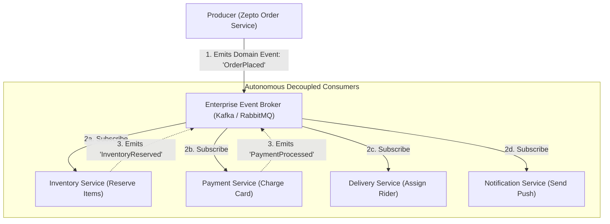
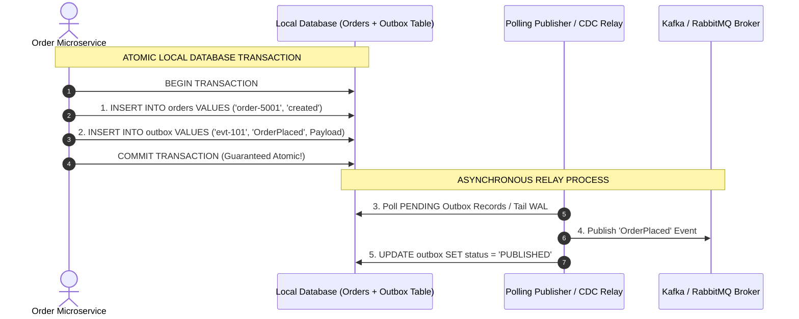

# Module 25: Event-Driven Architecture (EDA), Transactional Outbox, & Idempotence

## Theoretical Overview & Reactive Systems Paradigm

**Event-Driven Architecture (EDA)** is an enterprise architectural pattern where microservices communicate asynchronously by producing, emitting, detecting, and consuming immutable **Domain Events** (`OrderPlaced`, `PaymentProcessed`, `DeliveryAssigned`).



### Real-World Case Study: Zepto 10-Minute Grocery Delivery
A customer tap on Zepto initiates an ultra-fast grocery delivery workflow:
- **Synchronous Monolith Flaw**: Order API calls Inventory, Payment, Rider Assignment, and Push Notifications sequentially. If the SMS gateway takes 5 seconds, the 10-minute SLA is breached.
- **Event-Driven Solution**: Order API persists the order and emits `OrderPlaced`. Inventory, Payment, and Rider Allocation services process the event **concurrently**, reducing total processing overhead to under 100 milliseconds.

---

## 1. Domain Event Design Standards (`DomainEvent`)

Domain Events are immutable facts recording actions that have already occurred in the business domain.

```javascript
class DomainEvent {
  constructor(type, aggregateId, data, source = "unknown") {
    this.eventId = `evt-${Date.now()}-${Math.floor(Math.random() * 10000)}`;
    this.type = type; // Past-Tense Naming (e.g. "OrderPlaced")
    this.aggregateId = aggregateId;
    this.data = data; // Context-rich payload
    this.metadata = {
      timestamp: new Date().toISOString(),
      version: 1,
      source,
      correlationId: `corr-${Date.now()}`, // End-to-end tracing ID
    };
  }
}
```

### 5 Rules of Enterprise Domain Event Design
1. **Past-Tense Naming**: Name events in the past tense (`OrderPlaced`, `PaymentFailed`), never as imperative commands (`PlaceOrder`).
2. **Context-Rich Payload**: Include sufficient data so consumers can fulfill business logic without executing synchronous callback queries to the producer.
3. **Strict Immutability**: Events represent historical facts and must never be altered or mutated after creation.
4. **Schema Versioning**: Always include schema version headers (`version: 1`) to support forward/backward compatibility.
5. **Correlation & Causality IDs**: Pass `correlationId` headers across event boundaries for distributed tracing.

---

## 2. Choreography vs. Orchestration Patterns

| Aspect | Choreography (Event Bus) | Orchestration (State Machine) |
| :--- | :--- | :--- |
| **Control Model** | **Decentralized**: Each service listens & reacts. | **Centralized**: Orchestrator directs each step. |
| **Coupling** | **Ultra-Loose**: Services know only event schemas. | Moderate: Orchestrator knows all participating services. |
| **Workflow Visibility**| Harder to trace complex multi-step flows. | **Clear Visibility** in central state machine. |
| **Error Handling** | Distributed compensating event chains. | Centralized compensating saga logic. |
| **Best Used For** | Cross-domain broadcasting (Order $\to$ Marketing). | Critical multi-step workflows (Payment $\to$ Inventory). |

---

## 3. The Dual-Write Problem & Transactional Outbox Pattern

Updating a local database AND publishing an event to a message broker in a single API call creates the **Dual-Write Bug**—if the broker crashes after the database commit, the event is lost forever.

The **Transactional Outbox Pattern** writes the domain entity AND an outbox record inside the **same local database transaction**, followed by an asynchronous Outbox Relay:



```javascript
class OutboxService {
  constructor(name) {
    this.db = { orders: [], outbox: [] };
    this.nextId = 1;
  }

  createOrderTransactional(data) {
    // Local Atomic Transaction
    const order = { id: `order-${this.nextId++}`, ...data, status: "created" };
    this.db.orders.push(order);

    const outboxEntry = {
      id: `ob-${Date.now()}`,
      eventType: "OrderPlaced",
      aggregateId: order.id,
      payload: JSON.stringify({ orderId: order.id, customerId: data.customerId }),
      status: "PENDING",
    };
    this.db.outbox.push(outboxEntry); // Written in SAME local transaction!
    return order;
  }
}
```

---

## 4. Idempotent Consumer Pattern (`IdempotentConsumer`)

Because brokers deliver messages with **At-Least-Once** guarantees, network retries can send duplicate events (`OrderPlaced`). Idempotent Consumers track processed `eventId` keys to prevent double-charging customers:

```javascript
class IdempotentConsumer {
  constructor(name) {
    this.name = name;
    this.processedEvents = new Set();
  }

  handle(event) {
    if (this.processedEvents.has(event.eventId)) {
      return { status: "SKIPPED_DUPLICATE" }; // Deduplication filter
    }
    
    this.processedEvents.add(event.eventId);
    this.executeBusinessLogic(event);
    return { status: "PROCESSED_SUCCESSFULLY" };
  }
}
```

---

## 5. Enterprise Message Broker Ecosystem

| Broker Framework | Messaging Paradigm | Primary Strengths | Enterprise Use Case |
| :--- | :--- | :--- | :--- |
| **Apache Kafka** | Distributed Append Log | High Throughput, Event Replay, Partitions | Core Event Streaming Backbone. |
| **RabbitMQ** | AMQP Message Broker | Flexible Routing Keys, Exchange Queues | Task Processing Queues & RPC. |
| **AWS SQS / SNS** | Cloud Native Queue & Pub/Sub | Zero Management, Scalable Cloud Fan-Out | AWS Serverless Microservices. |
| **Redis Streams** | In-Memory Log Stream | Sub-millisecond Latency, Lightweight | Real-Time Telemetry & Session Events. |

---

## Key Takeaways

1. **Decouple Services via Domain Events**: Emits past-tense events (`OrderPlaced`) with rich payloads to allow consumers to process logic autonomously.
2. **Solve Dual-Writes with Outbox Pattern**: Write business records and outbox event logs inside the same local database transaction to prevent lost events.
3. **Guarantee Idempotent Processing**: Use event ID deduplication stores on consumers to protect against duplicate message deliveries.
4. **Enforce Schema Compatibility**: Use Schema Registries (Avro/Protobuf) to prevent schema changes from breaking downstream event consumers.
