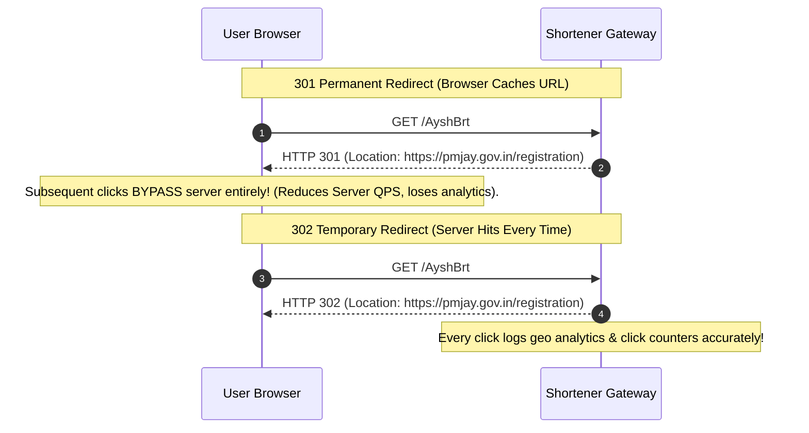

# Module 26: System Design - Scalable URL Shortener (Bitly / TinyURL)

## Theoretical Overview & High-Level Architecture

A **URL Shortener** (e.g., TinyURL, Bitly) converts a long web address into a compact 7-character short link. When accessed, the short link redirects the user to the original target destination.

```mermaid
flowchart TD
    Client["Client Browser"] -->|1. GET /AyshBrt| CDN["CDN Edge / Load Balancer"]
    
    CDN -->|2. Cache Check| Cache["Redis Cache Layer (L2)"]
    Cache -->|2a. Cache Hit (99% Traffic)| RedirectHit["Return 302 Redirect (Location Header)"]
    
    Cache -.->|2b. Cache Miss| DB[("Distributed Database (PostgreSQL / DynamoDB)")]
    DB -.->|3. Read Long URL| WriteCache["Populate Cache"] --> RedirectHit
```

### Real-World Case Study: Government Scheme Short Link Platform
The Prime Minister's Office shares short links for national welfare initiatives (e.g., Ayushman Bharat, PM-KISAN):
- **Traffic Load**: A single tweet generates **50+ million clicks in hours**.
- **System SLAs**: High availability (99.99%), sub-10ms redirect latencies across low-bandwidth 2G/3G mobile networks, and state-level click analytics tracking.

---

## 1. Requirements & Capacity Estimation

### System SLA Parameters
- **Write Throughput**: 1 Million new URLs generated per day ($\approx 12\text{ QPS}$ write).
- **Read Throughput**: 100 Million redirects per day ($\approx 1,160\text{ QPS}$ read, peaking at $10,000\text{ QPS}$).
- **Read-to-Write Ratio**: **$100:1$** (Ultra read-heavy workload).

### Capacity Math & Base62 Collision Invariant
Using a 7-character Base62 string (characters `0-9`, `a-z`, `A-Z`):

$$\text{Possible Short Code Combinations} = 62^7 = 3.52 \times 10^{12} \quad (\approx 3.52 \text{ Trillion URLs})$$

At 1 million URLs created daily, $62^7$ capacity will last **over 9,000 years** without code exhaustion.

---

## 2. Encoding Strategies Comparison Matrix

| Strategy | Short Code Generation | Collision Risk | Predictability Risk | Engineering Complexity |
| :--- | :--- | :--- | :--- | :--- |
| **Counter + Base62** | Auto-increment ID converted to Base62. | **Zero Collisions**. | High (User can guess `id+1`). | Low (Requires range allocator). |
| **MD5/SHA256 Hash** | Truncate MD5 hash of URL to 7 chars. | High (Requires re-hashing). | **Zero Predictability**. | Medium (Requires collision check). |
| **Pre-generated Keys** | Key Generation Service (KGS) pre-creates keys. | **Zero Collisions**. | Low (Randomized pre-fill). | Medium (Requires KGS management). |

---

## 3. Core Component Implementations

### 1. Base62 Encoder / Decoder (`Base62`)
```javascript
class Base62 {
  constructor() {
    this.chars = "0123456789abcdefghijklmnopqrstuvwxyzABCDEFGHIJKLMNOPQRSTUVWXYZ";
    this.base = 62;
  }

  encode(num) {
    if (num === 0) return this.chars[0];
    let result = "";
    let n = num;
    while (n > 0) {
      result = this.chars[n % this.base] + result;
      n = Math.floor(n / this.base);
    }
    return result;
  }

  decode(str) {
    let result = 0;
    for (const char of str) {
      result = result * this.base + this.chars.indexOf(char);
    }
    return result;
  }

  encodePadded(num, length = 7) {
    let encoded = this.encode(num);
    while (encoded.length < length) encoded = this.chars[0] + encoded;
    return encoded;
  }
}
```

### 2. Distributed Counter Range Allocator (`RangeAllocator`)
To avoid central counter database bottlenecks across multi-region application servers, a ZooKeeper coordinator pre-assigns **Counter Ranges** (e.g., 1,000,000 IDs per server):

```javascript
class RangeAllocator {
  constructor(rangeSize = 1000000) {
    this.rangeSize = rangeSize;
    this.nextStart = 0;
  }

  allocateRange(serverId) {
    const start = this.nextStart;
    const end = start + this.rangeSize - 1;
    this.nextStart = end + 1; // Advance start pointer for next server
    return { serverId, start, end };
  }
}
```

### 3. Hash-Based Generator with Re-hashing (`HashBasedShortener`)
```javascript
const crypto = require("crypto");

class HashBasedShortener {
  constructor() {
    this.urlMap = new Map();
    this.base62 = new Base62();
  }

  shorten(longUrl) {
    let shortCode;
    let attempt = 0;
    let input = longUrl;

    while (true) {
      const hash = crypto.createHash("md5").update(input).digest("hex");
      const num = parseInt(hash.substring(0, 12), 16);
      shortCode = this.base62.encodePadded(num, 7);

      if (!this.urlMap.has(shortCode)) break; // Unique code found!
      attempt++;
      input = longUrl + attempt; // Re-hash with salt on collision
    }

    this.urlMap.set(shortCode, longUrl);
    return shortCode;
  }
}
```

---

## 4. HTTP Redirect Semantics: 301 vs. 302



---

## 5. Aggressive Caching & Expiration Engine (`URLStore`)

To maintain sub-10ms redirect SLAs under viral spikes, hot short links are cached in Redis using an LRU eviction policy.

```javascript
class URLStore {
  constructor() {
    this.urls = new Map();
  }

  create(longUrl, options = {}) {
    const shortCode = options.customCode || generateUniqueCode();
    this.urls.set(shortCode, {
      longUrl,
      shortCode,
      createdAt: Date.now(),
      expiresAt: options.ttlMs ? Date.now() + options.ttlMs : null,
      isActive: true,
      clickCount: 0,
    });
    return shortCode;
  }

  resolve(shortCode) {
    const entry = this.urls.get(shortCode);
    if (!entry || !entry.isActive) return { found: false, reason: "not_found" };
    
    // Check TTL Expiration
    if (entry.expiresAt && Date.now() > entry.expiresAt) {
      entry.isActive = false;
      return { found: false, reason: "expired" };
    }

    entry.clickCount++; // Increment Analytics
    return { found: true, longUrl: entry.longUrl, clickCount: entry.clickCount };
  }
}
```

---

## Key Takeaways

1. **Use 7-Character Base62 Encoding**: Base62 yields 3.52 trillion combinations, easily scaling across decades of global traffic.
2. **Pre-Allocate Counter Ranges**: Use ZooKeeper to allocate unique ID ranges to application nodes, achieving zero-collision URL generation without lock contention.
3. **Use 302 Redirects for Analytics**: Return HTTP 302 Temporary Redirects when click tracking and geo-analytics are required; return HTTP 301 Permanent Redirects to minimize server load.
4. **Cache Hot Links at Edge**: Place Redis / CDN caches ahead of the database layer to serve 99% of read redirects with sub-10ms latency.
