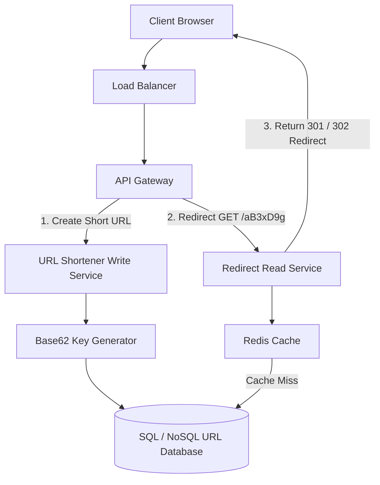

# File 26: System Design — TinyURL / URL Shortener

## Overview
Designing a high-scale **URL Shortener Service** (like TinyURL or Bitly) requires converting long URLs into short 7-character Base62 keys (`https://tiny.url/aB3xD9g`), serving 100M+ redirects daily with $O(1)$ latency.

---

## 1. URL Shortener System Architecture



---

## 2. Base62 Key Encoding Implementation

```javascript
class Base62Encoder {
    static CHARS = "0123456789abcdefghijklmnopqrstuvwxyzABCDEFGHIJKLMNOPQRSTUVWXYZ";

    static encode(num) {
        if (num === 0) return Base62Encoder.CHARS[0];
        let str = "";
        const base = Base62Encoder.CHARS.length;
        while (num > 0) {
            str = Base62Encoder.CHARS[num % base] + str;
            num = Math.floor(num / base);
        }
        return str.padStart(7, "0"); // Fixed 7-char key
    }
}

console.log("Encoded Key for ID 125000000000:", Base62Encoder.encode(125000000000));
```

---

## Key Takeaways
1. **Base62 Encoding** (`[0-9][a-z][A-Z]`) allows $62^7 \approx 3.5 \text{ Trillion}$ unique short URLs.
2. Use **301 Permanent Redirect** for caching redirects on client browser; use **302 Temporary Redirect** to track analytics per click.
3. Cache popular URLs in Redis to achieve sub-10ms redirect latency.
