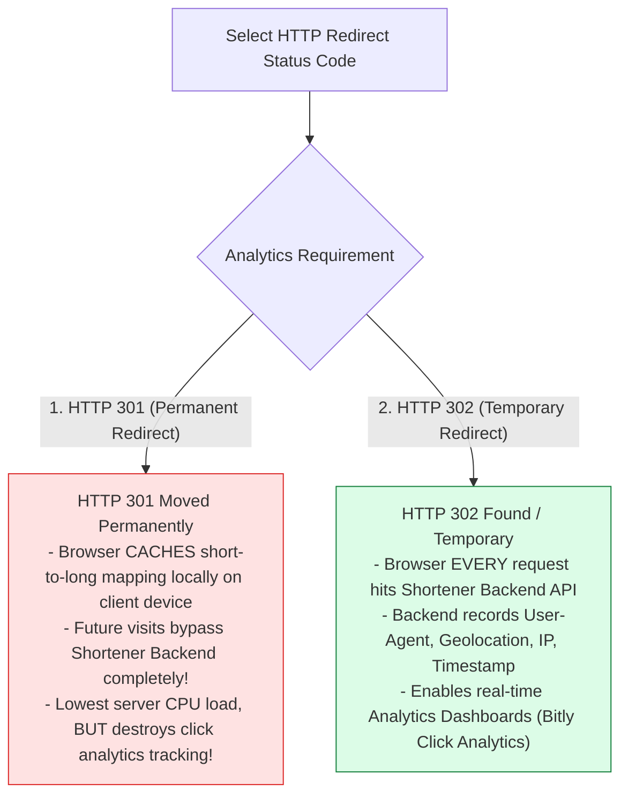

# Module 26: System Design — High-Scale TinyURL & URL Shortener Architecture

## Overview

Designing a distributed **URL Shortener Service** (such as TinyURL or Bitly) requires converting long URLs (`https://example.com/products/electronics/laptops/gaming-series-2026?ref=analytics_991823`) into unique, compact 7-character short keys (`https://tiny.url/aB3xD9g`).

The system must handle high traffic volume ($100\text{M}$ URLs generated per day, $1\text{B}$ daily redirect requests) with sub-10ms latency, high availability ($99.99\%$), and zero key collision risk.

Understanding **Capacity Estimation Math**, **Base62 Encoding Algorithms**, **Key Generation Service (KGS)** pre-generation, and **HTTP 301 vs. 302 Redirect Semantics** is essential.

---

## 1. Capacity Estimation & Back-of-the-Envelope Math

$$\text{Capacity Math}: 62^7 = 3,521,614,606,208 \text{ unique keys (3.5 Trillion URLs)}$$

### Back-of-the-Envelope Estimates

| Metric | Quantitative Calculation | System Target |
| :--- | :--- | :--- |
| **Write Throughput** | $100\text{M URLs} / 86,400\text{s} \approx 1,160 \text{ writes/sec}$ | Peak Write QPS: $2,500 \text{ req/sec}$ |
| **Read Throughput (10:1 Ratio)** | $1\text{B Redirects} / 86,400\text{s} \approx 11,600 \text{ reads/sec}$ | Peak Read QPS: $25,000 \text{ req/sec}$ |
| **Storage (10 Years)** | $100\text{M/day} \times 365 \times 10 \text{ yrs} \times 500 \text{ bytes/row}$ | **$\approx 18.25 \text{ Terabytes}$** |
| **RAM Cache (80/20 Rule)** | $20\% \text{ of daily read traffic cached in Redis}$ | **$\approx 10 \text{ Gigabytes RAM}$** |

---

## 2. URL Shortener Distributed System Architecture

```mermaid
flowchart TD
    Client[Client Web Browser / Mobile App] --> LB[Cloud Load Balancer]
    LB --> Gateway[API Gateway / Router]

    subgraph Write Path (URL Shortening)
        Gateway -->|POST /api/v1/shorten| WriteSvc[URL Shortener Write Service]
        WriteSvc --> KGS[Key Generation Service - KGS Pool]
        WriteSvc --> DB[(NoSQL Key-Value DB / MongoDB / DynamoDB)]
    end

    subgraph Read Path (Redirect Lookup)
        Gateway -->|GET /aB3xD9g| ReadSvc[Redirect Read Service]
        ReadSvc --> RedisCache[(Redis In-Memory Cache)]
        RedisCache -- "Cache Miss" --> DB
        ReadSvc -- "Cache Hit (sub-5ms)" --> Client
    end

    style KGS fill:#dcfce7,stroke:#15803d
    style RedisCache fill:#dbeafe,stroke:#1d4ed8
```

---

## 3. HTTP 301 Permanent vs. HTTP 302 Temporary Redirect Semantics



---

## 4. Key Generation Service (KGS) & Base62 Encoding Engine

```javascript
class Base62Encoder {
  static CHARS = "0123456789abcdefghijklmnopqrstuvwxyzABCDEFGHIJKLMNOPQRSTUVWXYZ";
  static BASE = 62;

  // Convert 64-bit Auto-Increment ID into 7-character Base62 String
  static encode(uniqueAutoIncId) {
    if (uniqueAutoIncId === 0) return "0".padStart(7, "0");

    let num = Number(uniqueAutoIncId);
    let str = "";

    while (num > 0) {
      const remainder = num % Base62Encoder.BASE;
      str = Base62Encoder.CHARS[remainder] + str;
      num = Math.floor(num / Base62Encoder.BASE);
    }

    // Pad to fixed 7-character key length
    return str.padStart(7, "0");
  }

  // Convert 7-character Base62 string back to 64-bit ID
  static decode(base62Str) {
    let num = 0;
    for (let i = 0; i < base62Str.length; i++) {
      const char = base62Str[i];
      const charIndex = Base62Encoder.CHARS.indexOf(char);
      num = num * Base62Encoder.BASE + charIndex;
    }
    return num;
  }
}

// Key Generation Service (KGS) Buffer Pre-fetch Simulator
class KeyGenerationService {
  constructor(batchSize = 5) {
    this.currentId = 1000000000; // Start at 1 Billion
    this.keyBuffer = [];
    this.batchSize = batchSize;
    this._refillBuffer();
  }

  _refillBuffer() {
    console.log(`⚡ [KGS PRE-GENERATION] Pre-generating batch of ${this.batchSize} Base62 keys in RAM...`);
    for (let i = 0; i < this.batchSize; i++) {
      const key = Base62Encoder.encode(this.currentId++);
      this.keyBuffer.push(key);
    }
  }

  fetchKey() {
    if (this.keyBuffer.length === 0) {
      this._refillBuffer();
    }
    const key = this.keyBuffer.shift();
    console.log(`  ✓ [KGS ASSIGNED KEY] Assigned Key '${key}'`);
    return key;
  }
}

// Execution Demonstration
const kgs = new KeyGenerationService(3);
const key1 = kgs.fetchKey();
const key2 = kgs.fetchKey();
const key3 = kgs.fetchKey();
const key4 = kgs.fetchKey(); // Triggers KGS buffer refill

console.log("\nDecoded ID for Key 1:", Base62Encoder.decode(key1));
```

---

## Key Production Takeaways

1. **Use Key Generation Service (KGS) to Eliminate Runtime Collisions**: Pre-generate unique 7-character Base62 keys in a dedicated KGS service using a distributed sequence generator (Snowflake ID) to achieve zero collision risk during write requests.
2. **Use HTTP 302 Redirects for Click Analytics**: Select `302 Found` temporary redirects when building analytics platforms (Bitly) to force client browsers to hit your backend on every click, recording referrer and geolocation metadata.
3. **Cache Popular Redirect Mappings in Redis**: Store the most frequently accessed short-to-long URL mappings in Redis with LRU (Least Recently Used) eviction to serve $80\%+$ of read traffic in sub-5ms latency.
4. **Partition Database by Short Key Hash**: Shard the database horizontally using `hash(short_key)` to distribute read and write throughput evenly across storage nodes.

