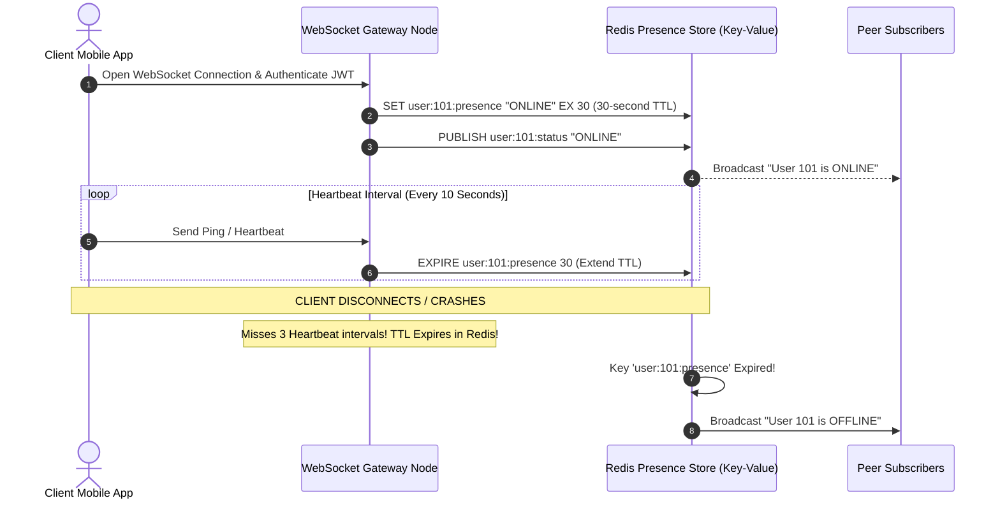

# Module 27: System Design — Real-Time Chat System Architecture (WhatsApp / Slack)

## Overview

Designing a global **Real-Time Distributed Chat Platform** (such as WhatsApp, Discord, or Slack) requires supporting $500\text{M}$ Daily Active Users (DAU) exchanging over $50\text{B}$ messages daily.

Key architectural hurdles include maintaining persistent full-duplex **WebSocket Connection Servers**, routing messages across distributed gateway clusters via **Redis Pub/Sub Session Registries**, persisting high-volume append-only message history in **Cassandra / Wide-Column Stores**, and delivering fallback **Push Notifications (FCM / APNS)** when recipients are offline.

---

## 1. Real-Time Chat System End-to-End Topology

```mermaid
flowchart TD
    ClientA[Client A Mobile App] <-->|WebSocket Persistent Conn| WSGateway1[WebSocket Gateway Node 1]
    ClientB[Client B Mobile App] <-->|WebSocket Persistent Conn| WSGateway2[WebSocket Gateway Node 2]

    WSGateway1 <--> RedisSession[(Redis Session Presence Registry<br/>Maps UserID -> WSGateway Node ID)]
    WSGateway2 <--> RedisSession

    WSGateway1 -->|1. Post Message| ChatService[Message Dispatcher Service]
    ChatService --> MessageDB[(Cassandra Message Database<br/>Partition Key: channel_id / conversation_id)]
    
    ChatService -->|2. Check Recipient Online Status| RedisSession

    RedisSession -- "User B Online" --> WSGateway2
    WSGateway2 -->|3. Deliver Instant Msg| ClientB

    RedisSession -- "User B Offline" --> PushSvc[Push Notification Service (FCM / APNS)]
    PushSvc -->|3. Deliver Mobile Push Notification| ClientB

    style WSGateway1 fill:#dbeafe,stroke:#1d4ed8
    style WSGateway2 fill:#dbeafe,stroke:#1d4ed8
    style MessageDB fill:#dcfce7,stroke:#15803d
```

---

## 2. High-Throughput Message Persistence Schema (Cassandra / Wide-Column)

Message storage requires high-speed append-only writes. Relational databases fail under $500\text{k}+$ write requests/sec due to B+Tree lock contention. We use **Apache Cassandra** partitioned by `channel_id`:

```sql
-- Cassandra Table Schema for Scalable Chat Message Storage
CREATE TABLE chat_messages (
    channel_id uuid,
    message_id timeuuid,
    sender_id text,
    content text,
    media_url text,
    created_at timestamp,
    PRIMARY KEY (channel_id, message_id)
) WITH CLUSTERING ORDER BY (message_id DESC);

-- Fast Range Query: Fetch latest 50 messages for a conversation
SELECT * FROM chat_messages 
WHERE channel_id = 9981-abcd-1234 
LIMIT 50;
```

---

## 3. Real-Time User Presence Status & Heartbeat Pipeline



---

## 4. Practical Implementation Showcase: Distributed Chat Gateway & Message Router

```javascript
class DistributedChatGateway {
  constructor() {
    this.localConnections = new Map(); // Local WebSocket Map: userId -> Socket
    this.globalPresenceRegistry = new Map(); // Simulated Redis: userId -> serverNodeId
    this.messageDatabase = []; // Simulated Cassandra Store
  }

  // User connects to this specific Gateway Node (Node ID: GW_EAST_1)
  connectUser(userId, socketMock, nodeId = "GW_EAST_1") {
    this.localConnections.set(userId, socketMock);
    this.globalPresenceRegistry.set(userId, { nodeId, status: "ONLINE", lastHeartbeat: Date.now() });
    console.log(`🔌 [WEBSOCKET CONNECTED] User '${userId}' connected to Node ${nodeId}`);
  }

  // Dispatch message from Sender to Recipient
  async dispatchMessage(senderId, recipientId, text) {
    const messageEnvelope = {
      messageId: `msg_${Date.now()}_${Math.floor(Math.random() * 1000)}`,
      senderId,
      recipientId,
      text,
      timestamp: new Date().toISOString()
    };

    // 1. Asynchronously persist to Message DB (Cassandra append-only write)
    this.messageDatabase.push(messageEnvelope);
    console.log(`\n💾 [CASSANDRA PERSIST] Message ID ${messageEnvelope.messageId} saved.`);

    // 2. Check Recipient Presence in Global Session Registry (Redis)
    const presenceMeta = this.globalPresenceRegistry.get(recipientId);

    if (presenceMeta && presenceMeta.status === "ONLINE") {
      // 3a. Recipient Online: Route via WebSocket
      const recipientSocket = this.localConnections.get(recipientId);
      if (recipientSocket) {
        console.log(`  ⚡ [WEBSOCKET DELIVER] Direct socket delivery to User '${recipientId}': "${text}"`);
      } else {
        console.log(`  🔀 [REDIS PUB/SUB] User '${recipientId}' is online on remote Node ${presenceMeta.nodeId}. Publishing to channel...`);
      }
    } else {
      // 3b. Recipient Offline: Fallback to FCM/APNS Push Notification
      console.log(`  📲 [PUSH NOTIFICATION] User '${recipientId}' is OFFLINE. Triggering FCM Mobile Push Notification...`);
    }
  }
}

// Execution Demonstration
async function runChatDemo() {
  const chatSystem = new DistributedChatGateway();

  // Connect User A and User B
  chatSystem.connectUser("user_alice", { send: () => {} }, "GW_EAST_1");
  chatSystem.connectUser("user_bob", { send: () => {} }, "GW_EAST_1");

  // Send Message: Alice -> Bob (Online Delivery)
  await chatSystem.dispatchMessage("user_alice", "user_bob", "Hey Bob, let's review the architecture doc!");

  // Send Message: Alice -> Charlie (Offline Push Notification Delivery)
  await chatSystem.dispatchMessage("user_alice", "user_charlie", "Hey Charlie, call me when you get this.");
}

runChatDemo();
```

---

## Key Production Takeaways

1. **Use Persistent Full-Duplex WebSockets for Real-Time Chat**: Establish stateful WebSocket connections between clients and WebSocket Gateway clusters to eliminate HTTP polling overhead and deliver messages with sub-50ms latency.
2. **Persist Messages in Wide-Column Stores (Cassandra)**: Use Apache Cassandra or ScyllaDB partitioned by `conversation_id` and sorted by `message_id (timeuuid)` to scale write ingestion effortlessly to millions of messages/sec.
3. **Manage Online Presence in Redis with TTL Heartbeats**: Store active user session locations (`userId -> gateway_node_id`) in Redis with automatic 30-second TTL expirations refreshed by 10-second client ping heartbeats.
4. **Fallback to FCM/APNS for Offline Delivery**: Route messages through push notification services (Firebase Cloud Messaging / Apple Push Notification Service) whenever the recipient's WebSocket connection is inactive.

