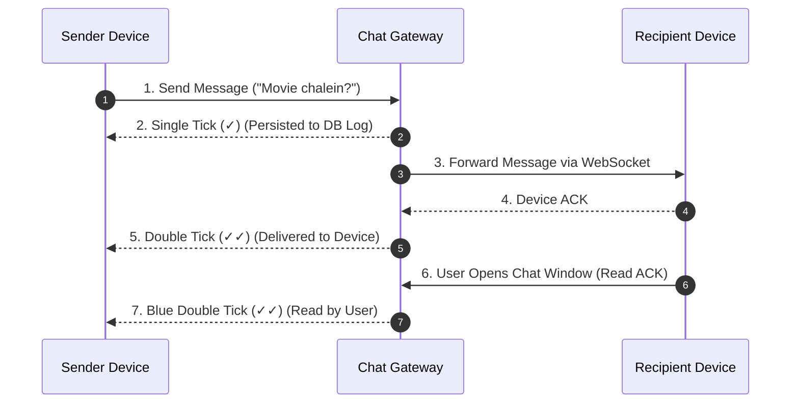

# Module 27: System Design - Distributed Chat System (WhatsApp / Slack)

## Theoretical Overview & Real-Time Communication Architecture

A **Distributed Chat System** (e.g., WhatsApp, Discord, Slack) enables real-time 1:1 and group messaging across millions of concurrent connections. It provides full-duplex communication via **WebSockets**, guaranteed per-conversation message ordering, delivery receipts, and presence detection.

```mermaid
flowchart TD
    subgraph Client Tier
        ClientA["User A (Sender - Online)"]
        ClientB["User B (Recipient - Online)"]
        ClientC["User C (Recipient - Offline)"]
    end

    subgraph Edge Layer & WebSockets
        ClientA -->|1. WebSocket (TLS)| Gateway["API Gateway / Connection Manager"]
        Gateway -->|2. Route Message| ChatServer["Chat Server (Node / Go)"]
    end

    subgraph Core Infrastructure & Storage
        ChatServer -->|3. Append Sequence Number| DB[("Message Store DB (Cassandra / HBase)")]
        ChatServer -->|4. Check Presence| Redis[("Presence & Session KV Store (Redis)")]
        
        ChatServer -->|5a. Direct Delivery| ClientB
        ChatServer -.->|5b. Queue Offline Msg| OfflineQueue["Offline Queue (RabbitMQ / SQS)"]
    end

    OfflineQueue -.->|6. Push on Reconnect| ClientC
```

### Real-World Case Study: WhatsApp Family Group ("Sharma Parivar")
Consider a 47-member extended family group chat in India:
- **Variable Connections**: Grandpa's phone drops to 2G in rural areas, while others are on high-speed 5G.
- **Tick Status Lifecycle**:
  - Single Tick ($\checkmark$): Message persisted to WhatsApp servers.
  - Double Tick ($\checkmark\checkmark$): Message delivered to recipient's physical device.
  - Blue Double Tick ($\checkmark\checkmark$): Recipient opened the chat thread and read the message.

---

## 1. Requirements & System SLAs

### Functional Requirements
1. **1:1 Messaging & Group Chats**: Support 1:1 direct messages and group chats up to 256 members.
2. **Delivery Status Receipts**: Single tick ($\checkmark$), double tick ($\checkmark\checkmark$), and read receipts.
3. **Presence Engine**: Real-time "Online" status and "Last Seen" timestamp detection.
4. **Offline Message Queueing**: Store messages for offline users and deliver immediately upon reconnection.

### Non-Functional SLAs
- **Ultra-Low Latency**: End-to-end message delivery latency **$< 100\text{ ms}$**.
- **Per-Conversation Sequence Ordering**: Guaranteed message sequence order within a conversation thread.
- **High Concurrency**: Scale up to **500 Million concurrent WebSocket connections**.

---

## 2. Core Components & Code Models

### 1. Connection Manager & Load Balancer (`ConnectionManager`)
Hashes users to dedicated WebSocket servers for persistent full-duplex connections:

```javascript
class ConnectionManager {
  constructor() {
    this.connections = new Map();
    this.servers = ["chat-srv-1", "chat-srv-2", "chat-srv-3"];
  }

  _hash(str) {
    let h = 0;
    for (let i = 0; i < str.length; i++) h = ((h << 5) - h) + str.charCodeAt(i);
    return Math.abs(h);
  }

  connect(userId, deviceInfo = {}) {
    const serverId = this.servers[this._hash(userId) % this.servers.length];
    const conn = { userId, serverId, connectedAt: Date.now(), status: "connected" };
    this.connections.set(userId, conn);
    return conn;
  }

  disconnect(userId) {
    const conn = this.connections.get(userId);
    if (conn) conn.status = "disconnected";
  }
}
```

### 2. Message Storage & Sequence Orderer (`MessageStore` & `MessageOrderer`)
To handle out-of-order message arrivals across mobile 2G/3G networks, the system assigns incremental sequence numbers per conversation (`user1:user2` sorted key):

```javascript
class MessageStore {
  constructor() {
    this.messages = new Map();
    this.sequenceCounters = new Map();
  }

  _convKey(user1, user2) { return [user1, user2].sort().join(":"); }

  store(message) {
    const convKey = this._convKey(message.senderId, message.recipientId);
    const seq = (this.sequenceCounters.get(convKey) || 0) + 1;
    this.sequenceCounters.set(convKey, seq);
    
    message.sequenceNum = seq;
    this.messages.set(message.id, message);
    return message;
  }
}

class MessageOrderer {
  constructor() { this.buffers = new Map(); }

  receiveMessage(convKey, message) {
    if (!this.buffers.has(convKey)) {
      this.buffers.set(convKey, { expectedSeq: 1, buffer: new Map(), delivered: [] });
    }
    const state = this.buffers.get(convKey);
    const seq = message.sequenceNum;

    if (seq === state.expectedSeq) {
      state.delivered.push(message);
      state.expectedSeq++;
      // Drain buffered out-of-order messages
      while (state.buffer.has(state.expectedSeq)) {
        state.delivered.push(state.buffer.get(state.expectedSeq));
        state.buffer.delete(state.expectedSeq);
        state.expectedSeq++;
      }
      return { action: "DELIVERED", seq };
    } else if (seq > state.expectedSeq) {
      state.buffer.set(seq, message); // Buffer out-of-order message
      return { action: "BUFFERED", seq, waitingFor: state.expectedSeq };
    }
    return { action: "DUPLICATE_SKIPPED", seq };
  }
}
```

---

## 3. Delivery Receipt Tick Architecture (`DeliveryTracker`)



```javascript
class DeliveryTracker {
  constructor() { this.receipts = new Map(); }

  markSent(messageId) {
    this.receipts.set(messageId, { status: "sent", sentAt: Date.now() });
    return "✓ Single Tick (Sent to Server)";
  }

  markDelivered(messageId) {
    const entry = this.receipts.get(messageId);
    if (entry) { entry.status = "delivered"; entry.deliveredAt = Date.now(); }
    return "✓✓ Double Tick (Delivered to Device)";
  }

  markRead(messageId) {
    const entry = this.receipts.get(messageId);
    if (entry) { entry.status = "read"; entry.readAt = Date.now(); }
    return "✓✓ Blue Double Tick (Read by User)";
  }
}
```

---

## 4. Presence Engine & Heartbeat Monitoring

```javascript
class PresenceService {
  constructor() {
    this.presence = new Map();
    this.heartbeatTimeoutMs = 35000; // 35 seconds
  }

  goOnline(userId) {
    this.presence.set(userId, { status: "online", lastHeartbeat: Date.now() });
  }

  getPresence(userId) {
    const p = this.presence.get(userId);
    if (!p) return { status: "offline", lastSeen: null };
    
    // Heartbeat Timeout Evaluation
    if (p.status === "online" && Date.now() - p.lastHeartbeat > this.heartbeatTimeoutMs) {
      p.status = "offline";
    }
    return { status: p.status, lastSeen: p.lastHeartbeat };
  }
}
```

---

## 5. Group Chat Fan-Out & Offline Queueing Engine

When sending a message to a group with $N$ members, the server executes an $\mathcal{O}(N)$ **Fan-Out** operation. If a recipient is offline, the message is pushed to an **Offline Queue**.

```javascript
class OfflineQueue {
  constructor() { this.queues = new Map(); }

  enqueue(userId, message) {
    if (!this.queues.has(userId)) this.queues.set(userId, []);
    this.queues.get(userId).push({ ...message, queuedAt: Date.now() });
  }

  drain(userId) {
    const messages = this.queues.get(userId) || [];
    this.queues.set(userId, []); // Clear queue after drain
    return { messages, count: messages.length };
  }
}
```

---

## Key Takeaways

1. **Use Persistent WebSockets**: Establish persistent full-duplex WebSockets for real-time delivery; fall back to Long Polling for legacy devices.
2. **Assign Per-Conversation Sequence IDs**: Use monotonic sequence counters per conversation (`user1:user2`) to re-order out-of-order network arrivals.
3. **Track Message Delivery States Explicitly**: Implement Single Tick ($\checkmark$), Double Tick ($\checkmark\checkmark$), and Read Receipt ($\checkmark\checkmark$) state transitions.
4. **Buffer Offline Messages for Reconnection**: Store un-delivered messages in an offline queue (Cassandra / RabbitMQ) and bulk-drain them upon user reconnection.
