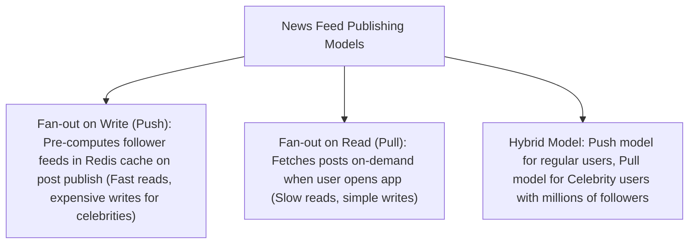

# File 28: System Design — News Feed System (Twitter / Instagram / Facebook)

## Overview
Designing a **News Feed System** requires generating timeline posts in real time. The choice between **Fan-out on Write (Push Model)**, **Fan-out on Read (Pull Model)**, or a **Hybrid Model** balances write vs read operations for celebrity users.

---

## 1. Fan-out Models Architecture



---

## 2. Push vs Pull Timeline Generator Implementation

```javascript
class NewsFeedService {
    constructor() {
        this.userFeeds = new Map(); // userId -> Feed Array (Redis Cache)
        this.followers = new Map(); // userId -> Followers List
    }

    publishPost(authorId, postContent) {
        const post = { id: `post_${Date.now()}`, authorId, postContent };
        const authorFollowers = this.followers.get(authorId) || [];

        // Fan-out on Write (Push Model)
        authorFollowers.forEach(followerId => {
            if (!this.userFeeds.has(followerId)) {
                this.userFeeds.set(followerId, []);
            }
            this.userFeeds.get(followerId).unshift(post); // Pre-cache post in follower feed!
        });

        console.log(`[FAN-OUT WRITE COMPLETE] Pushed post to ${authorFollowers.length} follower feed caches.`);
    }
}
```

---

## Key Takeaways
1. **Fan-out on Write (Push)**: Blazing fast $O(1)$ read performance; expensive for celebrity accounts.
2. **Fan-out on Read (Pull)**: Cheap writes; slower read queries requiring multi-user timeline aggregation.
3. **Hybrid Model**: Best for enterprise systems (Push for normal accounts, Pull for celebrities).
