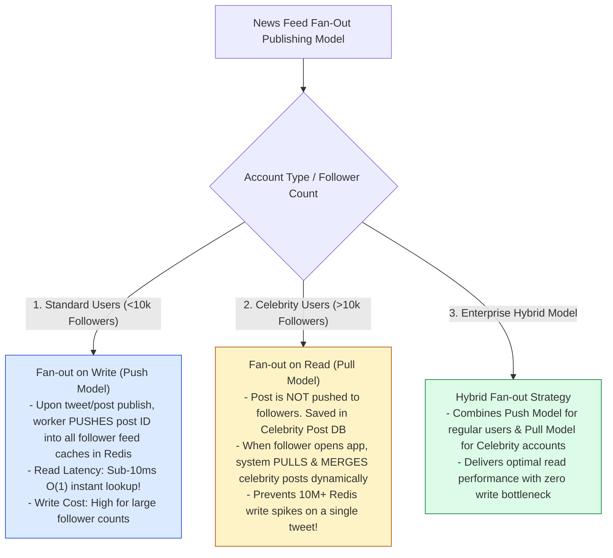
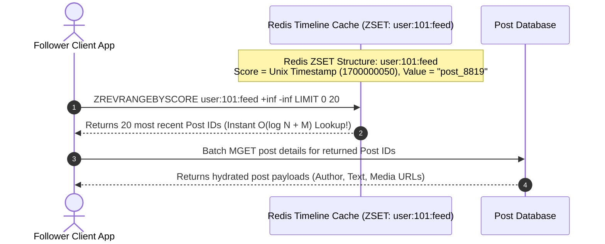

# Module 28: System Design — Scalable News Feed Architecture (Twitter / X / Instagram)

## Overview

Designing a distributed **News Feed Platform** (such as Twitter/X or Instagram) requires serving personalized activity streams to over $300\text{M}$ Daily Active Users (DAU) with sub-200ms latency.

The central architectural trade-off lies in selecting the feed generation model: **Fan-out on Write (Push Model)**, **Fan-out on Read (Pull Model)**, or an enterprise **Hybrid Fan-out Model** to overcome the "Celebrity Hotkey Problem" (accounts with $10\text{M}+$ followers).

Understanding **Redis Sorted Set (`ZSET`) Timeline Caching**, **Asynchronous Worker Fan-Out Chains**, and **Feed Ranking Pipelines** is essential.

---

## 1. Fan-out Models Architectural Taxonomy



---

## 2. End-to-End Hybrid News Feed Architecture

```mermaid
flowchart TD
    Client[User Client App] --> LB[Load Balancer]
    LB --> Gateway[API Gateway]

    subgraph Publishing Path
        Gateway -->|POST /api/v1/tweets| PostSvc[Post Publishing Service]
        PostSvc --> PostDB[(Post Storage DB - Cassandra / DynamoDB)]
        PostSvc --> FanOutQueue[Kafka Fan-Out Event Queue]
        
        FanOutQueue --> FanOutWorkers[Fan-Out Worker Pool]
        FanOutWorkers -->|If Author < 10k Followers| RedisFeeds[(Redis Timeline Feed Caches - ZSET)]
    end

    subgraph Timeline Retrieval Path (Read)
        Gateway -->|GET /api/v1/feed| FeedSvc[News Feed Service]
        FeedSvc -->|1. Fetch Pre-computed Push Feed| RedisFeeds
        FeedSvc -->|2. Fetch Followed Celebrity Posts| PostDB
        FeedSvc -->|3. Merge & Sort Timelines by Timestamp| Ranker[Ranking Engine]
        Ranker --> Client
    end

    style RedisFeeds fill:#dcfce7,stroke:#15803d
    style FanOutWorkers fill:#dbeafe,stroke:#1d4ed8
```

---

## 3. Redis Sorted Set (`ZSET`) Timeline Data Structure

News feeds are stored in Redis as Sorted Sets (`ZSET`), where the **Element Key** is the `post_id` and the **Sorting Score** is the Epoch `timestamp`:



---

## 4. Practical Implementation Showcase: Hybrid Fan-out News Feed Engine

```javascript
class HybridNewsFeedEngine {
  constructor(celebrityThreshold = 5) {
    this.celebrityThreshold = celebrityThreshold; // Threshold for demo
    this.followerGraph = new Map(); // userId -> Set of follower IDs
    this.userFeedCaches = new Map(); // userId -> Array of post IDs (Redis ZSet mock)
    this.postStore = new Map(); // postId -> Post Object
  }

  // Follower relationship helper
  addFollower(followerId, targetUserId) {
    if (!this.followerGraph.has(targetUserId)) {
      this.followerGraph.set(targetUserId, new Set());
    }
    this.followerGraph.get(targetUserId).add(followerId);
  }

  // Publish Post Handler (Hybrid Fan-Out Decision)
  async publishPost(authorId, content) {
    const postId = `post_${Date.now()}_${Math.floor(Math.random() * 1000)}`;
    const timestamp = Date.now();
    const post = { postId, authorId, content, timestamp };
    
    // Save to Post DB
    this.postStore.set(postId, post);
    console.log(`\n📝 [POST PUBLISHED] User '${authorId}' published Post #${postId}`);

    const followers = Array.from(this.followerGraph.get(authorId) || []);
    console.log(`   Follower Count: ${followers.length} (Celebrity Threshold: ${this.celebrityThreshold})`);

    if (followers.length >= this.celebrityThreshold) {
      // CELEBRITY ACCOUNT: Do NOT push! (Pull Model)
      console.log(`  ⭐ [CELEBRITY PULL MODEL] Author has ${followers.length} followers. Bypassing Push Fan-Out!`);
    } else {
      // REGULAR ACCOUNT: Push to all follower timeline caches! (Push Model)
      console.log(`  ⚡ [PUSH FAN-OUT] Pushing Post #${postId} into ${followers.length} follower Redis feeds...`);
      for (const followerId of followers) {
        if (!this.userFeedCaches.has(followerId)) {
          this.userFeedCaches.set(followerId, []);
        }
        this.userFeedCaches.get(followerId).unshift(post); // Insert at top
      }
    }
  }

  // Fetch News Feed Handler (Hybrid Retrieval & Merge)
  async getNewsFeed(userId, followedCelebrityIds = []) {
    console.log(`\n📖 [FETCH FEED] Loading news feed for User '${userId}'...`);

    // 1. Fetch pre-cached Push Timeline
    const pushFeed = this.userFeedCaches.get(userId) || [];

    // 2. Dynamically Pull recent posts from followed Celebrity accounts
    const pulledCelebrityPosts = [];
    for (const celebId of followedCelebrityIds) {
      for (const [id, post] of this.postStore.entries()) {
        if (post.authorId === celebId) {
          pulledCelebrityPosts.push(post);
        }
      }
    }

    // 3. Merge & Sort by Timestamp DESC
    const combinedFeed = [...pushFeed, ...pulledCelebrityPosts].sort((a, b) => b.timestamp - a.timestamp);
    console.log(`  ✓ [FEED GENERATED] Returned ${combinedFeed.length} posts merged in timeline.`);
    return combinedFeed;
  }
}

// Execution Demonstration
async function runNewsFeedDemo() {
  const feedSystem = new HybridNewsFeedEngine(2); // 2 followers = Celebrity for demo

  // Setup Social Graph
  feedSystem.addFollower("user_bob", "user_alice");      // Alice has 1 follower (Regular)
  feedSystem.addFollower("user_charlie", "user_star");    // Star has 2 followers (Celebrity)
  feedSystem.addFollower("user_bob", "user_star");

  // Regular user posts (Push Model)
  await feedSystem.publishPost("user_alice", "Hello world from Alice!");

  // Celebrity user posts (Pull Model)
  await feedSystem.publishPost("user_star", "Breaking News from Celebrity Star!");

  // Bob fetches feed (Reads pushed Alice post + pulls Celebrity Star post)
  const bobsFeed = await feedSystem.getNewsFeed("user_bob", ["user_star"]);
  console.log("Bob's Final Timeline:", bobsFeed.map((p) => `${p.authorId}: "${p.content}"`));
}

runNewsFeedDemo();
```

---

## Key Production Takeaways

1. **Adopt the Hybrid Fan-Out Architecture**: Use **Fan-out on Write (Push)** for standard accounts ($<10\text{k}$ followers) to ensure sub-10ms feed reads, and fallback to **Fan-out on Read (Pull)** for celebrity accounts ($>10\text{k}$ followers) to prevent Redis memory spikes.
2. **Store Timeline Caches in Redis Sorted Sets (`ZSET`)**: Store timeline post IDs in Redis `ZSET` structures with epoch timestamps as scores, allowing instant range queries (`ZREVRANGEBYSCORE`).
3. **Decouple Fan-Out Processing using Kafka Worker Pools**: Never compute fan-out pushes synchronously in the API request thread. Publish post events to Kafka topics and process fan-out pushes asynchronously via worker pools.
4. **Cap Max Items in Timeline Caches**: Limit Redis user feed `ZSET` caches to 500-800 items per user (`LTRIM` / `ZREMRANGEBYRANK`) to control RAM infrastructure costs while serving $99\%+$ of user scroll depth.

