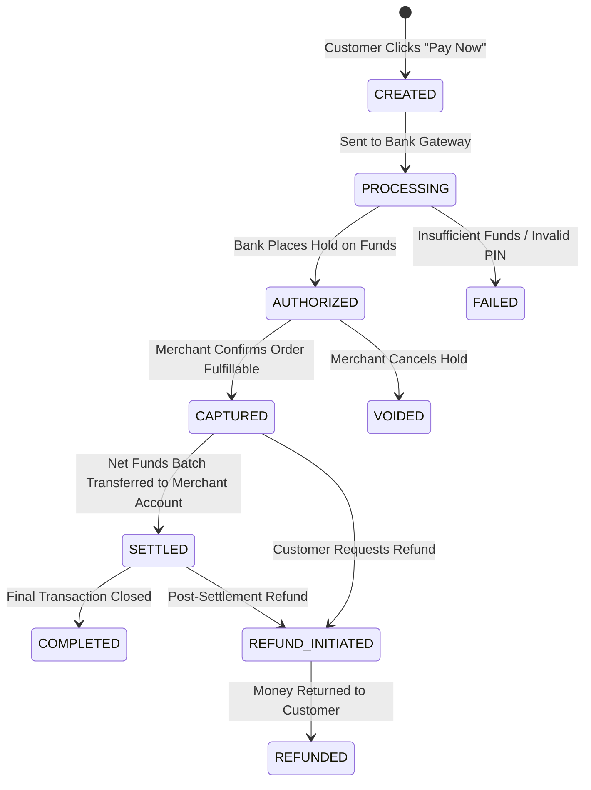
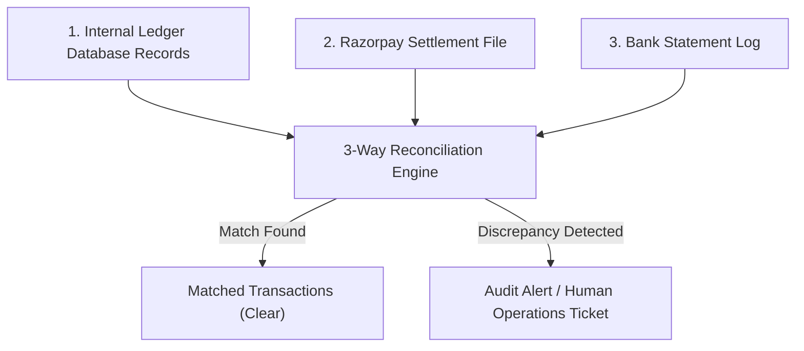

# Module 29: System Design - Payment System, Double-Entry Ledger, & Reconciliation

## Theoretical Overview & Zero-Data-Loss Architecture

A **Payment System** (e.g., UPI, Razorpay, Stripe) processes financial transactions across customers, merchants, gateways, and banking networks.

Because real currency is at stake, payment systems enforce **Exactly-Once Execution Guarantees**, **Double-Entry Accounting**, **Strict State Machines**, and **Daily Reconciliation**.

```mermaid
flowchart TD
    Client["Client (Swiggy App)"] -->|1. Pay ₹500 (Idempotency Key: 'ord_123')| Gateway["Razorpay / Payment Gateway"]
    
    Gateway -->|2. Check Idempotency| IdemStore[("Idempotency Store (Redis)")]
    
    Gateway -->|3. Record Intent| StateMachine["Payment State Machine (CREATED -> PROCESSING)"]
    
    Gateway -->|4. Execute Payment| Bank["NPCI / Bank Core Banking System"]
    
    Bank -->>|5. Auth & Capture Success| Gateway
    Gateway -->|6. Double-Entry Commit| Ledger[("Immutable Double-Entry Ledger DB")]
    
    Ledger -->|Debit ₹500| CustAccount["Customer Account Ledger"]
    Ledger -->|Credit ₹490| MerchantAccount["Merchant Account Ledger"]
    Ledger -->|Credit ₹10| GatewayFee["Gateway Fee Ledger"]
```

### Real-World Case Study: UPI / Razorpay Payment Integration
When a customer pays ₹500 for a Swiggy food order:
- **Idempotency Protection**: If a 3G network drops while processing, the client retries using `Idempotency-Key: order_swiggy_9845`. The gateway recognizes the key and returns the cached transaction response without double-charging the customer.
- **Double-Entry Balance**: The system debits ₹500 from the Customer Account and credits ₹490 to Swiggy and ₹10 to Razorpay. The sum of all debits and credits is strictly **₹0.00**.

---

## 1. Payment Lifecycle Stages



---

## 2. Core Implementations & Code Models

### 1. Idempotency Protection Engine (`IdempotencyStore`)
Prevents double charges during network retries by key caching:

```javascript
class IdempotencyStore {
  constructor() {
    this.keys = new Map();
    this.ttlMs = 86400000; // 24 Hours
  }

  check(key) {
    const entry = this.keys.get(key);
    if (!entry) return { exists: false };
    if (Date.now() - entry.timestamp > this.ttlMs) {
      this.keys.delete(key);
      return { exists: false };
    }
    return { exists: true, result: entry.result };
  }

  store(key, result) {
    this.keys.set(key, { result, timestamp: Date.now() });
  }
}

function processPaymentIdempotently(idempotencyKey, details) {
  const existing = idempotencyStore.check(idempotencyKey);
  if (existing.exists) {
    return { ...existing.result, isDuplicate: true }; // Cached response!
  }

  const result = { paymentId: `pay_${Date.now()}`, amount: details.amount, status: "SUCCESS" };
  idempotencyStore.store(idempotencyKey, result);
  return result;
}
```

### 2. Double-Entry Accounting Ledger (`Ledger`)
Financial invariant: Every financial movement must have equal debits and credits. Money is never created or destroyed out of thin air.

$$\sum \text{Debits} = \sum \text{Credits}$$

```javascript
class Ledger {
  constructor() {
    this.entries = [];
    this.balances = new Map();
    this.counter = 0;
  }

  _ensureAccount(id, initialBalance = 0) {
    if (!this.balances.has(id)) this.balances.set(id, initialBalance);
  }

  createTransaction(description, debitAccount, creditAccount, amount) {
    if (amount <= 0) return { success: false, error: "Invalid Amount" };
    this._ensureAccount(debitAccount);
    this._ensureAccount(creditAccount);

    if (this.balances.get(debitAccount) < amount) {
      return { success: false, error: "Insufficient Balance" };
    }

    const txnId = `txn_${++this.counter}`;
    
    // Balance Mutation
    this.balances.set(debitAccount, this.balances.get(debitAccount) - amount);
    this.balances.set(creditAccount, this.balances.get(creditAccount) + amount);

    // Immutable Double-Entry Ledger Logs
    this.entries.push({ txnId, account: debitAccount, type: "DEBIT", amount: -amount });
    this.entries.push({ txnId, account: creditAccount, type: "CREDIT", amount: +amount });

    return { success: true, txnId };
  }

  verifyLedgerBalance() {
    let debits = 0;
    let credits = 0;
    this.entries.forEach((e) => {
      if (e.type === "DEBIT") debits += Math.abs(e.amount);
      else credits += e.amount;
    });
    return { totalDebits: debits, totalCredits: credits, isBalanced: Math.abs(debits - credits) < 0.01 };
  }
}
```

### 3. Payment State Machine (`PaymentStateMachine`)
Prevents illegal state transitions (e.g., executing a refund directly on a `CREATED` payment):

```javascript
class PaymentStateMachine {
  constructor() {
    this.allowedTransitions = {
      CREATED: ["PROCESSING", "CANCELLED"],
      PROCESSING: ["AUTHORIZED", "FAILED", "TIMEOUT"],
      AUTHORIZED: ["CAPTURED", "VOIDED"],
      CAPTURED: ["SETTLED", "REFUND_INITIATED"],
      SETTLED: ["REFUND_INITIATED", "COMPLETED"],
      COMPLETED: ["REFUND_INITIATED"],
      REFUND_INITIATED: ["REFUNDED", "REFUND_FAILED"],
    };
  }

  transition(payment, newState) {
    const validStates = this.allowedTransitions[payment.state] || [];
    if (!validStates.includes(newState)) {
      return { success: false, error: `Illegal Transition: ${payment.state} -> ${newState}` };
    }
    const oldState = payment.state;
    payment.state = newState;
    return { success: true, from: oldState, to: newState };
  }
}
```

---

## 3. Daily 3-Way Reconciliation Engine (`ReconciliationEngine`)

At the end of every business day, the **Reconciliation System** compares internal database logs against payment gateway files and bank settlement statements to detect discrepancies:



```javascript
class ReconciliationEngine {
  reconcile(internalLedger, bankStatement) {
    const bankMap = new Map(bankStatement.map((e) => [e.txnRef, e]));
    const matched = [];
    const missingInBank = [];
    const mismatches = [];

    internalLedger.forEach((entry) => {
      const bankEntry = bankMap.get(entry.txnRef);
      if (!bankEntry) {
        missingInBank.push(entry);
      } else if (Math.abs(entry.amount - bankEntry.amount) > 0.01) {
        mismatches.push({ txnRef: entry.txnRef, internal: entry.amount, bank: bankEntry.amount });
      } else {
        matched.push(entry.txnRef);
      }
    });

    return {
      matchedCount: matched.length,
      missingInBankCount: missingInBank.length,
      mismatchCount: mismatches.length,
      isReconciled: missingInBank.length === 0 && mismatches.length === 0,
    };
  }
}
```

---

## Key Takeaways

1. **Mandatory Idempotency Keys**: Require `Idempotency-Key` headers on all payment requests to prevent double charges on network retries.
2. **Double-Entry Accounting Invariant**: Ensure every transaction logs equal debits and credits ($\sum \text{Debits} = \sum \text{Credits}$).
3. **Enforce State Transitions**: Use strict State Machines to block illegal state transitions (`CREATED` $\to$ `REFUNDED`).
4. **Daily 3-Way Reconciliation**: Run automated end-of-day reconciliation across Internal DBs, Gateways, and Bank Logs to catch data drift.
