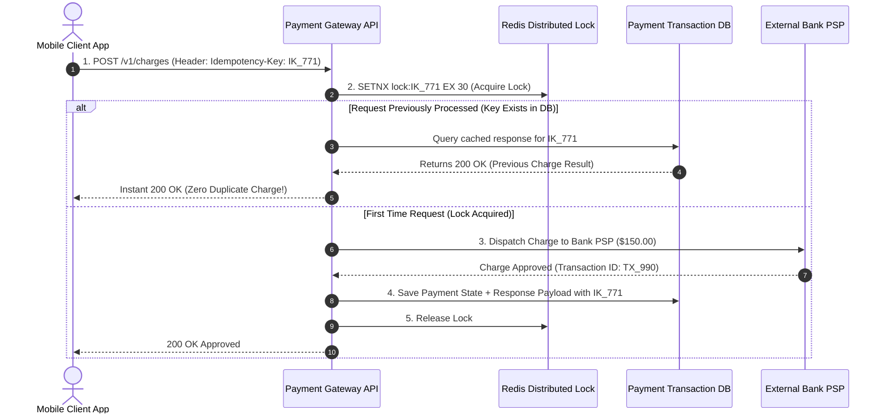

# Module 29: System Design — Distributed Payment Gateway Architecture (Stripe / Razorpay)

## Overview

Designing a financial **Distributed Payment Gateway Platform** (such as Stripe or Razorpay) requires zero tolerance for data corruption, single-point failures, or duplicate transaction charges.

Core architectural pillars include **Idempotency Key Guard Pipeline**, **Double-Entry Ledger Bookkeeping**, **Payment Service Provider (PSP) Integration Handling**, and **Asynchronous Bank Reconciliation Workers**.

Understanding **ACID Transaction Boundaries**, **Distributed Locking**, and **Daily Settlement File Processing** is essential.

---

## 1. End-to-End Payment Gateway System Architecture

```mermaid
flowchart TD
    Client[Client Mobile / Web App] --> Gateway[Payment API Gateway]

    Gateway -->|1. POST /v1/charges (Header: Idempotency-Key)| IdempotencyGuard[Idempotency Guard - Redis]

    subgraph Payment Processing System
        IdempotencyGuard --> PaySvc[Payment Service]
        PaySvc --> ExecSvc[PSP Payment Executor]
        
        ExecSvc -->|2. Charge Request| ExternalPSP[External PSP / Visa / MasterBank API]
        
        PaySvc -->|3. Record Financial Movement| LedgerSvc[Double-Entry Ledger Service]
        LedgerSvc --> LedgerDB[(Immutable Ledger Database)]
    end

    subgraph Nightly Reconciliation Pipeline
        ReconcileWorker[Nightly Bank Reconciliation Batch] <-->|Cross-verify DB vs Bank CSV| BankCSV[(Bank Settlement CSV Files)]
        ReconcileWorker --> LedgerDB
    end

    style IdempotencyGuard fill:#dbeafe,stroke:#1d4ed8
    style LedgerDB fill:#dcfce7,stroke:#15803d
    style ReconcileWorker fill:#fef3c7,stroke:#b45309
```

---

## 2. Strict Idempotency Key Guard Pipeline

Network drops during payment requests can trigger client retries. An **Idempotency Key** (`Idempotency-Key: idempotency_key_991823`) prevents double-charging credit cards:



---

## 3. Double-Entry Bookkeeping Ledger Framework

In financial software, money is neither created nor destroyed; it only moves from one account to another. Every transaction must consist of balanced **Debits** and **Credits** where:

$$\sum \text{Debits} = \sum \text{Credits}$$

### Transaction Ledger Journal Entry Example

| Entry ID | Account Name | Debit ($) | Credit ($) | Transaction Purpose |
| :--- | :--- | :--- | :--- | :--- |
| **`TX_1001`** | `Customer_Checking_Account` | **$100.00** | $0.00 | Money debited from customer |
| **`TX_1001`** | `Merchant_Receivables_Account`| $0.00 | **$97.00** | Net revenue credited to merchant |
| **`TX_1001`** | `Gateway_Fee_Revenue_Account` | $0.00 | **$3.00** | 3% processing fee credited to gateway |

---

## 4. Practical Implementation Showcase: Double-Entry Ledger & Idempotent Payment Processor

```javascript
class IdempotentPaymentGateway {
  constructor() {
    this.idempotencyStore = new Map(); // Key -> Cached Response
    this.ledgerJournal = [];           // Array of Double-Entry Journal Records
    this.accounts = new Map([
      ["CUSTOMER_ACC", 500],   // Customer balance $500
      ["MERCHANT_ACC", 0],     // Merchant balance $0
      ["GATEWAY_FEE_ACC", 0]   // Gateway fee balance $0
    ]);
  }

  async processPayment(idempotencyKey, customerId, amount) {
    console.log(`\n💳 [PAYMENT REQUEST] Key: '${idempotencyKey}' | Amount: $${amount}`);

    // 1. Strict Idempotency Check
    if (this.idempotencyStore.has(idempotencyKey)) {
      console.log(`🛡 [IDEMPOTENCY MATCH] Returning previously cached response for key '${idempotencyKey}'`);
      return { ...this.idempotencyStore.get(idempotencyKey), duplicatePrevented: true };
    }

    // 2. Perform Double-Entry Ledger Transaction
    const customerBal = this.accounts.get("CUSTOMER_ACC");
    if (customerBal < amount) {
      throw new Error("INSUFFICIENT_FUNDS");
    }

    const fee = amount * 0.03; // 3% fee
    const merchantNet = amount - fee;

    // Execute Debits and Credits
    this.accounts.set("CUSTOMER_ACC", customerBal - amount); // Debit
    this.accounts.set("MERCHANT_ACC", this.accounts.get("MERCHANT_ACC") + merchantNet); // Credit
    this.accounts.set("GATEWAY_FEE_ACC", this.accounts.get("GATEWAY_FEE_ACC") + fee);   // Credit

    // Record Journal Entry (Double-Entry Verification)
    const journalEntry = {
      txId: `tx_${Date.now()}`,
      idempotencyKey,
      debits: [{ account: "CUSTOMER_ACC", amount }],
      credits: [
        { account: "MERCHANT_ACC", amount: merchantNet },
        { account: "GATEWAY_FEE_ACC", amount: fee }
      ],
      timestamp: new Date().toISOString()
    };

    this.ledgerJournal.push(journalEntry);

    const response = {
      status: "APPROVED",
      txId: journalEntry.txId,
      chargedAmount: amount,
      merchantReceived: merchantNet,
      fee
    };

    // Save Response against Idempotency Key
    this.idempotencyStore.set(idempotencyKey, response);
    console.log(`  ✓ [PAYMENT SUCCESS] Transaction ${response.txId} approved. Balances updated.`);
    return response;
  }
}

// Execution Demonstration
async function runPaymentDemo() {
  const gateway = new IdempotentPaymentGateway();

  // First Payment Attempt
  const res1 = await gateway.processPayment("IK_UNIQUE_9901", "CUST_1", 100);
  console.log("Response 1:", res1);

  // Network Retry Attempt with SAME Idempotency Key
  const res2 = await gateway.processPayment("IK_UNIQUE_9901", "CUST_1", 100);
  console.log("Response 2 (Retry):", res2);
}

runPaymentDemo();
```

---

## Key Production Takeaways

1. **Mandate Idempotency-Key Headers on All Payment APIs**: Require client SDKs to attach a unique UUID `Idempotency-Key` header to every payment request, utilizing Redis distributed locks to eliminate duplicate charges during retries.
2. **Implement Immutable Double-Entry Ledger Models**: Store financial records as an append-only journal of debits and credits. Never update an existing transaction balance row directly using `UPDATE accounts SET balance = ...`.
3. **Run Asynchronous Daily Bank Reconciliation**: Implement nightly batch reconciliation workers to cross-reference local database transaction logs against settlement CSV files exported by banks and card networks (Visa/Mastercard).
4. **Encrypt Credit Card Data (PCI-DSS Compliance)**: Never store raw Primary Account Numbers (PAN / credit card numbers) or CVVs in application databases. Offload card tokenization to third-party PCI-compliant vaults (Stripe Elements / VGS).

