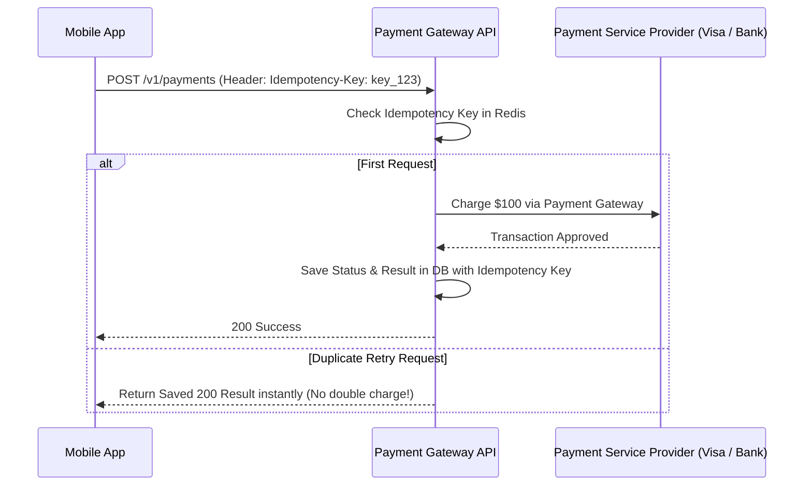

# File 29: System Design — Distributed Payment System (Stripe / Razorpay)

## Overview
Designing a **Distributed Payment System** requires zero tolerance for data loss or duplicate charges. It utilizes **Idempotency Keys**, **Double-Entry Bookkeeping**, and **Reconciliation Workers** to ensure financial data integrity.

---

## 1. Payment Flow Sequence & Idempotency Layer



---

## 2. Double-Entry Bookkeeping Ledger Implementation

```javascript
class DoubleEntryLedger {
    constructor() {
        this.accounts = new Map(); // Account -> Balance
    }

    transfer(fromAccount, toAccount, amount) {
        // Every transaction MUST debit one account and credit another by exact same amount!
        const fromBal = this.accounts.get(fromAccount) || 0;
        const toBal = this.accounts.get(toAccount) || 0;

        if (fromBal < amount) throw new Error("INSUFFICIENT_FUNDS");

        this.accounts.set(fromAccount, fromBal - amount); // Debit
        this.accounts.set(toAccount, toBal + amount);     // Credit

        console.log(`[LEDGER BALANCED] Transferred $${amount} from ${fromAccount} to ${toAccount}`);
    }
}
```

---

## Key Takeaways
1. Always require **Idempotency Keys** on payment request endpoints to eliminate double charges.
2. Use **Double-Entry Bookkeeping** (sum of debits must equal sum of credits).
3. Run asynchronous **Reconciliation Workers** to cross-verify database ledgers with bank settlement files.
