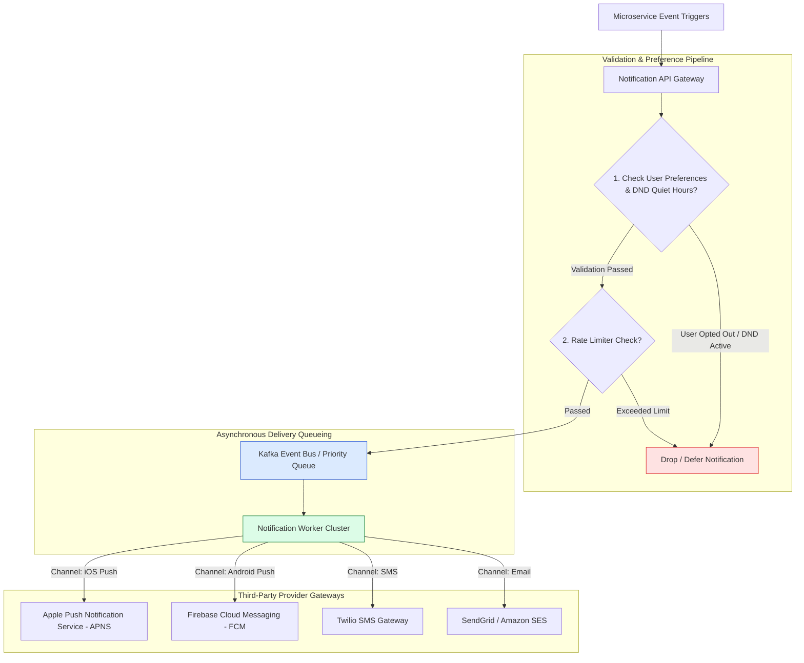
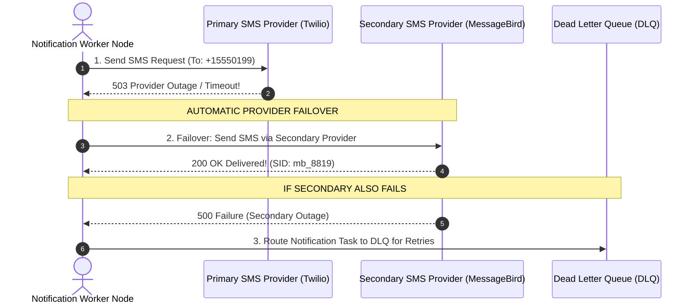

# Module 30: System Design — High-Scale Multi-Channel Notification Platform (APNS / FCM / Twilio)

## Overview

Designing an enterprise **Multi-Channel Notification Platform** requires delivering hundreds of millions of daily messages across diverse delivery channels (**iOS APNS, Android FCM, SMS via Twilio, Email via SendGrid/SES**).

Key architectural challenges include **Asynchronous Queue Buffering**, **User Opt-Out Preference Filtering (Quiet Hours / Do-Not-Disturb DND)**, **Third-Party Provider Failover**, and **Notification Deduplication**.

---

## 1. Multi-Channel Notification Platform Pipeline Topology



---

## 2. Notification Data Schema & Preference Storage

To process high-volume preference checks in $<2\text{ms}$, user notification settings are stored in **Redis Cache** backed by **DynamoDB/Postgres**:

```json
{
  "userId": "user_99182",
  "deviceTokens": {
    "ios": "apns_token_abc123",
    "android": "fcm_token_xyz789"
  },
  "preferences": {
    "pushEnabled": true,
    "emailEnabled": false,
    "smsEnabled": true,
    "dndQuietHours": {
      "enabled": true,
      "startTime": "22:00",
      "endTime": "07:00",
      "timezone": "America/New_York"
    }
  }
}
```

---

## 3. Third-Party Provider Failover & DLQ Sequence



---

## 4. Practical Implementation Showcase: Multi-Channel Dispatcher Engine

```javascript
class NotificationPlatformEngine {
  constructor() {
    this.userPreferences = new Map([
      ["user_101", { pushEnabled: true, emailEnabled: false, dndActive: false }],
      ["user_202", { pushEnabled: true, emailEnabled: true, dndActive: true }] // DND Active!
    ]);
  }

  // Multi-Channel Dispatcher Function
  async dispatchNotification(userId, title, body, channel = "PUSH") {
    console.log(`\n🔔 [DISPATCH REQUEST] User: '${userId}' | Channel: ${channel} | "${title}"`);

    // 1. Fetch User Preferences
    const prefs = this.userPreferences.get(userId);
    if (!prefs) {
      console.warn(`  ✖ User '${userId}' not found. Aborting.`);
      return false;
    }

    // 2. Validate Opt-Out Preferences & DND Quiet Hours
    if (prefs.dndActive) {
      console.warn(`  🛑 [DND ACTIVE] User '${userId}' is currently in Do-Not-Disturb quiet hours. Deferring notification.`);
      return { status: "DEFERRED_DND" };
    }

    if (channel === "PUSH" && !prefs.pushEnabled) {
      console.warn(`  🛑 [USER OPT-OUT] User '${userId}' has disabled Push Notifications.`);
      return { status: "OPTED_OUT" };
    }

    // 3. Dispatch to Provider Gateway
    try {
      const providerResponse = await this._sendToThirdPartyProvider(channel, title, body);
      console.log(`  ✓ [DELIVERED VIA ${providerResponse.provider}] MsgID: ${providerResponse.msgId}`);
      return { status: "DELIVERED", ...providerResponse };
    } catch (err) {
      console.error(`  ✖ [PROVIDER FAILURE] Failed to deliver via ${channel}:`, err.message);
      return { status: "FAILED", error: err.message };
    }
  }

  async _sendToThirdPartyProvider(channel, title, body) {
    // Simulated Provider Call
    if (channel === "PUSH") {
      return { provider: "FCM_APNS", msgId: `fcm_${Date.now()}` };
    } else if (channel === "EMAIL") {
      return { provider: "SENDGRID", msgId: `sg_${Date.now()}` };
    }
    throw new Error("UNSUPPORTED_CHANNEL");
  }
}

// Execution Demonstration
async function runNotificationDemo() {
  const platform = new NotificationPlatformEngine();

  // Standard Dispatch
  await platform.dispatchNotification("user_101", "Order Shipped!", "Your order #991 has been shipped.", "PUSH");

  // DND Deferred Dispatch
  await platform.dispatchNotification("user_202", "Security Alert", "New login detected.", "PUSH");
}

runNotificationDemo();
```

---

## Key Production Takeaways

1. **Decouple Triggering Services from Delivery Gateways**: Use high-throughput message queues (Kafka / SQS) to buffer incoming notification triggers, allowing backend APIs to return instant `202 Accepted` responses.
2. **Validate User Preferences Before Provider Dispatch**: Check user notification settings and DND (Do-Not-Disturb) quiet hours in Redis prior to enqueuing tasks to avoid wasting API charges on opted-out channels.
3. **Implement Provider Redundancy & Multi-Region Failover**: Configure secondary third-party providers (e.g. Twilio primary, MessageBird secondary) with automatic fallback to survive third-party vendor outages.
4. **Ensure Notification Idempotency**: Deduplicate identical notification events using `user_id + event_type + timestamp_minute` keys in Redis to avoid spamming users during service retries.

