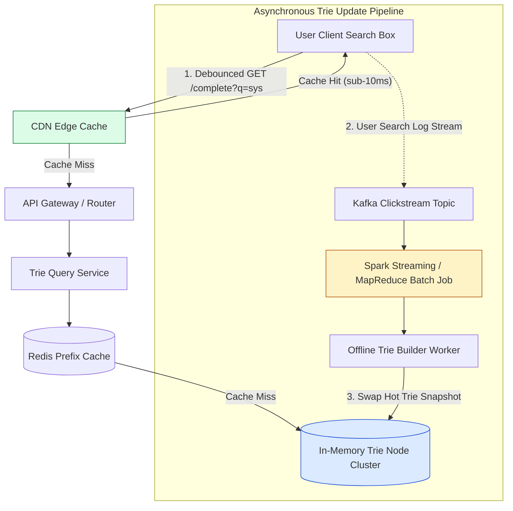
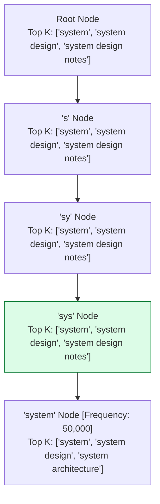
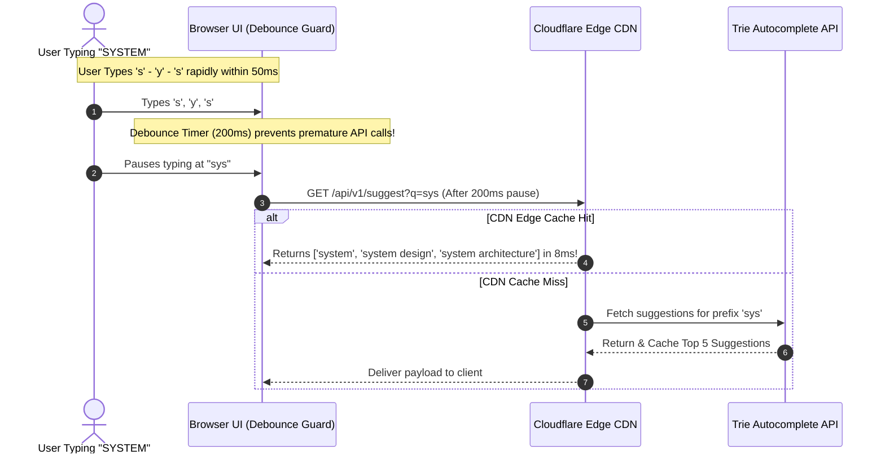

# Module 31: System Design — Real-Time Search Autocomplete Architecture (Google Typeahead)

## Overview

Designing a distributed **Search Autocomplete / Typeahead System** (such as Google Typeahead or Amazon Product Search) requires returning top 5 trending search suggestions within **sub-30ms latency** as users type keystrokes into a search box.

Achieving this throughput ($100\text{k}+$ QPS) requires optimizing the **Trie (Prefix Tree) Data Structure** by pre-computing top $K$ suggestions directly inside each Trie node, caching frequent prefixes at **CDN Edge Nodes**, and updating search frequencies via asynchronous **Spark/Hadoop Batch Pipelines**.

---

## 1. End-to-End Autocomplete System Architecture



---

## 2. Pre-Computed Top-$K$ Trie Node Optimization

Standard Trie traversals require searching all child nodes dynamically during query time ($O(N)$ tree search). 

By pre-computing and storing the **Top 5 Most Popular Suggestions** at every single node, query time drops from $O(N)$ to **$O(P)$** where $P$ is the length of the input prefix:



### Time Complexity Optimization Comparison

| Operations | Standard Naive Trie | Pre-Computed Top-$K$ Trie |
| :--- | :--- | :--- |
| **Search Time Complexity** | $O(P + N)$ (Traverse prefix $P$, then search all sub-nodes $N$) | **$O(P)$** (Traverse prefix $P$, return pre-cached Top-$K$ list instantly!) |
| **Space Overhead** | Low (Stores character pointers only) | Slightly Higher (Stores $K$ strings per prefix node) |
| **Query Latency** | 100ms - 500ms (Slow) | **$< 5\text{ms}$** (Blazing Fast) |

---

## 3. Client Debouncing & CDN Cache Edge Pipeline



---

## 4. Practical Implementation Showcase: Pre-Computed Top-$K$ Trie Engine

```javascript
class TrieNode {
  constructor() {
    this.children = new Map(); // Character -> TrieNode
    this.isEndOfWord = false;
    this.topKCache = [];       // Pre-computed Top 5 Suggestions List
  }
}

class AutocompleteTrieEngine {
  constructor(topKLimit = 5) {
    this.root = new TrieNode();
    this.topKLimit = topKLimit;
  }

  // Insert search phrase into Trie and update pre-computed Top-K lists
  insert(phrase, frequency) {
    let node = this.root;
    const lowerPhrase = phrase.toLowerCase();

    for (let i = 0; i < lowerPhrase.length; i++) {
      const char = lowerPhrase[i];
      if (!node.children.has(char)) {
        node.children.set(char, new TrieNode());
      }
      node = node.children.get(char);

      // Pre-compute & update Top-K cached list at THIS prefix node!
      this._updateTopKCache(node, lowerPhrase, frequency);
    }
    node.isEndOfWord = true;
  }

  _updateTopKCache(node, phrase, frequency) {
    // Remove existing entry if present
    node.topKCache = node.topKCache.filter((item) => item.phrase !== phrase);
    node.topKCache.push({ phrase, frequency });

    // Sort descending by frequency
    node.topKCache.sort((a, b) => b.frequency - a.frequency);

    // Trim to Top K limit
    if (node.topKCache.length > this.topKLimit) {
      node.topKCache.pop();
    }
  }

  // Instant O(P) Prefix Lookup Query
  getSuggestions(prefix) {
    let node = this.root;
    const lowerPrefix = prefix.toLowerCase();

    for (let i = 0; i < lowerPrefix.length; i++) {
      const char = lowerPrefix[i];
      if (!node.children.has(char)) {
        return []; // Prefix not found
      }
      node = node.children.get(char);
    }

    // Instant O(1) return of pre-computed Top-K list!
    return node.topKCache.map((item) => ({ phrase: item.phrase, score: item.frequency }));
  }
}

// Execution Demonstration
const trie = new AutocompleteTrieEngine(3);

trie.insert("system design", 15000);
trie.insert("system architecture", 9200);
trie.insert("system testing", 4100);
trie.insert("sysadmin tools", 2000);

console.log("Suggestions for 'sys':", trie.getSuggestions("sys"));
console.log("Suggestions for 'system':", trie.getSuggestions("system"));
```

---

## Key Production Takeaways

1. **Pre-Compute Top-$K$ Suggestions at Each Trie Node**: Eliminate expensive runtime tree traversals by storing the pre-sorted Top 5 suggestions list directly inside every Trie prefix node ($O(P)$ query time).
2. **Apply Frontend Client Debouncing**: Enforce a 150ms-200ms debounce delay in client search inputs to reduce unnecessary API calls while users type rapidly.
3. **Cache Popular Prefixes at CDN Edge Nodes**: Cache autocomplete suggestions for top 20% search prefixes (e.g. `a`, `b`, `am`, `ama`) at CDN Edge Servers (Cloudflare / Fastly) to resolve $80\%+$ of traffic in sub-10ms latency.
4. **Update Trie Weights Asynchronously via Spark Batch Jobs**: Process search logs asynchronously using Apache Spark or Hadoop MapReduce to rebuild Trie snapshots weekly/daily, hot-swapping memory references without taking the search API offline.

