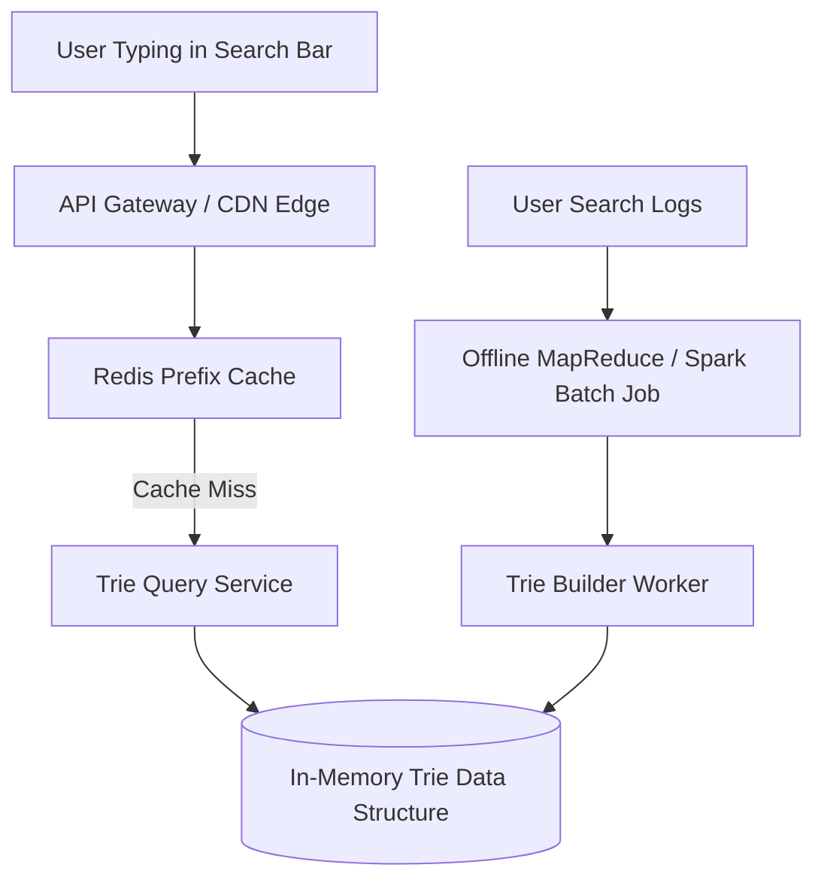

# File 31: System Design — Search Autocomplete System (Google Typeahead)

## Overview
Designing a **Search Autocomplete System** requires returning top 5 trending search suggestions in **sub-50ms latency** as users type characters into a search box. It uses a **Trie Data Structure** cached in memory with top $k$ suggestions stored at each prefix node.

---

## 1. Search Autocomplete Architecture



---

## 2. Autocomplete Trie Node Concept

```javascript
class AutocompleteTrieNode {
    constructor() {
        this.children = {};
        this.topSuggestions = []; // Pre-computed Top 5 popular suggestions!
    }
}

class AutocompleteTrie {
    constructor() {
        this.root = new AutocompleteTrieNode();
    }

    insert(phrase, frequency) {
        let node = this.root;
        for (const char of phrase) {
            if (!node.children[char]) {
                node.children[char] = new AutocompleteTrieNode();
            }
            node = node.children[char];
            
            // Keep top suggestions list sorted by frequency
            this._updateTopSuggestions(node, phrase, frequency);
        }
    }

    _updateTopSuggestions(node, phrase, frequency) {
        node.topSuggestions = node.topSuggestions.filter(item => item.phrase !== phrase);
        node.topSuggestions.push({ phrase, frequency });
        node.topSuggestions.sort((a, b) => b.frequency - a.frequency);
        if (node.topSuggestions.length > 5) node.topSuggestions.pop(); // Keep top 5
    }

    getSuggestions(prefix) {
        let node = this.root;
        for (const char of prefix) {
            if (!node.children[char]) return [];
            node = node.children[char];
        }
        return node.topSuggestions.map(item => item.phrase);
    }
}

const ac = new AutocompleteTrie();
ac.insert("system design", 1000);
ac.insert("system architecture", 800);
ac.insert("system testing", 500);

console.log("Suggestions for 'system':", ac.getSuggestions("system"));
```

---

## Key Takeaways
1. Pre-compute and store **Top $K$ suggestions at each Trie node** to achieve $O(1)$ lookup time.
2. Cache top search prefixes in **Redis / CDN Edge** for ultra-low sub-50ms latency.
3. Update Trie weights asynchronously via offline batch processing (Spark / MapReduce).
