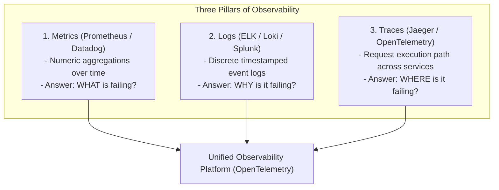
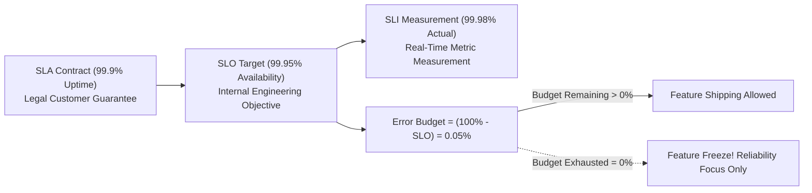

# Module 32: Monitoring, Observability Architecture, & Distributed Tracing

## Theoretical Overview & Observability Pillars

**Observability** is the degree to which the internal state of a complex distributed system can be inferred solely from its external outputs (telemetry).



### Real-World Case Study: Jio Telecom NOC Operations
Jio operates India's largest telecom network with over **450 million active subscribers**:
- **Telemetry Scale**: Processes over 5 Billion network telemetry events daily.
- **Incident Response**: When a VoLTE call setup failure spikes in a region, distributed tracing correlates 8+ microservice hops (HSS, VLR, MSC, MGW) to pinpoint the root cause in **$< 4\text{ minutes}$** Mean Time to Detect (MTTD).

---

## 1. Observability Frameworks: RED vs. USE

| Framework | Target Layer | Primary Metrics Monitored | When to Apply |
| :--- | :--- | :--- | :--- |
| **RED Method** | **Application Services & APIs**. | **Rate** (QPS), **Errors** (5xx %), **Duration** (Latency $P_{50}, P_{99}$). | Microservices, HTTP APIs, RPC endpoints. |
| **USE Method** | **Hardware Resources**. | **Utilization** (%), **Saturation** (Queue size), **Errors** (Hardware). | Servers, CPU, RAM, Disk I/O, Network Interfaces. |

---

## 2. Core Telemetry Implementations & Code Models

### 1. Percentile Metric Collector (`MetricsCollector`)
Tracks latency histograms and computes non-linear percentiles ($P_{50}, P_{90}, P_{99}$):

```javascript
class MetricsCollector {
  constructor() {
    this.counters = {};
    this.histograms = {};
  }

  incCounter(name, labels = {}, val = 1) {
    const key = `${name}:${JSON.stringify(labels)}`;
    if (!this.counters[key]) this.counters[key] = { name, labels, value: 0 };
    this.counters[key].value += val;
  }

  recordHist(name, labels = {}, val) {
    const key = `${name}:${JSON.stringify(labels)}`;
    if (!this.histograms[key]) this.histograms[key] = { values: [], count: 0, sum: 0 };
    const h = this.histograms[key];
    h.values.push(val);
    h.count++;
    h.sum += val;
  }

  percentiles(name, labels = {}) {
    const key = `${name}:${JSON.stringify(labels)}`;
    const h = this.histograms[key];
    if (!h || !h.values.length) return null;

    const sorted = [...h.values].sort((a, b) => a - b);
    const n = sorted.length;
    return {
      p50: sorted[Math.floor(n * 0.5)],
      p90: sorted[Math.floor(n * 0.9)],
      p99: sorted[Math.floor(n * 0.99)],
      avg: +(h.sum / h.count).toFixed(1),
      count: h.count,
    };
  }
}
```

### 2. Distributed Tracing Engine (`DistributedTracer`)
Propagates `traceId` and parent `spanId` context across HTTP/gRPC boundaries to reconstruct request waterfalls:

```mermaid
gantt
    title Distributed Request Trace: trace-8f921
    dateFormat  SS
    axisFormat %S
    
    section API Gateway
    volte-call-setup           :active, a1, 00, 12s
    section HSS Auth
    authenticate-sim           :crit, a2, 01, 02s
    section VLR Location
    locate-subscriber          :a3, 03, 05s
    section MSC Routing
    route-call                 :a4, 08, 04s
```



```javascript
class DistributedTracer {
  constructor() {
    this.traces = new Map();
    this.spanCounter = 0;
  }

  startTrace(operationName, serviceName) {
    const traceId = `trace-${Date.now()}-${Math.random().toString(36).substr(2, 6)}`;
    const span = { traceId, spanId: `span-${++this.spanCounter}`, op: operationName, service: serviceName, duration: 0 };
    this.traces.set(traceId, [span]);
    return span;
  }

  addSpan(traceId, operationName, serviceName, durationMs, status = "OK") {
    const span = { traceId, spanId: `span-${++this.spanCounter}`, op: operationName, service: serviceName, duration: durationMs, status };
    if (!this.traces.has(traceId)) this.traces.set(traceId, []);
    this.traces.get(traceId).push(span);
    return span;
  }
}
```

---

## 3. Service Level Targets & Error Budget Mechanics (`SLOTracker`)



```javascript
class SLOTracker {
  constructor(name, sloTarget) {
    this.name = name;
    this.sloTarget = sloTarget; // e.g. 0.9995 (99.95%)
    this.good = 0;
    this.total = 0;
  }

  record(isGood) {
    this.total++;
    if (isGood) this.good++;
  }

  status() {
    const sli = this.total > 0 ? (this.good / this.total) * 100 : 100;
    const allowedErrorBudgetPercent = (1 - this.sloTarget) * 100;
    const actualErrorPercent = 100 - sli;
    const remainingBudgetPercent = allowedErrorBudgetPercent - actualErrorPercent;

    return {
      sli: `${sli.toFixed(3)}%`,
      slo: `${(this.sloTarget * 100).toFixed(2)}%`,
      remainingBudget: `${remainingBudgetPercent.toFixed(3)}%`,
      isWithinBudget: remainingBudgetPercent > 0,
    };
  }
}
```

---

## 4. Alerting Engine & Symptom-Based Rules (`AlertManager`)

Alerting on root causes (e.g., "High CPU on node 4") causes **Alert Fatigue**. Production alerting rules must fire on **user-impacting symptoms** (e.g., "API 5xx Error Rate $> 1.0\%$").

```javascript
class AlertManager {
  constructor() {
    this.rules = [];
  }

  addRule(name, severity, conditionFn, team) {
    this.rules.push({ name, severity, conditionFn, team });
  }

  evaluate(currentMetrics) {
    const firedAlerts = [];
    this.rules.forEach((rule) => {
      if (rule.conditionFn(currentMetrics)) {
        firedAlerts.push({ name: rule.name, severity: rule.severity, team: rule.team });
      }
    });
    return firedAlerts;
  }
}
```

---

## Key Takeaways

1. **Unify Metrics, Logs, & Traces**: Use Prometheus for metrics (WHAT), structured JSON logs for context (WHY), and OpenTelemetry for distributed traces (WHERE).
2. **Track Percentiles Over Averages**: Evaluate $P_{99}$ and $P_{90}$ response times instead of averages to detect outlier degradation.
3. **Manage Error Budgets**: If an SLO Error Budget is exhausted, freeze feature deployments to focus strictly on reliability engineering.
4. **Alert on Symptoms, Not Causes**: Configure high-priority PagerDuty alerts to fire on high user-facing error rates ($5\text{xx} > 1\%$) rather than high CPU usage.
