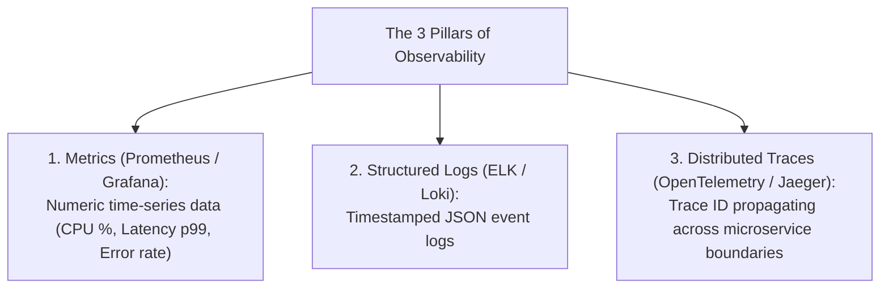

# File 32: Monitoring and Observability (The 3 Pillars: Metrics, Logs, Traces)

## Overview
**Observability** provides deep operational insight into distributed microservice systems. It relies on the **3 Pillars of Observability**: **Metrics** (Prometheus), **Structured Logging** (ELK Stack), and **Distributed Tracing** (Jaeger, OpenTelemetry).

---

## 1. The 3 Pillars of Observability



---

## 2. Distributed Tracing Header Propagation Concept

```javascript
class TraceContext {
    static generateTraceId() {
        return `trace_${Date.now()}_${Math.random().toString(36).substring(2, 9)}`;
    }
}

// Inter-service HTTP call carrying Trace ID header
function callServiceB(traceId) {
    console.log(`[SERVICE A -> SERVICE B] HTTP Request with Header 'x-trace-id: ${traceId}'`);
    serviceBHandler({ "x-trace-id": traceId });
}

function serviceBHandler(headers) {
    const traceId = headers["x-trace-id"];
    console.log(`[SERVICE B] Processing request within Trace Context: ${traceId}`);
}

const traceId = TraceContext.generateTraceId();
callServiceB(traceId);
```

---

## Key Takeaways
1. **Metrics**: Quantify system health (CPU, Memory, Request Count, Latency p95/p99).
2. **Logs**: Provide context-rich event data for post-mortem debugging.
3. **Distributed Tracing**: Tracks end-to-end request lifecycles across microservice RPC calls using `Trace-ID` headers.
