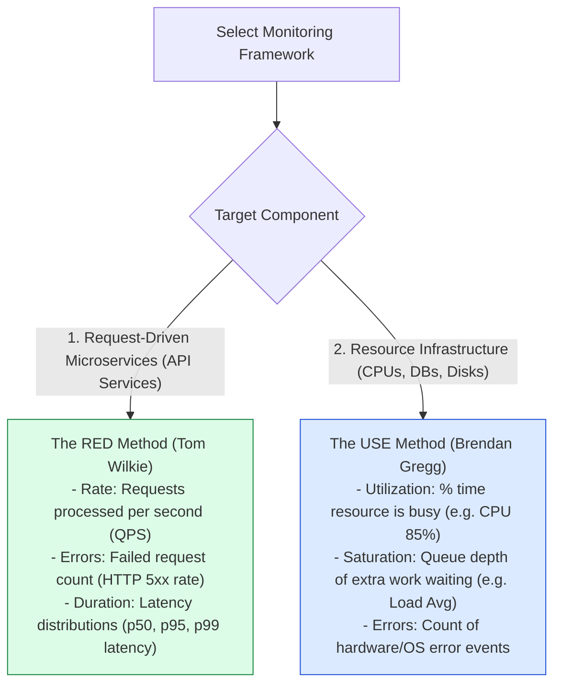
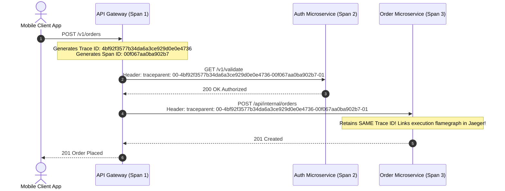

# Module 32: Enterprise Observability Architecture, OpenTelemetry, Metrics, and Distributed Tracing

## Overview

In complex distributed microservice environments, understanding internal system state purely from external HTTP responses is impossible. **Observability** provides deep operational insight into system behavior, health bottlenecks, and failure modes.

Production observability rests on **The 3 Pillars of Observability**: **Numeric Metrics (Prometheus/Grafana)**, **Structured JSON Logs (ELK / Grafana Loki)**, and **Distributed Tracing (OpenTelemetry / Jaeger)**.

Understanding **The RED Method (Rate, Errors, Duration)**, **The USE Method (Utilization, Saturation, Errors)**, and **W3C `traceparent` Context Propagation** is essential.

---

## 1. The 3 Pillars of Observability Architecture

```mermaid
flowchart TD
    subgraph Observability Data Collector (OpenTelemetry Collector)
        Agent[OTel Collector Agent]
    end

    Agent -->|1. Numeric Time-Series Aggregations| Prometheus[(Prometheus / Grafana)]
    Agent -->|2. Structured JSON Logs| Loki[(Grafana Loki / ElasticSearch)]
    Agent -->|3. Distributed Trace Spans| Jaeger[(Jaeger / Tempo Distributed Tracing)]

    Prometheus --> Dash[Unified Grafana Dashboard & PagerDuty Alerts]
    Loki --> Dash
    Jaeger --> Dash

    style Agent fill:#dbeafe,stroke:#1d4ed8
    style Dash fill:#dcfce7,stroke:#15803d
```

---

## 2. Observability Monitoring Frameworks: RED vs. USE



---

## 3. Distributed Tracing & W3C `traceparent` Header Propagation

To trace a single user request as it traverses 10 different microservices, services propagate a standardized W3C HTTP header (**`traceparent`**):

$$\text{traceparent Header Format}: \text{version}-\text{trace\_id}-\text{parent\_span\_id}-\text{trace\_flags}$$



---

## 4. Practical Implementation Showcase: OpenTelemetry Trace Context & Metrics Tracer

```javascript
const crypto = require("node:crypto");

class OpenTelemetryContextPropagator {
  // Generate W3C Compliant traceparent header: 00-traceId-spanId-01
  static createTraceContext() {
    const traceId = crypto.randomBytes(16).toString("hex"); // 32 hex chars
    const spanId = crypto.randomBytes(8).toString("hex");   // 16 hex chars
    return {
      traceId,
      spanId,
      traceparent: `00-${traceId}-${spanId}-01`
    };
  }

  // Extract or Inject Trace Context across HTTP boundaries
  static injectTraceHeader(headers, traceContext) {
    return {
      ...headers,
      "traceparent": traceContext.traceparent
    };
  }
}

class ObservabilityMetricsCollector {
  constructor() {
    this.counters = new Map();   // Metric Name -> Count
    this.histograms = new Map(); // Metric Name -> Array of Durations
  }

  incrementCounter(metricName, value = 1) {
    const current = this.counters.get(metricName) || 0;
    this.counters.set(metricName, current + value);
  }

  recordHistogram(metricName, durationMs) {
    if (!this.histograms.has(metricName)) {
      this.histograms.set(metricName, []);
    }
    this.histograms.get(metricName).push(durationMs);
  }

  // Calculate Percentiles (p50, p95, p99)
  getPercentiles(metricName) {
    const values = (this.histograms.get(metricName) || []).sort((a, b) => a - b);
    if (values.length === 0) return { p50: 0, p95: 0, p99: 0 };

    const getP = (p) => values[Math.floor(values.length * p)];
    return {
      count: values.length,
      p50: getP(0.50),
      p95: getP(0.95),
      p99: getP(0.99)
    };
  }
}

// Execution Demonstration
const collector = new ObservabilityMetricsCollector();

// Simulate 100 API Requests with Latencies
for (let i = 1; i <= 100; i++) {
  const latency = Math.floor(Math.random() * 50) + 10; // 10ms - 60ms
  collector.incrementCounter("http_requests_total");
  collector.recordHistogram("http_request_duration_ms", latency);
}

const traceCtx = OpenTelemetryContextPropagator.createTraceContext();
console.log("Generated W3C Trace Context:", traceCtx);
console.log("\nPrometheus Percentile Calculation (RED Method):", collector.getPercentiles("http_request_duration_ms"));
```

---

## Key Production Takeaways

1. **Adopt OpenTelemetry (OTel) for Vendor-Agnostic Instrumentation**: Instrument application code using OpenTelemetry standards to export metrics, logs, and traces to any backend (Jaeger, Prometheus, Datadog) without code rewrites.
2. **Propagate W3C `traceparent` Headers on All HTTP/gRPC Calls**: Ensure all internal microservice HTTP clients and gRPC channels pass incoming `traceparent` headers to preserve end-to-end trace correlation.
3. **Use the RED Method for Microservices, USE Method for Infrastructure**: Monitor request-driven microservice endpoints via **Rate, Errors, and Duration (RED)**; monitor server hardware resources via **Utilization, Saturation, and Errors (USE)**.
4. **Monitor High Percentiles (p99 / p99.9), Not Averages**: Average latencies hide severe performance degradation experienced by 1% of users. Always alert on p99 and p99.9 percentile latency thresholds.

