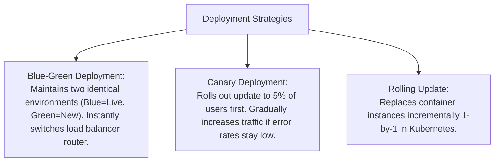

# File 33: Containers and Deployment Strategies (Docker, Kubernetes, Blue-Green, Canary)

## Overview
**Containers (Docker)** package applications with all dependencies into lightweight isolated images. **Orchestrators (Kubernetes)** manage container scaling, healing, and rolling deployment strategies (**Blue-Green**, **Canary Deployments**).

---

## 1. Zero-Downtime Deployment Strategies



---

## 2. Canary Deployment Traffic Router Implementation

```javascript
class CanaryTrafficRouter {
    constructor(canaryPercentage = 10) {
        this.canaryPercentage = canaryPercentage; // % of traffic to new version
    }

    routeUser(userId) {
        // Hash user ID to deterministically assign canary group
        const hash = String(userId).split("").reduce((acc, char) => acc + char.charCodeAt(0), 0);
        const bucket = hash % 100;

        if (bucket < this.canaryPercentage) {
            return "v2-canary"; // Route to new v2 deployment
        }
        return "v1-stable";     // Route to stable v1 deployment
    }
}

const router = new CanaryTrafficRouter(20); // 20% Canary
console.log("User 101 routes to:", router.routeUser("user_101"));
console.log("User 102 routes to:", router.routeUser("user_102"));
```

---

## Key Takeaways
1. **Docker Containers** isolate application environments from underlying host OS dependencies.
2. **Kubernetes** orchestrates automatic container scaling, health checks, and self-healing restarts.
3. **Blue-Green** allows instant zero-downtime cutover and instant rollback.
4. **Canary Deployments** mitigate deployment risk by testing new code on a small percentage of live users.
