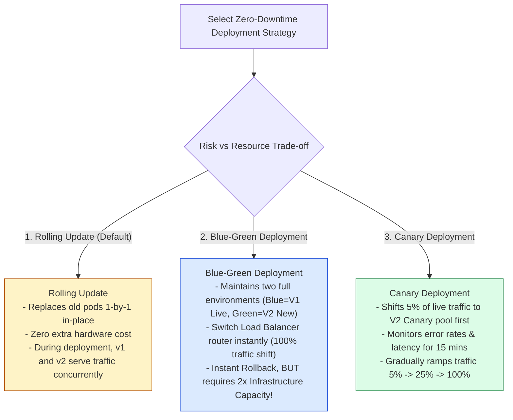
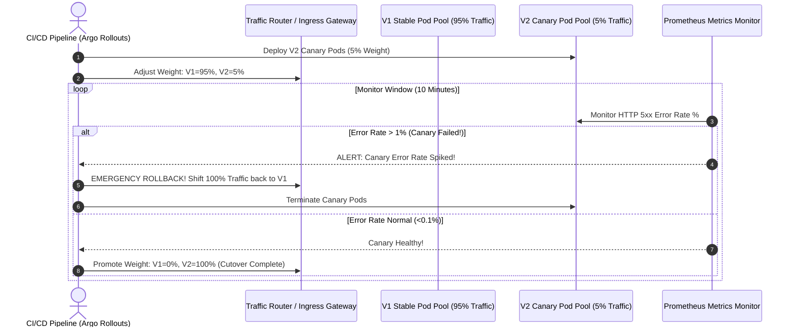

# Module 33: Containerization, Kubernetes Orchestration, and Zero-Downtime Deployment Strategies

## Overview

Modern cloud platforms use **Containerization (Docker)** to package application binaries, runtime dependencies, and configuration into immutable OS-level virtualization images.

At scale, **Container Orchestrators (Kubernetes / EKS)** automate pod scheduling, horizontal autoscaling, self-healing restarts, and **Zero-Downtime Deployment Strategies (Rolling Updates, Blue-Green Deployments, Canary Releases)**.

Understanding **Deployment Strategy Trade-offs**, **Traffic Splitting Algorithms**, and **Automated Health Check Rollbacks** is essential.

---

## 1. Container Isolation & Kubernetes Architecture

```mermaid
flowchart TD
    subgraph Kubernetes Cluster Control Plane
        API[K8s API Server] <--> Etcd[(etcd Cluster Store)]
        Sched[K8s Scheduler] --> API
        CCM[Controller Manager] --> API
    end

    subgraph Worker Nodes (EC2 / Bare Metal)
        API <--> Kubelet1[Kubelet Daemon Node 1]
        API <--> Kubelet2[Kubelet Daemon Node 2]

        Kubelet1 --> PodA["Pod 1 (App Container + Sidecar)"]
        Kubelet1 --> PodB["Pod 2 (App Container)"]
        Kubelet2 --> PodC["Pod 3 (App Container)"]
    end

    style API fill:#dbeafe,stroke:#1d4ed8
    style PodA fill:#dcfce7,stroke:#15803d
    style PodB fill:#dcfce7,stroke:#15803d
```

---

## 2. Zero-Downtime Deployment Strategy Taxonomy



### Deployment Strategy Comparison Matrix

| Strategy | Extra Infrastructure Cost | Rollback Speed | Mixed V1/V2 Traffic? | Production Use Case |
| :--- | :--- | :--- | :--- | :--- |
| **Rolling Update** | **0%** (Replaces in-place) | Medium (Sequential pod rollback) | **Yes** | Standard microservice deployments |
| **Blue-Green** | **100%** (Requires 2x cluster footprint) | **Instant** ($O(1)$ Load Balancer DNS flip) | No | High-risk database/monolith cutovers |
| **Canary Release** | Small (5-10% extra pods) | Fast (Scale down canary pod pool) | **Yes** (Controlled %) | High-traffic critical path APIs |

---

## 3. Canary Deployment Traffic Routing & Automated Rollback Sequence



---

## 4. Practical Implementation Showcase: Deterministic Canary Traffic Router Engine

```javascript
const crypto = require("node:crypto");

class CanaryTrafficRouter {
  constructor(canaryWeightPercentage = 10) {
    this.canaryWeight = canaryWeightPercentage; // e.g. 10%
  }

  // Set active canary percentage (e.g. 5%, 25%, 100%)
  setCanaryWeight(weight) {
    this.canaryWeight = Math.min(100, Math.max(0, weight));
    console.log(`🔀 [CANARY WEIGHT UPDATED] Target V2 Canary Weight: ${this.canaryWeight}%`);
  }

  // Deterministically route user ID using 32-bit Hash modulo 100
  routeUser(userId) {
    const hashHex = crypto.createHash("md5").update(String(userId)).digest("hex");
    const hashInt = parseInt(hashHex.substring(0, 8), 16);
    const bucket = Math.abs(hashInt) % 100; // 0 to 99

    if (bucket < this.canaryWeight) {
      return { version: "V2_CANARY", bucket };
    }
    return { version: "V1_STABLE", bucket };
  }
}

// Execution Demonstration
const router = new CanaryTrafficRouter(20); // 20% Canary

function testTrafficDistribution() {
  console.log("=== CANARY TRAFFIC DISTRIBUTION TEST (20% Target) ===");
  let v1Count = 0;
  let v2Count = 0;

  for (let i = 1; i <= 1000; i++) {
    const route = router.routeUser(`user_${i}`);
    if (route.version === "V2_CANARY") v2Count++;
    else v1Count++;
  }

  console.log(`V1 Stable Traffic : ${v1Count} requests (${(v1Count / 10).toFixed(1)}%)`);
  console.log(`V2 Canary Traffic : ${v2Count} requests (${(v2Count / 10).toFixed(1)}%)`);
}

testTrafficDistribution();
```

---

## Key Production Takeaways

1. **Use Canary Deployments for High-Scale Applications**: Use tools like Argo Rollouts or Istio to gradually shift 5% -> 25% -> 100% of live user traffic to new code releases while monitoring real-time error rates.
2. **Use Blue-Green Deployments for Instant Cutover & Rollback**: Select Blue-Green deployments when running database migrations or high-risk cutovers where concurrent V1 and V2 API traffic cannot be tolerated.
3. **Configure Kubernetes Liveness & Readiness Probes**: Ensure all containerized pods define explicit `readinessProbe` (pre-warming before receiving traffic) and `livenessProbe` (rebooting unresponsive containers).
4. **Automate Rollbacks via Prometheus Error Thresholds**: Configure CI/CD deployment controllers to trigger automatic rollbacks within 60 seconds if canary error rates exceed $1\%$ or latency p99 spikes significantly.

