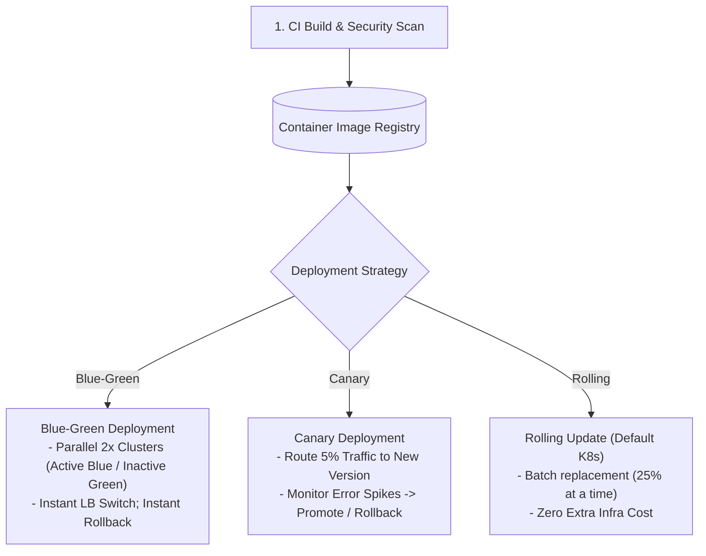

# Module 33: Containerization, Kubernetes Deployment Strategies, & Feature Flags

## Theoretical Overview & Continuous Delivery Framework

Modern cloud-native deployment strategies isolate code dependencies via **Containers** (Docker/OCI) and automate zero-downtime rollouts across container orchestrators (Kubernetes / ECS).



### Real-World Case Study: Flipkart Big Billion Days (BBD) Sale
During Flipkart's Big Billion Days:
- **Canary Rollout**: A new checkout optimization was deployed via a 5% Canary.
- **Automated Rollback**: When automated observability monitors detected a 2% error rate spike on the 5% canary pool, the deployment pipeline automatically executed a rollback within **90 seconds**, protecting 95% of active shoppers from checkout failures.

---

## 1. Deployment Strategies Comparison Matrix

| Deployment Strategy | Downtime SLA | Rollback Speed | Infra Cost Overhead | Blast Radius / Risk | Recommended Use Case |
| :--- | :--- | :--- | :--- | :--- | :--- |
| **Recreate** | Downtime ($1\text{m}-5\text{m}$).| Slow. | **$1\times$** (No extra cost). | High ($100\%$ users). | Non-critical dev/staging environments. |
| **Rolling Update** | Zero Downtime. | Moderate (Batch rollback).| **$1.25\times$** (Surge batch). | Moderate. | Kubernetes default for standard APIs. |
| **Blue-Green** | Zero Downtime. | **Instant ($< 1\text{s}$)**. | **$2.0\times$** ($100\%$ duplicate pool). | Low ($100\%$ instant switch). | Mission-critical payment/auth gateways. |
| **Canary** | Zero Downtime. | Fast ($< 90\text{s}$). | **$1.05\times$** ($5\%$ canary pool). | **Lowest ($5\%$ traffic limit)**. | User-facing production features. |
| **Feature Flags** | Zero Downtime. | **Instant ($< 100\text{ms}$)**.| **$1.0\times$**. | Precision targeted. | Decoupling deployment from feature release. |

---

## 2. Core Deployment Strategy Implementations

### 1. Blue-Green Deployment Engine (`BlueGreenDeploy`)
Maintains two identical environment pools (Blue and Green). At any time, only one environment handles production traffic:

```javascript
class BlueGreenDeploy {
  constructor(serviceName, instanceCount = 3) {
    this.serviceName = serviceName;
    this.count = instanceCount;
    this.blue = { instances: [], version: null, active: false };
    this.green = { instances: [], version: null, active: false };
    this.active = null;
  }

  deployInitial(version) {
    this.blue.instances = Array.from({ length: this.count }, () => new Container(this.serviceName, version).start());
    this.blue.version = version;
    this.blue.active = true;
    this.active = this.blue;
  }

  deployNew(version) {
    const inactive = this.active === this.blue ? this.green : this.blue;
    inactive.instances = Array.from({ length: this.count }, () => new Container(this.serviceName, version).start());
    inactive.version = version;

    // Run health check before switching traffic
    if (!inactive.instances.every((c) => c.isHealthy())) {
      return false; // Abort switch if health checks fail
    }

    this.active.active = false;
    inactive.active = true;
    this.active = inactive; // Instant Load Balancer Switch
    return true;
  }

  rollback() {
    const fallback = this.active === this.blue ? this.green : this.blue;
    this.active.active = false;
    fallback.active = true;
    this.active = fallback; // Instant LB Rollback
  }
}
```

### 2. Canary Deployment with Error Spike Analysis (`CanaryDeploy`)
Routes a small fraction of traffic to a new version, monitoring error rate differentials before promoting to 100%:

```javascript
class CanaryDeploy {
  constructor(serviceName, totalInstances = 20) {
    this.serviceName = serviceName;
    this.total = totalInstances;
    this.stableVersion = null;
    this.canaryVersion = null;
    this.canaryPct = 0;
    this.metrics = { stable: { reqs: 0, errs: 0 }, canary: { reqs: 0, errs: 0 } };
  }

  startCanary(version, percentage = 5) {
    this.canaryVersion = version;
    this.canaryPct = percentage;
  }

  analyze() {
    const sErr = this.metrics.stable.reqs > 0 ? (this.metrics.stable.errs / this.metrics.stable.reqs) * 100 : 0;
    const cErr = this.metrics.canary.reqs > 0 ? (this.metrics.canary.errs / this.metrics.canary.reqs) * 100 : 0;
    const diff = cErr - sErr;

    if (diff > 1.0) return "AUTOMATED_ROLLBACK"; // Tripped error threshold!
    if (diff > 0.5) return "HOLD";
    return "PROMOTE";
  }

  rollbackCanary() {
    this.canaryPct = 0; // Terminate canary routing
    this.canaryVersion = null;
  }
}
```

---

## 3. Feature Flags Engine (`FeatureFlagService`)

**Feature Flags** decouple code deployment from feature release. Code is shipped to production dormant and enabled remotely via targeted rules without redeploying binaries.

```mermaid
flowchart LR
    Request["Incoming User Request"] --> FF{"Feature Flag Check ('new_checkout_flow')"}
    
    FF -->|Flag OFF| OldFlow["Legacy Checkout Flow"]
    FF -->|Flag ON (Targeted: Bengaluru, 20% Rollout)| NewFlow["New Express Checkout Flow"]
```

```javascript
class FeatureFlagService {
  constructor() { this.flags = new Map(); }

  create(name, config) {
    this.flags.set(name, {
      enabled: config.enabled || false,
      pct: config.pct || 0, // Percentage Rollout (e.g. 20%)
      cities: config.cities || [], // Geo Targeting
    });
  }

  evaluate(name, context = {}) {
    const flag = this.flags.get(name);
    if (!flag || !flag.enabled) return false;

    if (flag.cities.length && context.city && flag.cities.includes(context.city)) {
      return true;
    }

    if (flag.pct > 0 && context.userId) {
      let hash = 0;
      for (const char of context.userId + name) hash = ((hash << 5) - hash) + char.charCodeAt(0);
      return (Math.abs(hash) % 100) < flag.pct; // Consistent hash user bucket
    }

    return flag.enabled && flag.pct === 100;
  }
}
```

---

## 4. Automated Continuous Delivery (CD) Pipeline

An enterprise CD pipeline enforces safety checks before promoting code across environments:

$$\text{Unit Tests} \longrightarrow \text{Container Build} \longrightarrow \text{CVE Security Scan} \longrightarrow \text{5\% Canary} \longrightarrow \text{Full Rollout}$$

```javascript
class DeliveryPipeline {
  constructor(serviceName) {
    this.serviceName = serviceName;
    this.stages = [];
  }

  addStage(name, actionFn) {
    this.stages.push({ name, actionFn });
  }

  run(version) {
    for (const stage of this.stages) {
      const res = stage.actionFn({ version });
      if (!res.ok) {
        return { status: "FAILED", stage: stage.name };
      }
    }
    return { status: "SUCCESSFULLY_DEPLOYED" };
  }
}
```

---

## Key Takeaways

1. **Standardize Environments via Containers**: Containerize services to guarantee identical behavior across local dev, staging, and production environments.
2. **Limit Blast Radius with Canary Rollouts**: Route 5% of production traffic to new releases before expanding to 100%.
3. **Use Blue-Green for Instant Rollbacks**: Use Blue-Green deployments for mission-critical payment gateways where instant traffic switching is required.
4. **Decouple Deploy from Release via Feature Flags**: Use feature flags to push code into production dormant and toggle access remotely per user segment.
