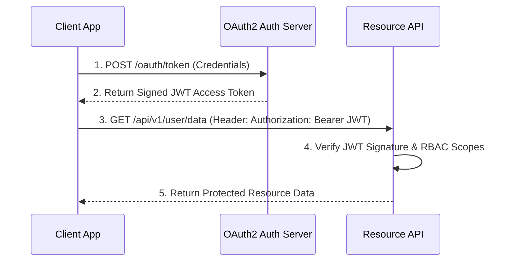

# File 34: System Security Fundamentals (Authentication, Authorization, TLS, OAuth2, OWASP)

## Overview
System Security protects applications from cyber threats. Essential security principles include **Authentication (Who are you?)**, **Authorization (What can you access?)**, **OAuth 2.0 / OIDC**, **JWT Tokens**, and defense against **OWASP Top 10** vulnerabilities (SQL Injection, XSS, CSRF).

---

## 1. Authentication vs Authorization Architecture



---

## 2. Password Hashing & Salt Implementation

```javascript
const crypto = require("crypto");

class SecurityUtils {
    // Salted Password Hashing via Scrypt / PBKDF2
    static hashPassword(password) {
        const salt = crypto.randomBytes(16).toString("hex");
        const hash = crypto.pbkdf2Sync(password, salt, 100000, 64, "sha512").toString("hex");
        return { salt, hash };
    }

    static verifyPassword(password, salt, storedHash) {
        const hash = crypto.pbkdf2Sync(password, salt, 100000, 64, "sha512").toString("hex");
        return crypto.timingSafeEqual(Buffer.from(hash, "hex"), Buffer.from(storedHash, "hex"));
    }
}

const { salt, hash } = SecurityUtils.hashPassword("SuperSecret123!");
console.log("Password Verified:", SecurityUtils.verifyPassword("SuperSecret123!", salt, hash)); // true
```

---

## Key Takeaways
1. Never store plain text passwords; use **bcrypt**, **Argon2**, or **PBKDF2** with unique salts.
2. Prevent **SQL Injection** using Parameterized Prepared Statements.
3. Prevent **XSS (Cross-Site Scripting)** by escaping output text and setting strict Content Security Policies (CSP).
4. Use **JWTs** with **OAuth 2.0 / OIDC** for stateless authentication across microservices.
