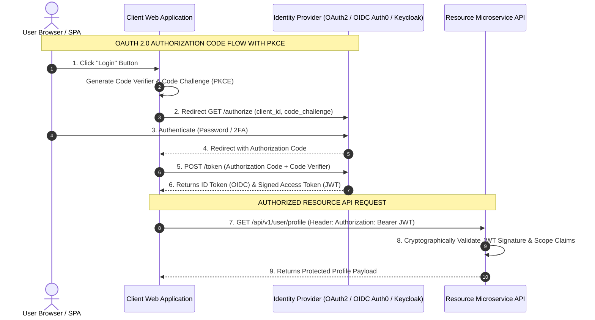
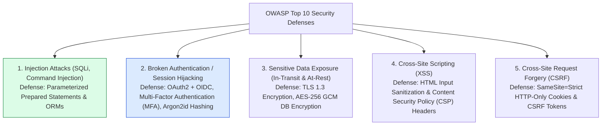
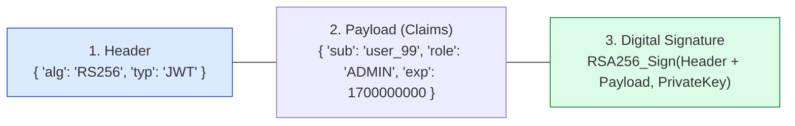

# Module 34: System Security Fundamentals, OAuth2/OIDC, Cryptography, and OWASP Top 10 Defenses

## Overview

System security is a foundational requirement across all software architecture layers. Securing distributed cloud platforms requires enforcing **Defense-in-Depth**, distinguishing **Authentication (Who are you?)** from **Authorization (What are you allowed to do?)**, and mitigating **OWASP Top 10 Cyber Threats**.

Understanding **OAuth 2.0 / OpenID Connect (OIDC)** with **PKCE (Proof Key for Code Exchange)**, **JWT (JSON Web Token) Verification**, **Argon2/bcrypt Password Hashing**, and **TLS 1.3 Transport Security** is essential.

---

## 1. Authentication vs. Authorization & OAuth 2.0 PKCE Flow



---

## 2. OWASP Top 10 Vulnerabilities & Defense Matrix



---

## 3. JWT Anatomy & Cryptographic Signature Verification (RS256 vs. HS256)

A JSON Web Token consists of three base64url-encoded parts separated by dots (`Header.Payload.Signature`):

$$\text{JWT} = \text{base64Url}(\text{Header}) + "." + \text{base64Url}(\text{Payload}) + "." + \text{Signature}$$



### Cryptographic Algorithm Comparison

| Algorithm | Signature Method | Key Type | Best Use Case |
| :--- | :--- | :--- | :--- |
| **HS256** | HMAC with SHA-256 | Single Symmetric Shared Secret Key | Internal monolith or single microservice |
| **RS256** | RSA Signature with SHA-256 | Asymmetric Key Pair (Private Sign / Public Verify) | Multi-service API Mesh (Public JWKS Verification) |
| **Argon2id** | Password Hashing Function | Memory-hard & Time-hard Salted Hash | Storing user passwords in DB |

---

## 4. Practical Implementation Showcase: Cryptographic Password Hashing & JWT Verification

```javascript
const crypto = require("node:crypto");

class SecurityEngine {
  // Salted Password Hashing using PBKDF2 (100,000 Iterations)
  static hashPassword(plainTextPassword) {
    const salt = crypto.randomBytes(16).toString("hex");
    const hash = crypto.pbkdf2Sync(plainTextPassword, salt, 100000, 64, "sha512").toString("hex");
    return { salt, hash };
  }

  // Constant-time timing-safe password verification
  static verifyPassword(plainTextPassword, salt, storedHash) {
    const hash = crypto.pbkdf2Sync(plainTextPassword, salt, 100000, 64, "sha512").toString("hex");
    const keyA = Buffer.from(hash, "hex");
    const keyB = Buffer.from(storedHash, "hex");
    
    // Prevents Timing Side-Channel Attacks!
    return crypto.timingSafeEqual(keyA, keyB);
  }

  // Generate Simple HMAC-SHA256 Signed JWT Token
  static generateJWT(payload, secretKey) {
    const header = { alg: "HS256", typ: "JWT" };
    const encodedHeader = Buffer.from(JSON.stringify(header)).toString("base64url");
    const encodedPayload = Buffer.from(JSON.stringify(payload)).toString("base64url");

    const signatureInput = `${encodedHeader}.${encodedPayload}`;
    const signature = crypto.createHmac("sha256", secretKey).update(signatureInput).digest("base64url");

    return `${signatureInput}.${signature}`;
  }

  // Verify HMAC-SHA256 JWT Token
  static verifyJWT(jwtToken, secretKey) {
    const parts = jwtToken.split(".");
    if (parts.length !== 3) throw new Error("INVALID_JWT_FORMAT");

    const [header, payload, signature] = parts;
    const expectedSignature = crypto.createHmac("sha256", secretKey).update(`${header}.${payload}`).digest("base64url");

    const isValid = crypto.timingSafeEqual(Buffer.from(signature), Buffer.from(expectedSignature));
    if (!isValid) throw new Error("JWT_SIGNATURE_MISMATCH");

    return JSON.parse(Buffer.from(payload, "base64url").toString("utf-8"));
  }
}

// Execution Demonstration
const secret = "SuperSecretEnterpriseKey_2026!";

// 1. Password Hashing Test
const { salt, hash } = SecurityEngine.hashPassword("SecureUserPass123!");
const isPasswordValid = SecurityEngine.verifyPassword("SecureUserPass123!", salt, hash);
console.log("🔒 [PASSWORD HASH] Verification Result:", isPasswordValid ? "PASSED (Valid)" : "FAILED");

// 2. JWT Generation & Verification Test
const token = SecurityEngine.generateJWT({ userId: "user_9918", role: "ADMIN" }, secret);
console.log("\n🔑 [JWT TOKEN GENERATED]:", token);

const decodedPayload = SecurityEngine.verifyJWT(token, secret);
console.log("  ✓ [JWT VERIFIED] Decoded Payload:", decodedPayload);
```

---

## Key Production Takeaways

1. **Never Store Plaintext Passwords**: Hash user passwords using memory-hard, salt-backed algorithms like **Argon2id** or **bcrypt** with a work factor of 12+.
2. **Prevent SQL Injection with Parameterized Queries**: Never concatenate user input into SQL queries. Always use Parameterized Prepared Statements (`SELECT * FROM users WHERE id = $1`).
3. **Use OAuth 2.0 PKCE Flow for Client Applications**: Enforce OAuth 2.0 with PKCE (Proof Key for Code Exchange) for Single Page Apps (SPAs) and Mobile Apps to prevent authorization code interception.
4. **Enforce TLS 1.3 Encryption In-Transit**: Mandate TLS 1.3 encryption across all public and internal service-to-service RPC traffic to guarantee confidentiality and integrity.

