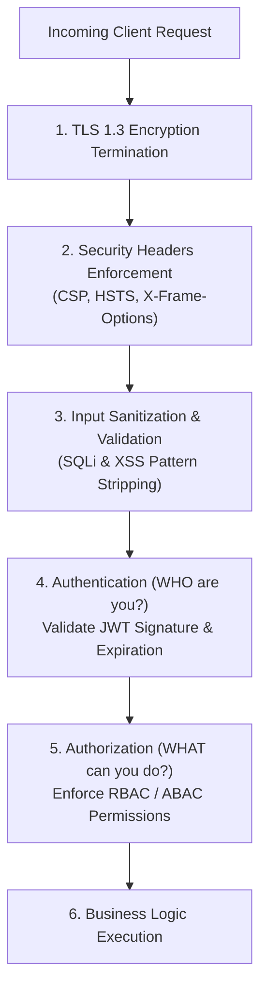
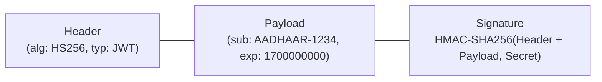
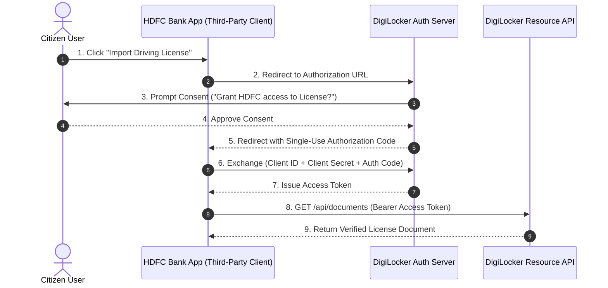

# Module 34: System Security Fundamentals, OAuth2, JWTs, & OWASP Mitigations

## Theoretical Overview & Zero-Trust Security Model

Security in distributed systems adheres to the **Zero-Trust Paradigm**: *"Never Trust, Always Verify."* Every request crossing microservice boundaries must be authenticated, authorized, and sanitized regardless of network perimeter location.



### Real-World Case Study: DigiLocker National Document Wallet
DigiLocker hosts official government documents (Aadhaar, Driving License, PAN) for **150+ million citizens**:
- **Authentication**: Aadhaar-verified OTP & biometric 2FA.
- **Authorization**: OAuth2 Authorization Code Flow allows third-party institutions (Banks, Telecoms) to access user-approved documents with explicit user consent.
- **Defense in Depth**: WAF rules block over 2 million malicious SQL injection and XSS probes daily.

---

## 1. Authentication vs. Authorization Matrix

| Attribute | Authentication (AuthN) | Authorization (AuthZ) |
| :--- | :--- | :--- |
| **Core Question** | *"Who are you?"* | *"What are you allowed to do?"* |
| **Mechanisms** | Passwords, OTP, Biometrics, WebAuthn, JWTs. | RBAC (Role-Based), ABAC (Attribute-Based), IAM Policies. |
| **HTTP Status Code** | **HTTP 401 Unauthorized** (Missing / Invalid Identity). | **HTTP 403 Forbidden** (Authenticated, but insufficient rights). |
| **Vulnerability Risk**| Credential Stuffing, Weak Passwords. | **IDOR (Insecure Direct Object Reference)** - OWASP #1. |

---

## 2. Stateless Authentication with JSON Web Tokens (JWT)

A **JSON Web Token (JWT)** contains 3 period-separated Base64URL-encoded strings: `Header.Payload.Signature`.



```javascript
class JWTSimulator {
  constructor(secretKey) {
    this.secret = secretKey;
  }

  _b64Encode(obj) {
    return Buffer.from(JSON.stringify(obj))
      .toString("base64")
      .replace(/\+/g, "-")
      .replace(/\//g, "_")
      .replace(/=+$/, "");
  }

  _b64Decode(str) {
    let s = str.replace(/-/g, "+").replace(/_/g, "/");
    while (s.length % 4) s += "=";
    return JSON.parse(Buffer.from(s, "base64").toString());
  }

  _hmac(data) {
    let h = 0;
    for (const c of data + this.secret) h = ((h << 5) - h) + c.charCodeAt(0) & 0x7fffffff;
    return h.toString(36);
  }

  create(payload, expSec = 3600) {
    const header = { alg: "HS256_SIM", typ: "JWT" };
    const now = Math.floor(Date.now() / 1000);
    const fullPayload = { ...payload, iat: now, exp: now + expSec, iss: "digilocker.gov.in" };

    const hEnc = this._b64Encode(header);
    const pEnc = this._b64Encode(fullPayload);
    const sig = this._hmac(`${hEnc}.${pEnc}`);

    return `${hEnc}.${pEnc}.${sig}`;
  }

  verify(token) {
    const parts = token.split(".");
    if (parts.length !== 3) return { valid: false, error: "Malformed Token" };

    const expectedSig = this._hmac(`${parts[0]}.${parts[1]}`);
    if (parts[2] !== expectedSig) return { valid: false, error: "Signature Mismatch (Tampered!)" };

    const payload = this._b64Decode(parts[1]);
    if (payload.exp && Math.floor(Date.now() / 1000) > payload.exp) {
      return { valid: false, error: "Token Expired" };
    }

    return { valid: true, payload };
  }
}
```

> [!WARNING]
> **JWT Myth**: Base64URL encoding is **NOT encryption**. Anyone can decode JWT payloads. Never store passwords, private keys, or raw Aadhaar numbers inside unencrypted JWT claims.

---

## 3. OAuth 2.0 Authorization Code Grant Flow



```javascript
class OAuth2Server {
  constructor() {
    this.clients = new Map();
    this.codes = new Map();
    this.tokens = new Map();
  }

  authorize(clientId, scope, userId) {
    const code = `code-${Math.random().toString(36).substring(2, 10)}`;
    this.codes.set(code, { clientId, userId, scope, used: false });
    return { code };
  }

  exchangeCode(clientId, clientSecret, code) {
    const client = this.clients.get(clientId);
    if (!client || client.secret !== clientSecret) return { error: "invalid_client" };

    const authRecord = this.codes.get(code);
    if (!authRecord || authRecord.used || authRecord.clientId !== clientId) {
      return { error: "invalid_grant" }; // Re-used or invalid code rejected!
    }

    authRecord.used = true; // Mark as single-use
    const accessToken = `at-${Math.random().toString(36).substring(2, 12)}`;
    this.tokens.set(accessToken, { userId: authRecord.userId, scope: authRecord.scope });
    return { access_token: accessToken };
  }
}
```

---

## 4. Input Validation & OWASP Mitigations (`InputValidator`)

```javascript
class InputValidator {
  static noSQLi() {
    return (val) => {
      if (typeof val !== "string") return { valid: true };
      const sqlPatterns = [/('|--|;|\/\*)/i, /(union\s+select|drop\s+table)/i, /(or\s+1\s*=\s*1)/i];
      return { valid: !sqlPatterns.some((p) => p.test(val)), error: "SQL Injection Detected" };
    };
  }

  static noXSS() {
    return (val) => {
      if (typeof val !== "string") return { valid: true };
      const xssPatterns = [/<script/i, /javascript\s*:/i, /on\w+\s*=/i];
      return { valid: !xssPatterns.some((p) => p.test(val)), error: "XSS Pattern Detected" };
    };
  }

  static aadhaarNumber() {
    return (val) => ({
      valid: typeof val === "string" && /^\d{4}\s?\d{4}\s?\d{4}$/.test(val.trim()),
      error: "Invalid Aadhaar Format",
    });
  }
}
```

---

## 5. Security Headers Checklist

Enforce essential HTTP security headers on all gateway responses:

```http
Content-Security-Policy: default-src 'self'; script-src 'self' https://trusted.cdn.com
Strict-Transport-Security: max-age=31536000; includeSubDomains; preload
X-Content-Type-Options: nosniff
X-Frame-Options: DENY
Referrer-Policy: strict-origin-when-cross-origin
```

---

## Key Takeaways

1. **Separate AuthN from AuthZ**: Verify identity via AuthN and enforce granular permissions (RBAC) on every single endpoint for AuthZ.
2. **JWTs are Encoded, Not Encrypted**: Never store sensitive credentials inside unencrypted JWT payloads.
3. **Single-Use OAuth2 Codes**: Enforce single-use authorization codes during OAuth2 exchanges to defeat interception attacks.
4. **Sanitize Inputs Server-Side**: Enforce server-side regex sanitization and parameterized SQL queries to block SQLi and XSS attacks.
